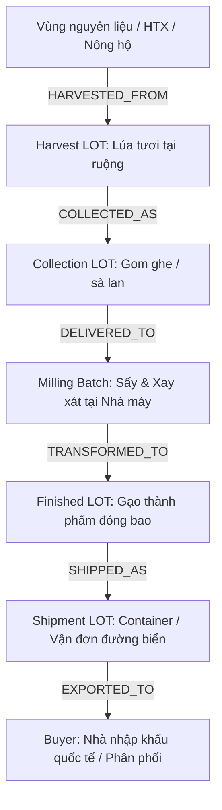
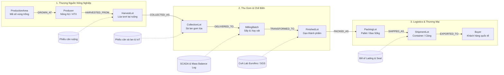
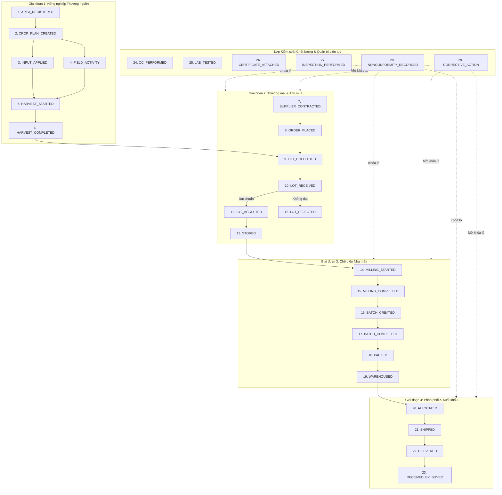
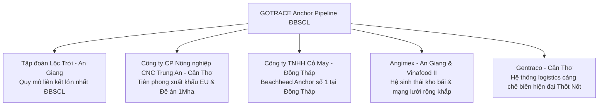
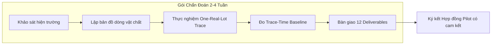
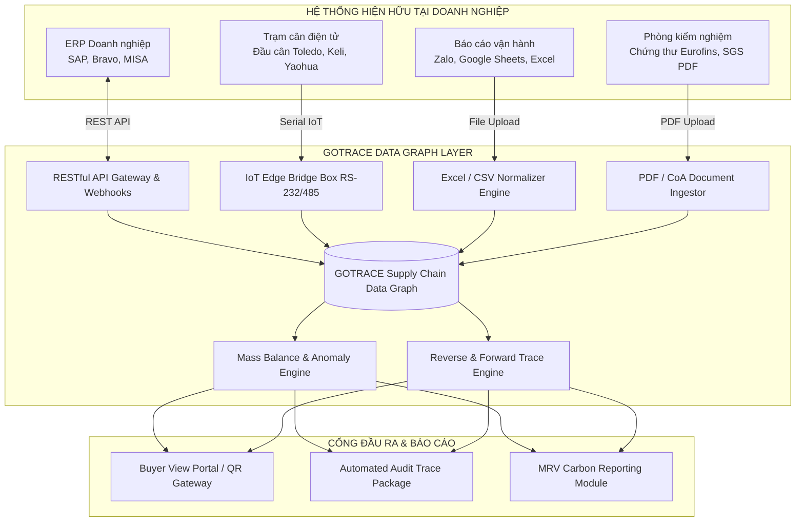
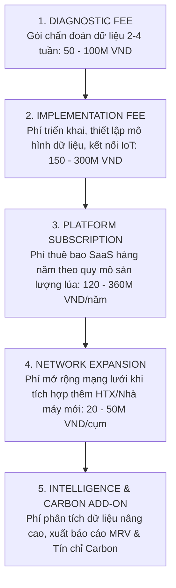
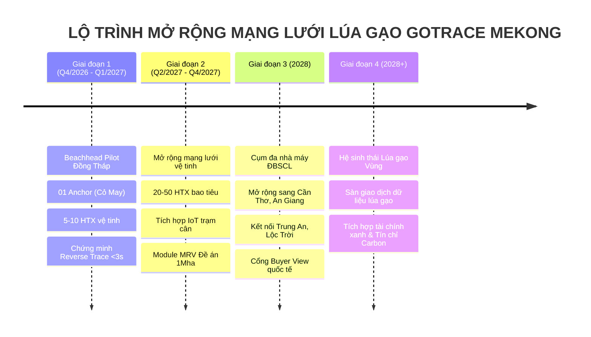
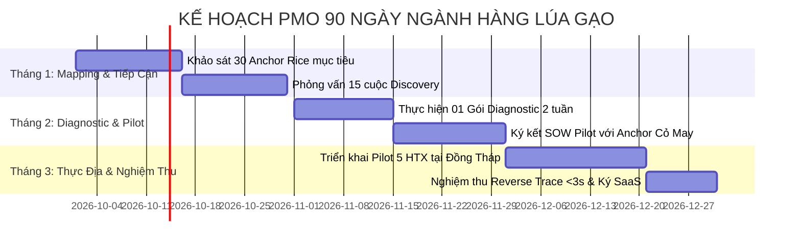

# 03_RICE PLAYBOOK — GOTRACE MEKONG
## Cẩm Nang Triển Khai Dữ Liệu Chuỗi Cung Ứng & Thâm Nhập Thị Trường Lúa Gạo ĐBSCL (Supply Chain Data Infrastructure & Go-To-Market Playbook)

**Phiên bản:** 2.0 (Master Unified Edition — 25/09/2026)  
**Tác giả:** GOTRACE Mekong Architecture & GTM Team  
**Thuộc bộ tài liệu:** [GOTRACE Mekong Strategy & Execution System 2026–2028](./00_MASTER_INDEX.md)  
**Dành cho:** Founder, BOD, PMO Lead, Head of Implementation, Solution Architects, Sales & Delivery Team tại ĐBSCL  
**Strategic Role:** Prove Network Scale — biến chuỗi cung ứng lúa gạo thẳng (Linear Supply Chain) thành Đồ thị Dữ liệu Chuỗi cung ứng (Supply Chain Data Graph) có thể liên kết, kiểm chứng pháp lý và nhân rộng quy mô lớn.

---

> [!NOTE]
> **Định Vị Chiến Lược Của Ngành Hàng Lúa Gạo:**
> Lúa gạo là ngành hàng chủ lực số 1 của Đồng bằng sông Cửu Long (ĐBSCL) với quy mô gieo trồng 3,875 triệu ha và sản lượng 24,63 triệu tấn/năm. Trong chiến lược 3 giai đoạn của GOTRACE Mekong, **Lúa gạo (Rice) đóng vai trò là "Beachhead Vertical" để chứng minh Quy mô Mạng lưới (Prove Network Scale) và tính chất phả hệ tuyến tính (Linear Genealogy)** trước khi mở rộng sang vertical Trái cây (độ phức tạp phân nhánh) và Bếp ăn tập thể (chuỗi hội tụ đa nguồn).
> 
> GOTRACE định vị là **Lớp hạ tầng dữ liệu liên kết (Supply Chain Data Infrastructure & Linkage Layer)**, kết nối xuyên suốt từ Vùng nguyên liệu $\rightarrow$ HTX/Nông hộ $\rightarrow$ Thương lái/Vận tải $\rightarrow$ Nhà máy sấy/xay xát $\rightarrow$ Kho thành phẩm $\rightarrow$ Cảng xuất khẩu $\rightarrow$ Khách hàng nhập khẩu (Buyer). **GOTRACE không thay thế ERP (SAP, Bravo, MISA), MES hay phần mềm kế toán hiện hữu**, mà đóng vai trò là xương sống kết nối dữ liệu liên tổ chức.

---

## 1. Vai Trò Chiến Lược & Mô Hình Tuyến Tính (Strategic Role & Linearity)

### 1.1 Tính chất Chuỗi Phả Hệ Tuyến Tính (Linear Genealogy)
Khác với chuỗi cung ứng trái cây phân nhánh phức tạp theo phẩm cấp (Grading) hay chuỗi bếp ăn hội tụ đa nguyên liệu (Convergence), chuỗi cung ứng lúa gạo sở hữu đặc tính **chuyển hóa tuyến tính đồng nhất từ thượng nguồn đến hạ nguồn**:



### 1.2 Chiến Lược Thâm Nhập Qua Anchor Enterprise (Anchor-Driven GTM)
- **Cơ chế tiếp cận:** Thay vì tiêu tốn nguồn lực bán lẻ cho hàng nghìn nông hộ hay hàng trăm Hợp tác xã (HTX) nhỏ lẻ có ngân sách hạn chế và trình độ số hóa không đồng đều, GOTRACE triển khai theo mô hình **Đầu kéo Doanh nghiệp Hạt nhân (Anchor Enterprise Model)**.
- **Dòng lan tỏa giá trị:** Tiếp cận Nhà máy chế biến gạo lớn hoặc Doanh nghiệp xuất khẩu $\rightarrow$ Kích hoạt mạng lưới 20–50 HTX bao tiêu vệ tinh $\rightarrow$ Số hóa hàng chục nghìn nông hộ $\rightarrow$ Xây dựng Đồ thị Dữ liệu Chuỗi cung ứng (Supply Chain Data Graph) bao phủ toàn vùng.
- **Công thức Giá trị Truy xuất Bắc Đẩu (North Star Metric):**
  $$\text{Verified Traceable LOT} = \text{Identity} + \text{Event} + \text{Relation} + \text{Evidence}$$
  Một Lô hàng chỉ được công nhận là "Traceable" khi hội tụ đủ 4 thành tố: Định danh duy nhất (GCI), Sự kiện vòng đời (Lifecycle Event), Mối quan hệ phả hệ (Genealogy Linkage), và Bằng chứng số hóa kiểm chứng được (Digital Evidence).

---

## 2. Bối Cảnh Thị Trường: Tại Sao Lúa Gạo? Tại Sao Bây Giờ? (Why Rice / Why Now)

Đồng bằng sông Cửu Long là vựa lúa lớn nhất cả nước, giữ vị thế sống còn đối với an ninh lương thực quốc gia và vị thế xuất khẩu nông sản của Việt Nam trên trường quốc tế:

### 2.1 Số Liệu Thực Tế Thị Trường Lúa Gạo ĐBSCL (Khảo Sát Thực Địa 2026)

| Chỉ số chỉ tiêu | Số liệu thực tế (Cập nhật 2026) | Cơ quan công bố / Nguồn kiểm chứng | Ý nghĩa chiến lược đối với GOTRACE |
|:---|:---:|:---|:---|
| **Diện tích gieo trồng toàn ĐBSCL** | **3.875.000 ha/năm** | Bộ Nông nghiệp & PTNT | Quy mô thị trường khổng lồ, bảo đảm dung lượng mở rộng mạng lưới |
| **Sản lượng lúa ĐBSCL** | **24,63 triệu tấn/năm** | Bộ NN&PTNT (Chiếm ~56% cả nước) | Khối lượng dữ liệu giao dịch vật chất cần số hóa cực lớn |
| **Tỷ trọng xuất khẩu gạo cả nước** | **~90% tổng kim ngạch XK** | Hiệp hội Lương thực Việt Nam (VFA) | Nhu cầu cấp bách về minh bạch nguồn gốc từ thị trường nhập khẩu |
| **Tỉnh Đồng Tháp (đến 20/8/2026)** | **530.677 ha gieo sạ** | Cục Thống kê tỉnh Đồng Tháp (2026) | Địa bàn Beachhead lý tưởng với diện tích canh tác tập trung cao |
| **Sản lượng lúa tỉnh Đồng Tháp** | **Ước đạt 2,58 triệu tấn** | Sở Nông nghiệp & PTNT Đồng Tháp | Sản lượng đủ lớn để nuôi sống 1 cụm hạ tầng dữ liệu chuỗi độc lập |
| **Thương nhân xuất khẩu gạo đủ điều kiện** | **158 doanh nghiệp** | Bộ Công Thương (Nghị định 107/CP) | Danh sách mục tiêu trực tiếp cho mô hình Anchor Enterprise |
| **Số HTX nông nghiệp tại Đồng Tháp** | **133 HTX lúa gạo liên kết** | Liên minh HTX tỉnh Đồng Tháp | Các Node dữ liệu cấp cơ sở sẵn sàng tham gia mạng lưới bao tiêu |
| **Đề án 1 triệu ha phát thải thấp** | **421.000 ha đã triển khai** | Bộ NN&PTNT / World Bank (8/2026) | Tạo động lực bắt buộc số hóa MRV và cơ hội bán tín chỉ carbon |

### 2.2 Ba Động Lực Thúc Đẩy Thị Trường Bùng Nổ (Market Triggers):

1. **Sức ép khắt khe từ thị trường nhập khẩu quốc tế:**
   - **Thị trường Liên minh Châu Âu (EU):** Hiệp định EVFTA yêu cầu truy xuất nguồn gốc chính xác đến từng lô hàng; kiểm soát gắt gao dư lượng hoạt chất bảo vệ thực vật (MRLs) như Tricyclazole, Chlorpyrifos, Difenoconazole với ngưỡng phát hiện cực thấp ($\le 0,01\text{ mg/kg}$).
   - **Thị trường Trung Quốc:** Lệnh 248 và 249 của Tổng cục Hải quan Trung Quốc (GACC) yêu cầu số hóa hồ sơ đăng ký doanh nghiệp sản xuất chế biến nước ngoài và minh bạch mã số vùng trồng (MSVT), cơ sở đóng gói; chuẩn bị triển khai mở rộng Lệnh 280 (giám sát nhật ký đồng ruộng trực tuyến).
   - **Thị trường Bắc Mỹ, Nhật Bản, Hàn Quốc:** Áp dụng hệ thống danh mục hoạt chất dương tính (Positive List System - PLS), đòi hỏi bằng chứng kiểm định độc lập (CoA) gắn liền với từng container gạo xuất bến.

2. **Áp lực chuyển đổi thể chế và quy định Nhà nước:**
   - Căn cứ **Quyết định 100/QĐ-TTg** của Thủ tướng Chính phủ và Thông tư của Bộ Nông nghiệp & PTNT: Hệ thống Cổng thông tin truy xuất nguồn gốc sản phẩm nông sản quốc gia mở rộng triển khai áp dụng bắt buộc đối với **ngành hàng lúa gạo từ ngày 01/07/2026**.
   - Doanh nghiệp không có hệ thống quản lý phả hệ lô hàng và dữ liệu canh tác số hóa sẽ đối mặt với nguy cơ bị từ chối cấp chứng thư xuất khẩu hoặc đình chỉ quyền sử dụng mã số vùng trồng xuất khẩu.

3. **Đề án 1 triệu héc-ta lúa chất lượng cao & phát thải thấp ĐBSCL:**
   - Phê duyệt theo **Quyết định số 1490/QĐ-TTg ngày 27/11/2023** của Thủ tướng Chính phủ. Tính đến tháng 8/2026, đã có **421.000 ha** triển khai thí điểm thực tế tại Đồng Tháp, Cần Thơ, An Giang, Kiên Giang.
   - Đề án quy định bắt buộc phải có hệ thống **Đo đạc, Báo cáo và Thẩm định (MRV - Measurement, Reporting, Verification)** nhật ký canh tác (tưới ngập khô xen kẽ AWD, giảm giống, giảm đạm, thu gom rơm rạ) để cấp chứng chỉ carbon và nhận chi trả tài chính xanh từ World Bank/TCAF ($\sim 20\text{ USD/tấn CO}_2\text{e}$).

> [!IMPORTANT]
> **Quy định 01/07/2026 & Đề án 1Mha biến Truy xuất Nguồn gốc từ "Chi phí tuân thủ phiền toái" thành "Điều kiện tiên quyết để tồn tại và mở ra dòng doanh thu tín chỉ Carbon mới".** Doanh nghiệp lúa gạo buộc phải hành động ngay trong năm 2026–2027.

---

## 3. Năm Giả Thuyết Chiến Lược (Strategic Hypotheses: H1 – H5)

* **H1 (Wedge Hypothesis — Mũi khoan Anchor Enterprise):** Tiếp cận thông qua các Doanh nghiệp Đầu mối / Nhà máy xay xát xuất khẩu khả thi và hiệu quả hơn gấp nhiều lần so với việc chào bán phần mềm trực tiếp cho hàng nghìn nông hộ hay HTX. Doanh nghiệp chế biến có quyền lực kinh tế để kéo các HTX vệ tinh vào nền tảng thông qua hợp đồng bao tiêu lúa.
* **H2 (Unit of Truth — LOT là đơn vị chân lý):** **Lô hàng (LOT)** là đơn vị nghiệp vụ cốt lõi xuyên suốt chuỗi cung ứng, không phải con tem QR hay hình thức bao bì. Mã QR dán trên túi gạo chỉ là cổng truy cập (Pointer); giá trị cốt lõi nằm ở đồ thị dữ liệu của Lô hàng (LOT Graph) nằm đằng sau mã QR đó.
* **H3 (Value Hypothesis — Bằng chứng số hóa tạo ra giá trị kinh tế):** **Evidence (Bằng chứng số hóa)** tạo ra giá trị kinh tế trực tiếp cho truy xuất nguồn gốc (giúp lô hàng thông quan nhanh, vượt qua các đợt audit của khách hàng EU/Mỹ, đối soát sản lượng chính xác, giải ngân tín dụng ngân hàng dựa trên hợp đồng bao tiêu).
* **H4 (Scale Metric — Đòn bẩy mạng lưới quan trọng hơn hợp đồng đơn lẻ):** **Network Leverage** (đo bằng tổng diện tích vùng trồng, số lượng HTX liên kết và sản lượng lúa quy đổi chạy trên GOTRACE Data Graph) quyết định vị thế độc quyền tự nhiên của nền tảng, quan trọng hơn chỉ số doanh thu phần mềm đơn lẻ trong giai đoạn đầu.
* **H5 (Sequencing — Trình tự triển khai chuẩn xác):** Module Carbon / MRV là **lớp giá trị gia tăng (Extension Add-on)** được kích hoạt trên nền tảng dữ liệu phả hệ vững chắc ở Pha 2. Tuyệt đối không bao giờ dùng câu chuyện Carbon làm mũi nhọn bán hàng sơ khởi, vì khách hàng sẽ nghi ngờ tính khả thi nếu chưa giải quyết được bài toán đối soát khối lượng và truy xuất lô hàng.

---

## 4. Cấu Trúc Đồ Thị Chuỗi Lúa Gạo & Sơ Đồ Tô-Pô (Rice Chain & Graph Topology)

Mối quan hệ giữa các thực thể vật lý và thực thể dữ liệu trong chuỗi lúa gạo được mô hình hóa theo cấu trúc đồ thị có hướng (Directed Acyclic Graph - DAG):



### Các Lớp Thực Thể Bổ Trợ Xuyên Suốt (Cross-Cutting Support Entities):
1. **Thực thể Định danh & Pháp lý (Identity & Compliance):** Mã số vùng trồng (Growing Area Code do Cục BVTV cấp), Giấy chứng nhận đủ điều kiện an toàn thực phẩm, Giấy chứng nhận tiêu chuẩn quốc tế (VietGAP, GlobalGAP, SRP, Halal, Kosher).
2. **Thực thể Kiểm định Chất lượng (Quality & Laboratory):** Phiếu kiểm nghiệm dư lượng thuốc BVTV, biên bản kiểm tra độ ẩm (Kett tester), phiếu kiểm tra tỷ lệ tấm, độ bạc bụng, tạp chất và kiểm dịch côn trùng sống.
3. **Thực thể Vận tải & Logistics:** Vận đơn sà lan đường thủy nội địa, số hiệu phương tiện ghe cào/sà lan, phiếu cân điện tử trạm cân đầu vào/đầu ra, biên bản kẹp chì hải quan (Container Seal Record).

---

## 5. Mô Hình Dữ Liệu Nền Tảng (Core Data Model)

Kế thừa chuẩn kiến trúc đối tượng từ `./02_Platform_Object_Implementation_Blueprint.md`, dữ liệu chuỗi lúa gạo được chuẩn hóa thành 4 nhóm đối tượng chính:

### 5.1 Identity Objects (Đối tượng Định danh)
- `Organization`: Doanh nghiệp xuất khẩu lúa gạo, Nhà máy xay xát, Hợp tác xã nông nghiệp, Đại lý/Thương lái thu mua lúa, Đơn vị vận tải sà lan, Phòng lab kiểm nghiệm độc lập (Eurofins, SGS).
- `Site / Facility`: Nhà máy chế biến gạo, Kho lúa tươi trung chuyển, Cụm silo sấy tháp, Kho bảo quản gạo thành phẩm, Cầu cảng bốc dỡ đường thủy.
- `ProductionArea`: Vùng sản xuất lúa, Cánh đồng mẫu lớn, Mã số vùng trồng (MSVT) được Cục Trồng trọt & Cục BVTV phê duyệt kèm tọa độ ranh giới GIS Polygon.

### 5.2 Product Objects (Đối tượng Hàng hóa)
- `Crop`: Lúa nước (`Oryza sativa L.`).
- `Variety`: Danh mục giống lúa thuần và lúa thơm chất lượng cao ĐBSCL: ST24, ST25, Đài Thơm 8 (DT8), OM18, OM5451, Jasmine 85, Nàng Hoa 9, IR50404.
- `Product / SKU`: Gạo trắng xuất khẩu 5% tấm, Gạo thơm đóng túi 5kg bán lẻ, Gạo đồ (Parboiled Rice), Gạo lứt huyết rồng hữu cơ, Tấm thơm, Cám gạo tươi trích ly dầu, Trấu nghiền viên nén sinh khối (Biomass Pellet).

### 5.3 LOT Objects (Đối tượng Lô hàng — Đơn vị Chân lý)
- `HarvestLot`: Lô lúa tươi thu hoạch tại một mảnh ruộng cụ thể trong ngày của từng hộ nông dân, gắn với phiếu cân ruộng và độ ẩm ban đầu ($22\% - 28\%$).
- `CollectionLot`: Lô lúa gom trên ghe hoặc sà lan của thương lái hoặc HTX, vận chuyển trên mạng lưới sông rạch ĐBSCL về bến cảng nhà máy.
- `MillingBatch`: Mẻ sản xuất tích hợp công đoạn Sấy lúa khô (về độ ẩm chuẩn $14.0\%$) và công đoạn Xay xát, bóc vỏ trấu, xát trắng, lau bóng và tách màu vi tính.
- `FinishedLot`: Lô gạo thành phẩm hoàn chỉnh đồng nhất về quy cách phẩm cấp, đóng gói vào bao (5kg, 10kg, 25kg, 50kg hoặc Jumbo 1 tấn), mang mã số định danh duy nhất (GCI).
- `ShipmentLot`: Lô hàng xuất kho gắn với số seal chì container hoặc boong sà lan xuất bến đi cảng Cát Lái / Cái Mép.

### 5.4 Chu Trình Chuyển Đổi Trạng Thái Lô Hàng (State Transition Lifecycle)
$$\text{PLANNED} \xrightarrow{\text{Sạ lúa}} \text{GROWING} \xrightarrow{\text{Gặt}} \text{HARVESTED} \xrightarrow{\text{Gom sà lan}} \text{IN\_TRANSIT} \xrightarrow{\text{Cân cảng}} \text{RECEIVED} \xrightarrow{\text{KCS duyệt}} \text{ACCEPTED} \xrightarrow{\text{Sấy \& Xát}} \text{PROCESSED} \xrightarrow{\text{Đóng bao}} \text{PACKED} \xrightarrow{\text{Xuất kho}} \text{SHIPPED} \xrightarrow{\text{Giao cảng}} \text{DELIVERED}$$

---

## 6. Bảng Ánh Xạ Đầy Đủ 29 Canonical Events (The 29 Canonical Rice Events)

Mọi biến cố vật chất và giao dịch nghiệp vụ trong chuỗi lúa gạo được chuẩn hóa thành **29 Canonical Events** với đầy đủ 9 thuộc tính kỹ thuật vận hành:

| # | Mã sự kiện (Event Code) | Tên sự kiện | Lifecycle Phase | Trigger (Điều kiện kích hoạt) | Tác nhân thực thi (Primary Actor) | Thực thể đầu vào (Inputs) | Thực thể đầu ra (Outputs) | Bằng chứng kiểm chứng (Level) | Quy tắc nghiệp vụ & Ràng buộc (Business Rules) |
|:---:|:---|:---|:---|:---|:---|:---|:---|:---|:---|
| 1 | `AREA_REGISTERED` | Đăng ký & cấp mã số vùng trồng | Upstream / Land | Vùng trồng được phê duyệt hồ sơ hoặc đo đạc ranh giới | Cục BVTV / Chi cục Trồng trọt | Giấy đề nghị, Bản đồ giải thửa địa chính | `ProductionArea` (MSVT) | Quyết định cấp MSVT, Bản đồ GIS Polygon tọa độ (L3) | Tọa độ GPS không được trùng lấn; diện tích tối thiểu $\ge 10$ ha đối với lúa |
| 2 | `CROP_PLAN_CREATED` | Khởi tạo kế hoạch sản xuất mùa vụ | Upstream / Field | Bắt đầu thời vụ gieo sạ (Đông Xuân, Hè Thu, Thu Đông) | Chủ nhiệm HTX / Kỹ sư vùng nguyên liệu | `ProductionArea` | `CropPlan` | Hợp đồng liên kết bao tiêu, Lịch thời vụ ngành nông nghiệp (L2) | Giống lúa phải nằm trong danh mục Bộ NN&PTNT; tuân thủ lịch gieo sạ "né rầy" |
| 3 | `INPUT_APPLIED` | Ghi nhận sử dụng phân bón, thuốc BVTV | Upstream / Field | Nông dân tiến hành bón phân, phun thuốc trên ruộng | Nông hộ / Thư ký HTX / Cán bộ kỹ thuật | `CropPlan`, Phân bón, Thuốc BVTV | `FieldActivityLog` | Hóa đơn mua vật tư, Ảnh chụp bao bì, Vỏ bao gói thuốc BVTV (L2) | Thuốc BVTV phải thuộc danh mục được phép sử dụng; tuân thủ thời gian cách ly (PHI $\ge 14$ ngày) |
| 4 | `FIELD_ACTIVITY` | Ghi nhận canh tác đồng ruộng & tưới tiêu | Upstream / Field | Bơm nước, rút nước AWD, làm cỏ, giám sát sâu rầy | Nông hộ / Cán bộ khuyến nông địa phương | `CropPlan` | `ActivityRecord` | Nhật ký canh tác đồng ruộng, Ảnh chụp mực nước ống đo AWD (L2) | Ghi nhận mực nước ống đo định kỳ 5 ngày/lần phục vụ tính toán MRV carbon |
| 5 | `HARVEST_STARTED` | Khởi động thu hoạch lúa tại ruộng | Harvesting | Máy gặt đập liên hợp bắt đầu cắt lúa trên mảnh ruộng | Đại diện Ban Quản trị HTX / Trưởng ấp | `CropPlan`, Máy gặt đập | `HarvestSession` | Thông báo thu hoạch, Biên bản giám sát độ chín hạt lúa (L1) | Độ chín sinh lý hạt lúa phải đạt $\ge 85\%$; độ ẩm lúa tươi ngoài đồng $20\% - 26\%$ |
| 6 | `HARVEST_COMPLETED` | Hoàn thành thu hoạch lô lúa tại ruộng | Harvesting | Máy gặt hoàn tất cắt lúa trên toàn bộ thửa ruộng | Nông hộ + KCS Anchor / Giám sát viên | `HarvestSession` | `HarvestLot` | Phiếu cân tại bờ ruộng, Biên bản xác nhận sản lượng từng hộ (L2) | Sản lượng thực tế không được vượt quá $120\%$ năng suất dự kiến của vùng trồng |
| 7 | `SUPPLIER_CONTRACTED` | Ký kết hợp đồng bao tiêu lúa mùa vụ | Commercial / Sourcing | Anchor và HTX thống nhất điều khoản giá sàn và tiêu chuẩn | Giám đốc Thu mua Anchor + Chủ nhiệm HTX | Hồ sơ pháp lý HTX, Phương án mùa vụ | `Contract` | Hợp đồng bao tiêu có chữ ký số hoặc đóng dấu đỏ 2 bên (L2/L3) | Ràng buộc tiêu chuẩn chất lượng (độ thuần giống $\ge 98\%$, không dư lượng cấm) |
| 8 | `ORDER_PLACED` | Phát lệnh điều động thu mua & bốc xếp | Commercial / Sourcing | Lúa chín đồng loạt, Anchor phát lệnh điều ghe/sà lan | Điều độ Thu mua Anchor | `Contract`, `HarvestLot` | `PurchaseOrder` | Lệnh điều động phương tiện vận tải thủy (L2) | Khối lượng lệnh đặt mua phải khớp với tiến độ gặt thực tế của các HTX |
| 9 | `LOT_COLLECTED` | Gom lúa lên ghe / sà lan trung chuyển | Aggregation | Lúa tươi đóng bao từ các ruộng được bốc lên sà lan gom | Đại diện HTX / Thương lái liên kết | Nhiều `HarvestLot` | `CollectionLot` | Phiếu bốc xếp hàng, Bảng kê danh sách nông hộ giao lúa (L2) | Các `HarvestLot` gộp chung trên 1 khoang sà lan phải cùng 1 giống lúa và cùng ngày cắt |
| 10 | `LOT_RECEIVED` | Tiếp nhận sà lan lúa tại cảng nhà máy | Plant Receiving | Sà lan cập cầu cảng nhà máy, tiến hành cân tổng | KCS Cổng cảng + Quản đốc Cảng | `CollectionLot`, Sà lan | `ReceivingRecord` | Phiếu cân điện tử tổng đầu cân trạm kết nối tự động (L3) | Đo độ ẩm lúa tươi sơ bộ ($22\% - 28\%$) và kiểm tra nhanh mùi hấp hơi |
| 11 | `LOT_ACCEPTED` | KCS kiểm định đạt chuẩn nhập lò sấy | Plant Receiving | Mẫu thử đạt tiêu chuẩn kỹ thuật tiếp nhận nhà máy | Trưởng phòng KCS Nhà máy | `ReceivingRecord`, Mẫu lúa | `AcceptedLot` | Phiếu phân tích nhanh KCS (độ ẩm, hạt vàng, hạt xanh, tạp chất) (L2) | Chuyển trạng thái lô sang sẵn sàng nạp vào tháp sấy; khóa van tiếp nhận nếu lỗi |
| 12 | `LOT_REJECTED` | Từ chối tiếp nhận lô lúa không đạt chuẩn | Plant Receiving | Lúa bị chua, hấp hơi, nảy mầm hoặc lẫn tạp giống | Trưởng phòng KCS Nhà máy | `ReceivingRecord`, Mẫu lúa | `RejectionRecord` | Biên bản từ chối tiếp nhận có chữ ký đại diện 2 bên, Ảnh chụp mẫu (L2) | Khóa cứng trạng thái lô hàng trên hệ thống; cấm xả lúa vào phễu tiếp nhận |
| 13 | `STORED` | Lưu kho đệm lúa tươi hoặc nhập Silo lúa khô | Storage / Silo | Lúa tươi vào bồ chứa đệm hoặc lúa khô vào Silo bảo quản | Thủ kho Silo | `AcceptedLot` / `MilledLot` | `StorageEvent` | Thẻ kho điện tử, Tọa độ bin/silo lưu trữ trong WMS (L2) | Giám sát nhiệt độ và độ ẩm silo định kỳ; thời gian lưu lúa tươi trước sấy $\le 24\text{h}$ |
| 14 | `MILLING_STARTED` | Nạp lúa khô vào dây chuyền xay xát | Processing / Mill | Nạp lúa khô từ silo vào phễu bóc vỏ trấu, xát trắng | Quản đốc Phân xưởng Xay xát | `CollectionLot` (đã sấy khô) | `MillingProcess` | Nhật ký vận hành ca sản xuất, Lệnh sản xuất MES/ERP (L2) | Lúa nạp máy xay xát bắt buộc phải đạt độ ẩm tiêu chuẩn $14,0\% \pm 0,5\%$ |
| 15 | `MILLING_COMPLETED` | Hoàn tất xát trắng, lau bóng, tách màu | Processing / Mill | Kết thúc mẻ xát, ra gạo xô nguyên liệu và phụ phẩm | Quản đốc Phân xưởng | `MillingProcess` | Gạo xô, Cám, Trấu, Tấm | Phiếu cân thành phẩm đầu ra, Báo cáo cân bằng Mass Balance (L3) | Tỷ lệ thu hồi gạo tổng phải nằm trong khoảng quy chuẩn TCVN $64,0\% - 70,5\%$ |
| 16 | `BATCH_CREATED` | Khởi tạo mẻ phối trộn, đánh bóng thành phẩm | Processing / Blend | Lập kế hoạch phối trộn tỷ lệ tấm theo đơn đặt hàng | Trưởng ca Chế biến | Các lô gạo xô, Tấm | `ProcessingBatch` | Công thức phối trộn (BOM), Phiếu xuất kho gạo xô nguyên liệu (L2) | Định mức phối trộn tỷ lệ tấm ($5\%, 10\%, 25\%$) đúng hợp đồng ngoại thương |
| 17 | `BATCH_COMPLETED` | Hoàn thành mẻ chế biến gạo thành phẩm | Processing / Blend | Hoàn tất đánh bóng vi tính, tách kim loại và sạn từ | Trưởng ca Chế biến | `ProcessingBatch` | Gạo thành phẩm quy chuẩn | Phiếu phân tích KCS mẻ thành phẩm (độ ẩm, độ bóng, độ trắng, côn trùng) (L2) | Đạt chuẩn an toàn vệ sinh thực phẩm và thông số kỹ thuật đơn hàng xuất khẩu |
| 18 | `PACKED` | Đóng gói bao bì & dán nhãn định danh GCI | Packaging | Đóng gạo vào bao (5kg, 10kg, 25kg, 50kg, bao Jumbo) | Tổ trưởng Đóng gói | Gạo thành phẩm, Bao bì | `FinishedLot` | Nhật ký đóng gói, Số serial nhãn barcode GS1, Phiếu kiểm cân bao (L2) | Mỗi bao/pallet được định danh duy nhất (GCI), gắn QR truy xuất nguồn gốc |
| 19 | `WAREHOUSED` | Nhập kho lưu trữ gạo thành phẩm | Warehouse | Bốc xếp pallet lên ô kệ tiêu chuẩn kho mát/kho khô | Thủ kho Thành phẩm | `FinishedLot` | `WarehouseRecord` | Phiếu nhập kho thành phẩm, Sơ đồ định vị ô kệ trên hệ thống WMS (L2) | Kho phải đạt chuẩn ISO 22000/HACCP, kiểm soát thông gió và động vật gây hại |
| 20 | `ALLOCATED` | Điều độ phân bổ lô gạo cho hợp đồng bán | Order Fulfillment | Gán lô gạo thành phẩm cho hợp đồng xuất khẩu cụ thể | Điều độ Bán hàng / Logistics | `FinishedLot`, Hợp đồng bán | `AllocationRecord` | Lệnh xuất kho bán hàng (Pick List / Allocation Order) (L2) | Kiểm tra hạn sử dụng còn lại và cam kết tiêu chuẩn kỹ thuật với người mua |
| 21 | `SHIPPED` | Bốc xếp hàng lên container / sà lan xuất cảng | Logistics / Dispatch | Bốc hàng lên xe container hoặc sà lan đi cảng quốc tế | Đơn vị Giao nhận / Kho vận | `FinishedLot`, Container/Sà lan | `ShipmentLot` | Vận đơn đường biển (B/L), Biên bản niêm phong kẹp chì (Seal Record) (L3) | Số container và số kẹp chì niêm phong phải được đối soát khớp 100% |
| 22 | `DELIVERED` | Hàng cập cảng đến hoặc kho trung tâm Buyer | Logistics / Transit | Hàng đến cảng đích quốc tế (Manila, Jakarta, Rotterdam) | Đơn vị Vận tải / Hãng tàu | `ShipmentLot` | `DeliveryRecord` | Biên bản giao nhận tại cảng đến, Giấy báo nhận hàng (Notice of Arrival) (L2) | Ghi nhận thời gian cập bến và tình trạng nguyên vẹn của niêm phong kẹp chì |
| 23 | `RECEIVED_BY_BUYER` | Khách hàng mở container kiểm tra & nghiệm thu | Customer Acceptance | Buyer hoàn tất dỡ hàng, kiểm tra cảm quan và ký nhận | Đại diện Người mua (Importer) | `ShipmentLot` | `AcceptanceRecord` | Phiếu nghiệm thu thương mại (Commercial Acceptance Certificate) (L2/L3) | Kích hoạt trạng thái hoàn tất vòng đời truy xuất nguồn gốc của lô hàng |
| 24 | `QC_PERFORMED` | Lấy mẫu kiểm tra chỉ tiêu cơ lý nội bộ | Quality Control | Lấy mẫu đo độ ẩm, độ lẫn, tỷ lệ bạc bụng định kỳ | KCS Phân xưởng / Lab Nhà máy | Mẫu lúa tươi / Mẫu gạo | `QC_Report` | Phiếu kết quả đo độ ẩm bằng máy điện dung Kett, tỷ lệ tấm máy sàng (L2) | Thực hiện theo tần suất quy chuẩn trong kế hoạch kiểm soát HACCP |
| 25 | `LAB_TESTED` | Kiểm nghiệm độc lập dư lượng thuốc BVTV | Quality Assurance | Gửi mẫu sang đơn vị kiểm định độc lập quốc tế | Phòng Lab bên thứ ba (Eurofins, SGS, VinaControl) | Mẫu lúa thu hoạch / Mẫu gạo TP | `LabCertificate` | Chứng thư phân tích (CoA - Certificate of Analysis) có chữ ký số (L3) | Dư lượng hoạt chất cấm phải ở mức Không phát hiện (ND - Not Detected) |
| 26 | `CERTIFICATE_ATTACHED` | Đính kèm chứng nhận chất lượng vào lô hàng | Compliance | Cập nhật chứng chỉ tiêu chuẩn vào hồ sơ điện tử | Trưởng phòng QA / Pháp chế | `FinishedLot`, `ProductionArea` | `CompliancePackage` | Bản sao số hóa chứng nhận VietGAP, GlobalGAP, SRP, Halal, HACCP còn hạn (L3) | Chứng chỉ phải còn đầy đủ hiệu lực pháp lý tại thời điểm sản xuất lô hàng |
| 27 | `INSPECTION_PERFORMED` | Thanh kiểm tra của cơ quan chuyên ngành | Governance | Cơ quan Nhà nước hoặc tổ chức chứng nhận đánh giá | Đoàn thanh tra chuyên ngành | Nhà máy, Kho, Vùng trồng | `AuditReport` | Biên bản thanh tra, Kết luận đánh giá sự phù hợp định kỳ (L3) | Ghi nhận các điểm không phù hợp (nếu có) để đưa vào hành động khắc phục |
| 28 | `NONCONFORMITY_RECORDED` | Ghi nhận sai lỗi hoặc sự cố kỹ thuật | Governance / Issue | Phát hiện sự cố sai lệch chất lượng, ẩm độ hoặc bao rách | KCS / Thủ kho / Điều độ viên | Bất kỳ thực thể lô nào | `NC_Record` | Phiếu ghi nhận sự không phù hợp (NCR - Non-Conformance Report) (L2) | Tự động kích hoạt cờ cảnh báo (Flag), phong tỏa lô hàng trên hệ thống |
| 29 | `CORRECTIVE_ACTION` | Thực hiện và nghiệm thu biện pháp khắc phục | Governance / Resolution | Triển khai xử lý lỗi (sấy lại, tách màu lại, hạ cấp, hủy) | Giám đốc Nhà máy / Trưởng ban QA | `NC_Record`, Lô bị lỗi | `CAR_Record` | Biên bản nghiệm thu hành động khắc phục (CAR Closeout Report) (L2/L3) | Xác nhận lô hàng đã được xử lý đạt chuẩn hoặc chuyển đổi mục đích sử dụng |



---

## 7. Mô Hình Toán Học Cân Bằng Khối Lượng (Mass Balance Formulation) & Chống Gian Lận Pha Trộn

Trong ngành lúa gạo, gian lận thương mại thường diễn ra dưới hình thức: **"Mượn mã vùng trồng"** (mua lúa trôi nổi giá rẻ ngoài vùng quy hoạch rồi trộn vào lô gạo đạt chứng nhận xuất khẩu) hoặc **"Khai khống tỷ lệ thu hồi"**. GOTRACE thiết lập mô hình toán học cân bằng vật chất nghiêm ngặt để phát hiện tự động các điểm bất thường.

### 7.1 Phương Trình Bảo Toàn Vật Chất Tổng Thể
Tổng khối lượng vật chất nạp vào hệ thống chế biến phải bằng tổng sản phẩm đầu ra cộng hao hụt chuyển hóa:
$$M_{\text{input}} = M_{\text{paddy\_fresh}} = M_{\text{dry\_paddy}} + \Delta M_{\text{moisture\_evaporation}} + \Delta M_{\text{handling\_loss}}$$

### 7.2 Phương Trình Hiệu Chỉnh Độ Ẩm Khi Sấy Lúa Tươi Về Lúa Khô Tiêu Chuẩn 14%
Lúa tươi từ ruộng cắt bằng máy gặt đập có độ ẩm thực tế $W_{\text{fresh}}$ dao động từ $20\% - 26\%$ (tùy thời tiết ngày gặt). Nhà máy phải sấy lúa về độ ẩm tiêu chuẩn bảo quản $W_{\text{standard}} = 14,0\%$ trước khi đưa vào silo hoặc xay xát.

Khối lượng lúa khô tiêu chuẩn thu được sau sấy ($M_{\text{dry}}$) được tính theo phương trình cân bằng hàm lượng chất khô (Dry Matter Conservation):
$$M_{\text{dry}} = M_{\text{fresh}} \times \left( \frac{100 - W_{\text{fresh}}}{100 - W_{\text{standard}}} \right) \times (1 - L_{\text{loss}})$$

*Trong đó:*
- $M_{\text{fresh}}$: Khối lượng lúa tươi nạp vào lò sấy ($\text{kg}$ hoặc tấn), đo bằng phiếu cân điện tử trạm tiếp nhận.
- $W_{\text{fresh}}$: Độ ẩm lúa tươi ban đầu ($\%$, đo bằng máy đo độ ẩm điện dung Kett PM-450).
- $W_{\text{standard}}$: Độ ẩm chuẩn của lúa khô ($14,0\% \pm 0,5\%$).
- $L_{\text{loss}}$: Tỷ lệ hao hụt cơ học qua hệ thống sàng tạp chất, gàu tải và bụi trấu bay trong tháp sấy ($0,3\% - 0,5\%$, tương đương hệ số $0,003 - 0,005$).

> [!TIP]
> **Ví dụ tính toán thực tế tại Nhà máy Cỏ May (Đồng Tháp):**  
> Tiếp nhận một lô lúa tươi OM18 có khối lượng $M_{\text{fresh}} = 60.000\text{ kg}$, độ ẩm đo được $W_{\text{fresh}} = 24,2\%$. Định mức hao hụt cơ học của hệ thống sấy tháp là $L_{\text{loss}} = 0,4\%$.  
> Sau khi sấy về độ ẩm tiêu chuẩn $14,0\%$, khối lượng lúa khô danh định phải thu được là:
> $$M_{\text{dry}} = 60.000 \times \left( \frac{100 - 24,2}{100 - 14,0} \right) \times (1 - 0,004) = 60.000 \times \frac{75,8}{86,0} \times 0,996 = 52.668,8\text{ kg}$$
> Nếu phiếu cân lúa khô sau sấy sai lệch vượt quá $\pm 1,5\%$ so với giá trị này, hệ thống sẽ tự động kích hoạt cảnh báo bất thường!

### 7.3 Phương Trình Chuyển Hóa Xay Xát & Định Mức Thu Hồi Theo Tiêu Chuẩn TCVN 5644:2008
Khi nạp lúa khô ($M_{\text{dry}}$) vào cối xay, hạt thóc được bóc vỏ trấu, xát trắng lớp cám và đánh bóng, phân tách thành các dòng sản phẩm:
$$M_{\text{dry}} = M_{\text{head\_rice}} + M_{\text{broken\_rice}} + M_{\text{bran}} + M_{\text{husk}} + M_{\text{process\_loss}}$$

**Bảng định mức tỷ lệ thu hồi chuẩn ngành lúa gạo ĐBSCL (TCVN 5644:2008 & Tiêu chuẩn xuất khẩu VFA):**

| Cấu phần dòng sản phẩm | Ký hiệu | Tỷ lệ phần trăm chuẩn (% theo lúa khô) | Biên độ kiểm soát bất thường (Tolerance) |
|:---|:---:|:---:|:---:|
| **Gạo nguyên hạt (Head Rice)** | $Y_{\text{head}}$ | **$50,0\% - 58,0\%$** | Cảnh báo nứt hạt nếu $<48\%$ |
| **Tấm (Broken Rice)** | $Y_{\text{broken}}$ | **$8,0\% - 10,0\%$** (hoặc $10-15\%$ tùy giống) | Cảnh báo gãy hạt nếu $>16\%$ |
| **Tổng tỷ lệ thu hồi gạo (Gạo TP + Tấm)** | $Y_{\text{total}}$ | **$66,0\% - 70,0\%$** (ngưỡng TCVN: $64,0\% - 70,5\%$) | **$>71\%$: Nghi vấn trộn gạo ngoài!**<br>**$<62\%$: Nghi vấn thất thoát!** |
| **Cám gạo tươi (Rice Bran)** | $Y_{\text{bran}}$ | **$9,0\% - 11,0\%$** | Dao động theo độ bóng của hạt |
| **Vỏ trấu (Rice Husk)** | $Y_{\text{husk}}$ | **$18,0\% - 20,0\%$** (tối đa $22\%$) | Chuẩn giải phẫu vỏ trấu hạt lúa |
| **Hao hụt bay bụi & tạp chất bóc tách** | $Y_{\text{loss}}$ | **$\le 1,5\%$** | Vượt $1,5\%$ báo lỗi cân đo |

### 7.4 Thuật Toán Phân Bổ Phả Hệ Tỷ Lệ (Proportional Ancestry Allocation)
Trong thực tế tại các nhà máy quy mô lớn ở ĐBSCL, một mẻ xay xát công suất $100 - 300\text{ tấn/ngày}$ không bao giờ chỉ lấy lúa từ một nông hộ duy nhất. Nhà máy bắt buộc phải gom lúa từ $K$ lô thu gom ($C_1, C_2, \dots, C_K$) với khối lượng khô tương ứng $m_1, m_2, \dots, m_K$ thành một Mẻ chế biến $B$ có tổng khối lượng $M_B = \sum_{i=1}^K m_i$.

Khi đó, mọi Lô gạo thành phẩm $F_j$ xuất xưởng từ mẻ $B$ sẽ kế thừa tỷ trọng phả hệ chính xác theo công thức phân bổ tỷ lệ:
$$w_i = \frac{m_i}{M_B} \quad \text{với } \sum_{i=1}^K w_i = 1,0$$

Khối lượng gạo thành phẩm $F_j$ (khối lượng $Q_{F}$) có nguồn gốc phả hệ kế thừa từ Lô thu gom $C_i$ là:
$$Q_{F \leftarrow C_i} = Q_{F} \times w_i$$

*Ý nghĩa an toàn thực phẩm & kiểm dịch:* Khi cơ quan hải quan nước nhập khẩu phát hiện container gạo xuất khẩu mang mã $F_j$ bị nhiễm dư lượng thuốc BVTV, hệ thống GOTRACE lập tức truy xuất ngược và chỉ ra chính xác: Lô hàng này chứa $w_i \times 100\%$ khối lượng bắt nguồn từ HTX A (Lô $C_i$), giúp doanh nghiệp cô lập đúng vùng trồng vi phạm mà không bị đối tác phạt hợp đồng toàn bộ lô hàng.

### 7.5 Mã Nguồn Python Mẫu: Động Cơ Kiểm Soát Mass Balance & Anomaly Detection

```python
"""
GOTRACE Rice Mass Balance & Anomaly Detection Engine
Chuẩn hóa theo TCVN 5644:2008 & Tiêu chuẩn xuất khẩu gạo ĐBSCL
"""
from typing import Dict, List, Any

def evaluate_rice_mass_balance(
    dry_paddy_kg: float,
    head_rice_kg: float,
    broken_rice_kg: float,
    bran_kg: float,
    husk_kg: float,
    loss_kg: float
) -> Dict[str, Any]:
    """
    Kiểm tra cân bằng vật chất mẻ xay xát lúa gạo và phát hiện gian lận pha trộn.
    """
    total_output = head_rice_kg + broken_rice_kg + bran_kg + husk_kg + loss_kg
    balance_delta_pct = abs(total_output - dry_paddy_kg) / dry_paddy_kg * 100.0
    total_rice_yield_pct = (head_rice_kg + broken_rice_kg) / dry_paddy_kg * 100.0
    broken_rate_pct = broken_rice_kg / (head_rice_kg + broken_rice_kg) * 100.0

    flags: List[str] = []

    # Quy tắc 1: Bảo toàn khối lượng vào-ra (Dung sai tối đa 1.5%)
    if balance_delta_pct > 1.5:
        flags.append(
            f"MASS_UNBALANCED_ERROR: Chenh lech vao-ra {balance_delta_pct:.2f}% vuot nguong 1.5%!"
        )

    # Quy tắc 2: Tỷ lệ thu hồi gạo bất thường (Dấu hiệu gian lận pha trộn lúa ngoài)
    if total_rice_yield_pct > 70.5:
        flags.append(
            f"HIGH_YIELD_FRAUD_SUSPECT: Ty le thu hoi gao {total_rice_yield_pct:.2f}% > 70.5%! "
            "Nghi van gian lan tron gao ngoai vung khong ro nguon goc."
        )
    elif total_rice_yield_pct < 62.0:
        flags.append(
            f"LOW_YIELD_PILFERAGE_SUSPECT: Ty le thu hoi gao {total_rice_yield_pct:.2f}% < 62.0%! "
            "Nghi van that thoat nguyen lieu hoac lua bi lem lep hat qua cao."
        )

    # Quy tắc 3: Tỷ lệ tấm bất thường (Sự cố kỹ thuật sấy hoặc máy xát)
    if broken_rate_pct > 20.0:
        flags.append(
            f"EXCESSIVE_BROKEN_SPIKE: Ty le tam trong gao {broken_rate_pct:.2f}% > 20.0%! "
            "Canh bao lua say qua nhiet gay gion hat hoac da xat can chinh lech."
        )

    return {
        "status": "FLAGGED" if flags else "CLEARED",
        "balance_delta_pct": round(balance_delta_pct, 3),
        "total_rice_yield_pct": round(total_rice_yield_pct, 2),
        "broken_rate_pct": round(broken_rate_pct, 2),
        "flags": flags
    }


def calculate_proportional_ancestry(
    input_lots: List[Dict[str, Any]],
    finished_lot_id: str,
    finished_qty_kg: float
) -> Dict[str, Any]:
    """
    Tính toán phân bổ phả hệ tỷ lệ khi gộp nhiều lô lúa đầu vào thành phẩm.
    """
    total_input_dry_kg = sum(lot["dry_weight_kg"] for lot in input_lots)
    allocations = []

    for lot in input_lots:
        ratio = lot["dry_weight_kg"] / total_input_dry_kg
        allocated_kg = finished_qty_kg * ratio
        allocations.append({
            "source_lot_id": lot["lot_id"],
            "producer_name": lot["producer_name"],
            "area_code": lot["area_code"],
            "input_dry_weight_kg": lot["dry_weight_kg"],
            "ancestry_weight_pct": round(ratio * 100.0, 3),
            "allocated_finished_kg": round(allocated_kg, 2)
        })

    return {
        "finished_lot_id": finished_lot_id,
        "total_finished_kg": finished_qty_kg,
        "ancestry_allocations": allocations
    }
```

---

## 8. Kiến Trúc Bằng Chứng Số Hóa (Evidence Architecture & 4 Cấp Độ Trưởng Thành)

Mọi công bố nguồn gốc (Traceability Claim) trên hệ thống GOTRACE đều phải có bằng chứng số tương ứng bảo chứng:

$$\text{Claim: Gạo ST25 Vùng Trồng Đồng Tháp} \longleftrightarrow \begin{cases} \text{Mã số vùng trồng hợp lệ trên Cổng Cục BVTV} \\ \text{Nhật ký thu hoạch HTX có chữ ký điện tử} \\ \text{Phiếu cân tự động kết nối qua IoT Bridge} \\ \text{Chứng thư test lab Eurofins không phát hiện hoạt chất cấm} \end{cases}$$

### 8.1 Bốn Cấp Độ Trưởng Thành Dữ Liệu Bằng Chứng (Evidence Maturity Levels L0 – L3)
* **L0 — Claim Only (Tự khai báo):** Doanh nghiệp tự nhập thông tin trên form web hoặc in tem nhãn bao bì; hoàn toàn không có tài liệu hay biên bản đối soát đính kèm. *Hệ thống GOTRACE cảnh báo độ tin cậy rủi ro cao ($0\%$ điểm bằng chứng).*
* **L1 — Operational Record (Ghi nhận nội bộ):** Có dữ liệu nội bộ như sổ tay ghi chép của thủ kho, file Excel đối soát sản lượng, ảnh chụp viết tay. *Chỉ dùng phục vụ tham khảo nội bộ, không đủ điều kiện thông quan xuất khẩu.*
* **L2 — Attached Evidence (Bằng chứng số hóa đính kèm):** Tài liệu số hóa được đính kèm trực tiếp vào từng Event/LOT: File ảnh chụp phiếu cân có dấu mộc tròn, file PDF hợp đồng bao tiêu, ảnh chụp hiện trường mùa vụ, chứng chỉ kiểm định chất lượng do phòng thí nghiệm nội bộ phát hành.
* **L3 — Verified Evidence (Bằng chứng xác thực độc lập):** Dữ liệu được xác thực tự động thông qua API hoặc chữ ký số từ bên thứ ba độc lập: Dữ liệu mã số vùng trồng đồng bộ từ Cục BVTV, dữ liệu trạm cân điện tử truyền qua IoT Bridge không thể can thiệp bằng tay, chứng thư phân tích (CoA) ký số trực tiếp từ Eurofins/SGS.

> [!IMPORTANT]
> **Chỉ Số Evidence Completeness Score (%):**
> Giao diện điều hành của GOTRACE hiển thị tỷ lệ phần trăm đầy đủ bằng chứng ($\text{Completeness } \%$), tuyệt đối không dùng nhãn nhị phân mơ hồ "Truy xuất được / Không truy xuất được".
> $$\text{Evidence Completeness} = \frac{\text{Số sự kiện trọng yếu có bằng chứng L2/L3}}{\text{Tổng số sự kiện trọng yếu trong chuỗi}} \times 100\%$$

---

## 9. Chân Dung Khách Hàng Lý Tưởng & Phân Loại Anchor (ICP & Buyer Architecture)

### 9.1 Phân Loại Hai Nhóm Khách Hàng Hạt Nhân Mục Tiêu
1. **Nhóm A — Doanh Nghiệp Xuất Khẩu Gạo Truyền Thống (Top 158 DN):**
   - *Đặc điểm:* Sở hữu nhà máy xay xát công suất lớn ($>50.000\text{ tấn/năm}$), liên kết từ 10–30 HTX; thị trường xuất khẩu trọng điểm là EU, Trung Quốc, Nhật Bản, Philippines.
   - *Nỗi đau lớn nhất:* Kiểm soát dư lượng hóa chất bị siết chặt; nguy cơ bị giữ container tại cảng nước ngoài; đối soát khối lượng thu mua lúa tươi với hàng chục thương lái mất 2–4 tuần mỗi vụ; gian lận pha trộn lúa làm mất uy tín thương hiệu.
   - *Nguồn ngân sách chi trả (WTP):* Trích từ Ngân sách Quản trị Rủi ro (Risk & Compliance) và Quỹ Phát triển Thị trường Xuất khẩu.

2. **Nhóm B — Doanh Nghiệp Tiên Phong Chương Trình 1 Triệu Héc-Ta (Phát Thải Thấp):**
   - *Đặc điểm:* Nằm trong danh sách ưu tiên của Bộ NN&PTNT và Sở NN&PTNT các tỉnh ĐBSCL triển khai Đề án 1490; hợp tác chặt chẽ với World Bank và các viện nghiên cứu lúa (IRRI, Viện Lúa ĐBSCL).
   - *Nỗi đau lớn nhất:* Thiếu công cụ số hóa để ghi nhận nhật ký tưới tiêu AWD và quản lý rơm rạ theo chuẩn IPCC; không đủ bằng chứng để thẩm định hồ sơ phát thải MRV bán tín chỉ carbon.
   - *Nguồn ngân sách chi trả (WTP):* Ngân sách Chuyển đổi số / Đổi mới sáng tạo và Nguồn vốn tài trợ quốc tế (WB, TCAF).

### 9.2 Danh Sách Anchor Hạt Nhân Ưu Tiên Tại ĐBSCL (Target Account Highlights)



* **Công ty TNHH Cỏ May (Đồng Tháp):** Doanh nghiệp hạt nhân số 1 tại địa bàn Beachhead Đồng Tháp, thương hiệu gạo cao cấp uy tín, sở hữu chuỗi nhà máy hiện đại tại Lai Vung và Sa Đéc.
* **Tập đoàn Lộc Trời (An Giang):** Quản lý diện tích liên kết vùng nguyên liệu lớn nhất cả nước, đã đầu tư ERP SAP S/4HANA nhưng thiếu lớp thu thập dữ liệu nông hộ và HTX cấp cơ sở.
* **Công ty CP Nông nghiệp Công nghệ cao Trung An (Cần Thơ):** Doanh nghiệp tiên phong hàng đầu trong Đề án 1Mha lúa phát thải thấp, xuất khẩu gạo chất lượng cao sang EU và Hàn Quốc.
* **Angimex (An Giang) & Tổng Công ty Lương thực Miền Nam (Vinafood II):** Hệ sinh thái hội viên và kho bãi lớn nhất vùng, tiềm năng lan tỏa đồ thị mạng lưới toàn ĐBSCL.

### 9.3 Định Vị Vai Trò Của Hợp Tác Xã (HTX)
Trong kiến trúc GOTRACE, Hợp tác xã (HTX) được định vị là:
$$\text{HTX} = \text{Data Producer (Bên tạo lập dữ liệu)} + \text{Network Node (Điểm nút mạng lưới)} + \text{Supply Aggregator (Đơn vị gom nguồn)}$$
**HTX không mặc định là đối tượng chi trả tiền phần mềm (Payer).** Chi phí sử dụng nền tảng được tài trợ bởi Anchor Enterprise thông qua hợp đồng liên kết bao tiêu hoặc các dự án hỗ trợ chuyển đổi số của tỉnh.

---

## 10. Bản Đồ Mua Hàng & Các Bên Liên Quan (Buyer Map & Stakeholder Architecture)

| Vai trò trong tổ chức | Chức danh điển hình | Mối quan tâm cốt lõi & Tiêu chí đánh giá | Giá trị GOTRACE mang lại & Thông điệp sắc bén |
|:---|:---|:---|:---|
| **Economic Buyer (Người duyệt chi)** | Chủ tịch HĐQT / Tổng Giám Đốc (CEO) | Tăng biên lợi nhuận ròng, giữ vững hợp đồng xuất khẩu lớn, ngăn ngừa sự cố triệu hồi hàng quốc tế, tiếp cận tín dụng xanh | "GOTRACE bảo vệ uy tín thương hiệu của doanh nghiệp trước các đợt kiểm dịch quốc tế và mở ra dòng tiền tín chỉ carbon mới." |
| **Business Owner (Chủ quy trình kinh doanh)** | Giám đốc Thu Mua / Supply Chain Director | Quản trị mạng lưới 20–50 HTX, đối soát sản lượng thu hoạch minh bạch, giảm tối đa hao hụt và tranh chấp giá | "Đối soát khối lượng lúa giao nhận tự động trong ngày thay vì mất 2 tuần gom hóa đơn giấy cuối vụ." |
| **Operational Owner (Người vận hành trực tiếp)** | Quản đốc Nhà máy / Trưởng ca Chế biến | Tiếp nhận lúa tươi nhanh chóng, quản lý mẻ sấy, kiểm soát cân bằng Mass Balance, tối ưu tỷ lệ thu hồi | "Màn hình giám sát mẻ xay xát theo thời gian thực, tự động phát hiện lệch cân và hao hụt bất thường." |
| **Compliance Owner (Người phụ trách tuân thủ)** | Trưởng phòng QA/QC / Pháp chế | Hồ sơ audit của khách hàng quốc tế, lưu trữ chứng nhận VietGAP/SRP, quản lý chứng thư test lab | "Trích xuất trọn bộ hồ sơ lô hàng (Trace Package) đạt chuẩn kiểm toán quốc tế chỉ trong 60 giây." |
| **IT Owner (Phụ trách công nghệ)** | Giám đốc CNTT (CIO) / Trưởng ban Chuyển đổi số | An toàn dữ liệu, không làm gián đoạn hệ thống ERP hiện hữu (SAP/Bravo/MISA), dễ dàng tích hợp | "Kiến trúc API Gateway mở, kết nối êm ái vào ERP qua RESTful API, không thay đổi core hệ thống." |

---

## 11. Ma Trận Nỗi Đau & Giá Trị Kinh Doanh (Pain Map & Business Value)

| Khâu nghiệp vụ chuỗi | Hiện trạng nhức nhối (Chưa có GOTRACE) | Giải pháp Đồ thị Dữ liệu GOTRACE | Giá trị kinh tế đo đếm được (ROI) |
|:---|:---|:---|:---|
| **Thu hoạch & Gom lúa tại ruộng** | HTX ghi chép sổ tay, chụp ảnh gửi Zalo mờ nhòe; thất lạc phiếu cân; tranh chấp sản lượng | Nhập liệu tối giản qua Zalo Mini App; định danh Harvest LOT kèm tọa độ GPS và ảnh chụp phiếu cân | Giảm $90\%$ sai lệch số liệu thu mua; triệt tiêu tranh chấp cân đo |
| **Giao nhận lúa tại cảng nhà máy** | Cân xe/sà lan thủ công; đối soát giữa KCS cổng và đội ghe mất 7–14 ngày mỗi mùa vụ | IoT Bridge kết nối trực tiếp đầu cân điện tử RS-232; tự động sinh sự kiện `LOT_RECEIVED` | Rút ngắn thời gian chốt công nợ từ 14 ngày xuống thời gian thực (Real-time) |
| **Sấy lúa & Xay xát chế biến** | Không theo dõi được hao hụt ẩm độ; nghi vấn gian lận pha trộn lúa kém chất lượng ngoài vùng | Mô hình Mass Balance tự động tính toán tỷ lệ thu hồi theo TCVN 5644:2008; phát hiện gian lận | Ngăn chặn gian lận pha trộn; bảo vệ độ thuần giống lúa $\ge 98\%$ |
| **Kiểm tra chất lượng & Test Lab** | Kết quả phân tích lab về chậm; hàng đã đóng container lên tàu mới phát hiện dư lượng | Số hóa chứng thư CoA điện tử (L3); gắn chặn cứng (Hard Gate) trước khi cấp lệnh đóng hàng | Loại bỏ hoàn toàn nguy cơ bị trả hàng quốc tế (thiệt hại hàng tỷ đồng/lô) |
| **Audit xuất khẩu từ Buyer** | Mỗi đợt khách hàng EU audit: 3 nhân sự lục tìm hồ sơ chứng từ giấy mất 3–5 ngày | Xuất trọn bộ Trace Package điện tử (PDF/ZIP) có bảo chứng số trong 60 giây | Tiết kiệm hàng trăm giờ lao động; nâng tỷ lệ ký hợp đồng bao tiêu dài hạn |

---

## 12. Gói Dịch Vụ Đột Phá: Supply Chain Data Diagnostic (2–4 Tuần)

Để vượt qua tâm lý e ngại đầu tư phần mềm lớn của các doanh nghiệp gạo ĐBSCL, GOTRACE triển khai chiến lược mũi nhọn thông qua gói **Chẩn đoán Dữ liệu Chuỗi Cung ứng (Supply Chain Data Diagnostic)**.



### 12 Sản Phẩm Bàn Giao Tiêu Chuẩn (12 Diagnostic Deliverables):
1. **Bản đồ dòng vật chất chuỗi lúa gạo (Material Flow Map):** Mô tả chi tiết các điểm giao cắt vật lý từ ruộng đến cảng.
2. **Bản đồ tác nhân mạng lưới (Actor Map):** Danh sách phân loại các nhóm nông hộ, HTX, thương lái, tài xế sà lan.
3. **Bản đồ hiện trạng công nghệ thông tin (System Landscape Map):** Đánh giá tình trạng ERP, phần mềm cân, bảng tính Excel.
4. **Khung định danh đối tượng Lô (Lot Identification Framework):** Chuẩn hóa quy tắc đặt mã Harvest Lot, Collection Lot, Milling Batch.
5. **Danh mục sự kiện trọng yếu (Critical Event Model):** Ánh xạ các sự kiện thực tế của nhà máy vào 29 Canonical Events.
6. **Ma trận bằng chứng số hóa (Evidence Matrix):** Rà soát các biên bản, phiếu cân, test lab hiện có và xếp hạng theo chuẩn L0–L3.
7. **Báo cáo phân tích khoảng trống dữ liệu (Data Gap Analysis):** Chỉ rõ các điểm "mù thông tin" gây đứt gãy phả hệ chuỗi.
8. **Thực nghiệm truy vết trên 01 Lô hàng thực tế (One-Real-Lot Trace Test):** Chọn ngẫu nhiên 01 container gạo xuất khẩu và truy vết ngược.
9. **Báo cáo đo lường thời gian truy vết cơ sở (Trace-Time Baseline Report):** Đo lường chính xác doanh nghiệp mất bao nhiêu giờ/ngày để truy xuất 1 lô.
10. **Bản thiết kế kiến trúc dữ liệu chuỗi (Supply Chain Data Blueprint):** Bản vẽ chi tiết mô hình dữ liệu tương lai cho doanh nghiệp.
11. **Báo cáo đánh giá hiệu quả kinh tế & ROI giả định (Value & ROI Hypothesis):** Mô hình hóa giá trị tiết kiệm chi phí và giảm rủi ro.
12. **Bản đề xuất phạm vi và điều khoản Pilot (Pilot Scope of Work):** Kế hoạch chi tiết 60 ngày thử nghiệm thực địa.

---

## 13. Thiết Kế & Kịch Bản Thử Nghiệm Pilot (Pilot Design & Scenarios)

| Tiêu chí so sánh | Pilot Cấp 1: Cơ bản (Basic Pilot) | Pilot Cấp 2: Mạng lưới (Network Pilot) | Pilot Cấp 3: Xuất khẩu Toàn diện (Export Pilot) |
|:---|:---|:---|:---|
| **Quy mô triển khai** | 01 Nhà máy xay xát + 05 HTX vệ tinh | 01 Nhà máy + 15–20 HTX đa vùng | Toàn bộ chuỗi từ Vùng trồng $\rightarrow$ Cảng xuất khẩu |
| **Đối tượng giống lúa** | 01 Giống lúa thuần (OM18 hoặc DT8) | 02–03 Giống lúa (ST25, OM18) | Giống lúa chất lượng cao đi thị trường khó tính (EU/Mỹ) |
| **Quy trình chế biến** | 01 Dây chuyền sấy + 01 Dây chuyền xát | Giám sát các mẻ phối trộn nhiều lô lúa | Toàn bộ các mẻ sấy, tách màu, đóng gói xuất khẩu |
| **Sản lượng thử nghiệm** | $1.000 - 2.000$ tấn lúa tươi | $5.000 - 10.000$ tấn lúa tươi | Toàn bộ 10 container gạo xuất khẩu tham gia thử nghiệm |
| **Tích hợp hệ thống** | Nhập liệu bán tự động qua Excel/Zalo | Tích hợp IoT đầu cân điện tử trạm tiếp nhận | Tích hợp API ERP + Kết nối chứng thư điện tử SGS/Eurofins |
| **Mục tiêu nghiệm thu** | Chứng minh truy xuất ngược trong 5 phút | Kiểm soát Mass Balance và phả hệ mẻ trộn | Cung cấp Buyer View Portal cho đối tác nhập khẩu nước ngoài |

---

## 14. Tiêu Chuẩn Nghiệm Thu & Bộ Chỉ Số KPI Pilot (Success Metrics & KPIs)

### 14.1 Điều Kiện Tiên Quyết Bắt Buộc Nghiệm Thu (Must-Have Criteria):
- [ ] **Định danh duy nhất 100%:** Toàn bộ Harvest Lot, Collection Lot, Milling Batch và Finished Lot trong phạm vi pilot được cấp mã GCI duy nhất.
- [ ] **Truy vết ngược tốc độ cao (Reverse Trace):** Từ mã số in trên bao gạo thành phẩm, truy xuất ngược về danh sách nông hộ, thửa ruộng và ngày gặt trong thời gian **$<3$ giây**.
- [ ] **Truy vết xuôi kiểm soát sự cố (Forward Trace):** Khi giả định một thửa ruộng bị cảnh báo nhiễm phân bón cấm, hệ thống truy quét và xác định toàn bộ các lô gạo thành phẩm liên quan trong **$<3$ giây**.
- [ ] **Bảo đảm cấp độ bằng chứng:** $100\%$ các lô hàng tham gia pilot có đính kèm bằng chứng tối thiểu cấp độ **L2** (phiếu cân, biên bản giao nhận có xác nhận).

### 14.2 Bộ Chỉ Số Đo Lường Hiệu Quả Trước và Sau Pilot (KPI Comparison):

| Chỉ số đo lường cốt lõi | Hiện trạng ban đầu (Baseline) | Cam kết đạt được sau Pilot GOTRACE |
|:---|:---:|:---:|
| **Thời gian trích xuất trọn bộ hồ sơ truy xuất 1 lô hàng** | **3 – 5 ngày làm việc** | **$< 5$ phút** (Trích xuất tức thì) |
| **Thời gian đối soát khối lượng thu mua HTX – Nhà máy** | **7 – 14 ngày/mùa vụ** | **Thời gian thực (Real-time)** |
| **Tỷ lệ hồ sơ lô hàng đầy đủ bằng chứng kiểm chứng (L2/L3)** | **$< 35\%$** | **$> 95\%$** |
| **Khả năng bóc tách phả hệ khi trộn nhiều lô lúa** | **Hoàn toàn không thể (Mù dữ liệu)** | **Chính xác đến từng $\%$ tỷ trọng khối lượng** |
| **Tỷ lệ hao hụt khối lượng không rõ nguyên nhân** | **$1,5\% - 3,0\%$** | **Kiểm soát chặt dưới $0,5\%$** |

---

## 15. Kiến Trúc Tích Hợp Hệ Thống: "Kết Nối, Không Thay Thế" (Integration Architecture)

GOTRACE hoạt động như một lớp hạ tầng dữ liệu mở (Open Data Infrastructure Layer), tích hợp mượt mà với các hệ thống CNTT sẵn có của doanh nghiệp:



---

## 16. Khung Quản Trị & Phân Quyền Dữ Liệu (Data Ownership & Governance Framework)

Hệ thống bảo đảm nguyên tắc bảo mật thông tin thương mại tuyệt đối giữa các bên tham gia mạng lưới:

| Chủ thể trong chuỗi | Quyền sở hữu dữ liệu (Ownership) | Nghĩa vụ tạo lập dữ liệu | Phạm vi nhìn thấy dữ liệu (Data Visibility Scope) |
|:---|:---|:---|:---|
| **Nông hộ / HTX** | Sở hữu dữ liệu sản xuất, nhật ký đồng ruộng, sản lượng thu hoạch | Cập nhật nhật ký canh tác và thông tin thu hoạch | Chỉ xem dữ liệu nội bộ của HTX mình; không thấy giá bán xuất khẩu của nhà máy |
| **Thương lái / Ghe sà lan** | Sở hữu dữ liệu vận chuyển, phiếu cân ghe, lịch trình sông | Cung cấp biển số phương tiện và thời gian giao nhận | Chỉ xem thông tin các lô lúa mình nhận vận chuyển |
| **Nhà máy chế biến (Anchor)**| Sở hữu dữ liệu mẻ sấy, tỷ lệ thu hồi xay xát, tồn kho thành phẩm | Giám sát chất lượng, điều độ chế biến và đóng gói | Toàn quyền xem toàn bộ chuỗi cung ứng trực thuộc quản lý của doanh nghiệp mình |
| **Khách hàng (Buyer)** | Sở hữu dữ liệu mua hàng và nhận hàng | Nghiệm thu thương phẩm tại cảng đến | Chỉ xem Trace Package của lô hàng mình mua (không xem được giá vốn lúa tươi đầu vào) |
| **Cơ quan quản lý Nhà nước** | Giám sát an toàn thực phẩm và mã số vùng trồng | Thanh tra, kiểm tra và cấp chứng nhận | Xem dữ liệu truy xuất theo địa bàn và chuyên đề thanh kiểm tra được phân công |
| **GOTRACE** | Sở hữu nền tảng đồ thị (Platform Infrastructure) | Chuẩn hóa, liên kết, vận hành và bảo mật dữ liệu | Tuyệt đối không sở hữu dữ liệu thương mại; không tiết lộ bí mật kinh doanh của khách hàng |

---

## 17. Kịch Bản Khảo Sát & Sát Hạch Nghiệp Vụ (Discovery Scripts)

### Dành cho Tổng Giám Đốc / Chủ Tịch HĐQT:
1. *"Nếu ngày mai một container gạo thơm xuất khẩu của công ty cập cảng Rotterdam bị cơ quan kiểm dịch Hà Lan cảnh báo phát hiện hoạt chất lạ vượt ngưỡng MRL, ban điều hành mất bao lâu để xác minh chính xác lô hàng đó được gom từ những nông hộ nào, ở xã nào?"*
2. *"Hiện tại ban lãnh đạo có thể nhìn thấy dòng chảy lúa tươi từ cánh đồng mẫu lớn về đến silo sấy theo thời gian thực hay vẫn phải chờ kế toán tổng hợp báo cáo giấy sau 1–2 tuần?"*

### Dành cho Giám Đốc Thu Mua (Procurement Director):
1. *"Doanh nghiệp đang quản lý bao nhiêu HTX và thương lái vệ tinh? Việc chốt khối lượng và đối soát phiếu cân hàng ngày qua Zalo tiêu tốn bao nhiêu nhân sự và bao nhiêu giờ làm việc?"*
2. *"Làm thế nào anh/chị bảo đảm $100\%$ lúa tươi đưa vào nhà máy đúng là lúa từ vùng bao tiêu của HTX, không bị thương lái pha trộn lúa trôi nổi giá rẻ bên ngoài vào?"*

### Dành cho Quản Đốc Nhà Máy (Plant Manager):
1. *"Khi trộn 3 lô lúa từ 3 trạm thu mua khác nhau vào một mẻ sấy 200 tấn, hệ thống hiện tại có bóc tách được phả hệ từng phần khi xuất hàng đóng bao không?"*
2. *"Tỷ lệ thu hồi gạo thành phẩm được đối soát như thế nào để phát hiện ngay các sự cố máy móc làm tăng tỷ lệ tấm hoặc thất thoát cám?"*

### Dành cho Trưởng Phòng QA/QC & Xuất Khẩu:
1. *"Mỗi lần có đoàn đánh giá của khách hàng quốc tế hoặc cơ quan chức năng sang kiểm tra nhà máy, phòng QA/QC mất bao nhiêu ngày để gom đủ hồ sơ bằng chứng từ đồng ruộng đến bao bì?"*
2. *"Có bao giờ kết quả kiểm nghiệm lab độc lập gửi về sau khi hàng đã đóng container lên tàu, khiến công ty rơi vào thế bị động hoàn toàn trong xử lý rủi ro?"*

---

## 18. Xử Lý Từ Chối Nghiệp Vụ Thực Tế (Objection Handling)

* **Từ chối 1: "Doanh nghiệp chúng tôi đã đầu tư ERP (SAP / Bravo / MISA) hàng tỷ đồng, không có nhu cầu mua thêm phần mềm."**  
  $\rightarrow$ *Cách xử lý:* "ERP quản lý tài chính, tồn kho và kế toán trong 4 bức tường nhà máy rất hoàn hảo. Nhưng ERP không thể vươn ra ngoài cánh đồng để quản lý nhật ký 500 nông dân và 20 HTX. GOTRACE không cạnh tranh hay thay thế ERP mà đóng vai trò là 'cánh tay nối dài', thu thập và làm sạch dữ liệu ngoài đồng ruộng rồi đồng bộ ngược vào ERP qua API."
* **Từ chối 2: "Nông dân và chủ nhiệm HTX ở miền Tây lớn tuổi, ngại công nghệ, không biết dùng phần mềm."**  
  $\rightarrow$ *Cách xử lý:* "GOTRACE thấu hiểu sâu sắc thực tế nông thôn ĐBSCL. Chúng tôi không bắt nông dân cài ứng dụng phức tạp hay gõ văn bản. Mọi thao tác được thực hiện trực tiếp trên Zalo Mini App quen thuộc với đúng 3 nút chạm, hoặc giao quyền cho cán bộ kỹ thuật nông nghiệp của Anchor nhập liệu đại diện theo nhóm hộ."
* **Từ chối 3: "Chúng tôi đã in tem dán mã QR truy xuất nguồn gốc trên bao bì nhiều năm nay rồi."**  
  $\rightarrow$ *Cách xử lý:* "Mã QR thông thường của các đơn vị in ấn chỉ là một trang web tĩnh giới thiệu thông tin công ty. Khi đối tác nhập khẩu hoặc hải quan yêu cầu kiểm chứng chứng thư kiểm dịch và phiếu cân thực tế của mẻ sản xuất đó, con tem QR tĩnh hoàn toàn vô giá trị. GOTRACE cung cấp một Đồ thị Dữ liệu Lô hàng có thể kiểm chứng pháp lý đầy đủ theo tiêu chuẩn quốc tế."

---

## 19. Kịch Bản Trình Diễn Live 15 Phút (Demo Scenario)

```text
========================================================================================
            KỊCH BẢN TRÌNH DIỄN 15 PHÚT CHINH PHỤC BAN LÃNH ĐẠO ANCHOR
========================================================================================
1. CHỌN 01 LÔ GẠO THÀNH PHẨM THỰC TẾ:
   • Mở giao diện GOTRACE, chọn Lô gạo xuất khẩu "LOT-FIN-2026-OM18-088".
   • Quét mã QR mô phỏng như khách hàng nhập khẩu tại cảng đến.

2. TRUY VẾT NGƯỢC (REVERSE TRACE) TRONG 3 GIÂY:
   • Click 1 chạm -> Hệ thống hiển thị toàn bộ Cây phả hệ đồ thị (Genealogy Tree):
     LOT-FIN-088 <--- Mẻ xay xát MILL-BATCH-X88 <--- Lô sà lan CLOT-TG88
                 <--- 3 Lô thu hoạch ruộng <--- 3 Hộ nông dân HTX Thắng Lợi (Đồng Tháp).

3. KIỂM TRA BẰNG CHỨNG XÁC THỰC (EVIDENCE VERIFICATION):
   • Mở trực tiếp ảnh chụp phiếu cân điện tử trạm tiếp nhận có dấu xác nhận.
   • Mở chứng thư phân tích CoA của Eurofins xác nhận hàm lượng Tricyclazole = Not Detected.
   • Kiểm tra bản đồ vệ tinh GIS xác nhận thửa ruộng nằm trong Mã số vùng trồng được cấp phép.

4. MÔ PHỎNG SỰ CỐ & PHÂN TÍCH BÁN KÍNH TÁC ĐỘNG (INCIDENT BLAST RADIUS):
   • Đưa ra giả định: "Ruộng của nông dân Nguyễn Văn Út bị phát hiện nhiễm dư lượng hoạt chất lạ."
   • Bấm nút "Phân tích tác động" -> Trong 3 giây, hệ thống khoanh vùng chính xác:
     - 01 mẻ xay xát bị ảnh hưởng.
     - Xác định đúng 2 container đang trên đường vận chuyển ra cảng Cát Lái.
     - Phát lệnh cảnh báo khẩn cấp dừng thông quan, cứu doanh nghiệp khỏi nguy cơ bị phạt hàng tỷ đồng!
========================================================================================
```

---

## 20. Mô Hình Thương Mại 5 Lớp (5-Layer Commercial Revenue Model)

Doanh thu từ mảng lúa gạo được thiết kế theo mô hình 5 lớp bền vững, bảo đảm giá trị tương xứng với từng giai đoạn trưởng thành của khách hàng:



---

## 21. Lộ Trình Mở Rộng Đa Giai Đoạn (Multi-Stage Expansion Plan)



---

## 22. Module Đo Đạc MRV & Thương Mại Hóa Tín Chỉ Carbon (Đề Án 1 Triệu Ha)

### 22.1 Căn Cứ Pháp Lý & Thực Tiễn Triển Khai
- **Căn cứ pháp lý:** Quyết định số **1490/QĐ-TTg ngày 27/11/2023** của Thủ tướng Chính phủ phê duyệt Đề án *"Phát triển bền vững một triệu héc-ta chuyên canh lúa chất lượng cao và phát thải thấp gắn với tăng trưởng xanh vùng Đồng bằng sông Cửu Long đến năm 2030"*.
- **Thực tế triển khai đến tháng 8/2026:** Toàn vùng ĐBSCL đã triển khai thí điểm thực tế **421.000 ha** tại các vùng trọng điểm (Cần Thơ, Đồng Tháp, An Giang, Kiên Giang) với sự tài trợ kỹ thuật và tài chính từ Ngân hàng Thế giới (World Bank) và Quỹ TCAF.
- **Bốn trụ cột kỹ thuật canh tác giảm phát thải:**
  1. *Giảm lượng giống sạ:* Hạ từ mức tập quán $150 - 200\text{ kg/ha}$ xuống còn $\le 80\text{ kg/ha}$ bằng phương pháp sạ hàng hoặc cấy máy.
  2. *Quản lý phân bón thông minh:* Giảm tối thiểu $\ge 30\%$ lượng phân đạm hóa học (N) vô cơ thông qua bảng so màu lá lúa hoặc bón vùi sâu phân nén.
  3. *Quy trình tưới ngập khô xen kẽ (AWD - Alternate Wetting and Drying):* Thực hiện rút nước ruộng $2 - 3$ lần trong vụ vào các giai đoạn cây lúa đẻ nhánh rộ và trước trổ bông; duy trì mực nước trong ống đo nông học âm $-15\text{ cm}$ so với mặt đất ruộng để oxy khuếch tán vào đất, ức chế vi sinh vật kỵ khí sinh khí Methane ($\text{CH}_4$).
  4. *Quản lý triệt để rơm rạ sau thu hoạch:* $100\%$ rơm rạ được dùng máy cuộn rơm thu gom ra khỏi đồng làm nấm rơm, thức ăn gia súc hoặc phân bón hữu cơ; **nghiêm cấm tuyệt đối hành vi đốt rơm trên đồng hoặc vùi rơm tươi ngập nước**.

### 22.2 Mô Hình Tính Toán Giảm Phát Thải Theo Chuẩn IPCC Tier 2
Áp dụng Hướng dẫn Quốc gia của IPCC về Kiểm kê Khí nhà kính trong Nông nghiệp:

$$\Delta E = E_{\text{baseline}} - E_{\text{project}}$$

*Trong đó:*
- $E_{\text{baseline}}$: Lượng phát thải theo tập quán canh tác truyền thống (ngập nước liên tục, bón thừa đạm, vùi rơm tươi sinh khí metan):
  $$E_{\text{baseline}} \approx 6,5 - 7,5\text{ tấn CO}_2\text{e/ha/vụ}$$
- $E_{\text{project}}$: Lượng phát thải thực tế khi áp dụng triệt để gói kỹ thuật 1Mha (AWD + giảm đạm + cuộn rơm):
  $$E_{\text{project}} \approx 3,2 - 4,0\text{ tấn CO}_2\text{e/ha/vụ}$$
- $\Delta E$: Mức giảm phát thải ròng bình quân đạt được:
  $$\Delta E \approx 3,0 - 3,5\text{ tấn CO}_2\text{e/ha/vụ} \quad (\text{Bình quân cả năm đạt khoảng } \sim 3,35\text{ tấn CO}_2\text{e/ha/năm})$$

### 22.3 Giá Trị Kinh Tế Từ Tín Chỉ Carbon
Với mức giá cam kết mua trước từ các quỹ khí hậu quốc tế (World Bank / TCAF) và thị trường các-bon tự nguyện quốc tế dao động quanh mức **$\sim 20\text{ USD/tấn CO}_2\text{e}$**:
$$\text{Doanh thu gia tăng từ Carbon} = 3,35\text{ tấn} \times 20\text{ USD} \approx 67\text{ USD/ha/vụ} \quad (\sim 1,6 - 1,7\text{ triệu VNĐ/ha/vụ})$$
Đối với một HTX có diện tích canh tác liên kết $250\text{ ha}$, nguồn thu bổ sung từ tín chỉ carbon đạt khoảng **$400 - 425\text{ triệu VNĐ/vụ}$**, tạo ra động lực kinh tế to lớn để nông dân duy trì nhật ký canh tác số hóa trên nền tảng GOTRACE.

---

## 23. Bộ Schema YAML Chuẩn Hóa Toàn Diện Cho Chuỗi Lúa Gạo

### Schema 1: Vùng sản xuất lúa chất lượng cao (`ProductionArea_Rice`)
```yaml
production_area_id: "GT:VN:PLACE:MARD:DTP-RICE-TAMNONG-014"
official_code: "VN-DTP-RA-2026-0914"
local_name: "Cánh đồng mẫu lớn HTX Thắng Lợi - Xã Phú Thành B"
province: "Dong Thap"
district: "Tam Nong"
ward: "Phu Thanh B"
total_area_ha: 250.0
number_of_farmers: 142
water_management_type: "AWD_CAPABLE"  # Tuoi ngap kho xen ke
soil_type: "ALLUVIAL"
mrv_program_enrolled: true
mrv_program_name: "De An 1 Trieu Hecta Lua Phat Thai Thap DBSCL (QD 1490/QD-TTg)"
gps_polygon:
  type: "Polygon"
  coordinates:
    - [10.6512, 105.4821]
    - [10.6598, 105.4950]
    - [10.6480, 105.5012]
    - [10.6401, 105.4880]
    - [10.6512, 105.4821]
certifications:
  - cert_type: "VIETGAP"
    cert_number: "VG-2026-DTP-088"
    valid_until: "2027-11-30"
  - cert_type: "SRP_STANDARD"  # Sustainable Rice Platform
    score: 94
status: "ACTIVE"
created_at: "2026-09-25T08:00:00+07:00"
```

### Schema 2: Lô lúa tươi thu hoạch tại ruộng (`HarvestLot`)
```yaml
harvest_lot_id: "GT:VN:LOT:DTHAP:HLOT-2026-TL-OM18-042"
event_ref: "EVT-HARVEST-20260925-008"
production_area_id: "GT:VN:PLACE:MARD:DTP-RICE-TAMNONG-014"
farmer_id: "FARMER-DTP-0891"
farmer_name: "Nguyen Van Ut"
field_plot_id: "PLOT-PTB-04"
crop: "PADDY_RICE"
variety: "OM18"
harvest_date: "2026-09-25"
fresh_quantity_kg: 18500.0
moisture_percent: 24.5
impurities_percent: 1.8
harvest_method: "COMBINE_HARVESTER"
combine_machine_id: "MCH-KUBOTA-DC70-04"
scale_ticket_no: "SCALE-FIELD-2026-9912"
evidence_refs:
  - "EVI-SCALE-TICKET-PHOTO-9912.JPG"
  - "EVI-GPS-HARVEST-TRACK-04.KML"
status: "COLLECTED"
```

### Schema 3: Lô tập kết sà lan đường thủy (`CollectionLot`)
```yaml
collection_lot_id: "GT:VN:LOT:DTHAP:CLOT-20260925-BARGE-TG88"
transport_type: "WATERWAY_BARGE"
vessel_reg_number: "DT-28849"
skipper_name: "Le Van Buu"
target_facility_id: "SITE-MILL-COMAY-DONGTHAP"
variety: "OM18"
source_harvest_lots:
  - harvest_lot_id: "GT:VN:LOT:DTHAP:HLOT-2026-TL-OM18-042"
    fresh_weight_kg: 18500.0
  - harvest_lot_id: "GT:VN:LOT:DTHAP:HLOT-2026-TL-OM18-043"
    fresh_weight_kg: 22100.0
  - harvest_lot_id: "GT:VN:LOT:DTHAP:HLOT-2026-TL-OM18-044"
    fresh_weight_kg: 19400.0
total_fresh_weight_kg: 60000.0
average_moisture_percent: 24.2
departure_time: "2026-09-25T11:30:00+07:00"
estimated_arrival: "2026-09-25T16:00:00+07:00"
evidence_refs:
  - "EVI-BARGE-MANIFEST-TG88.PDF"
status: "IN_TRANSIT"
```

### Schema 4: Mẻ sấy & xay xát lúa gạo (`MillingBatchTransformation`)
```yaml
milling_batch_id: "GT:VN:BATCH:MILL:MILL-BATCH-20260926-X88"
facility_id: "SITE-MILL-COMAY-DONGTHAP"
dryer_id: "DRYER-SILO-03"
milling_line_id: "LINE-SAT-TRANG-02"
started_at: "2026-09-26T06:00:00+07:00"
completed_at: "2026-09-26T18:30:00+07:00"
inputs:
  - collection_lot_id: "GT:VN:LOT:DTHAP:CLOT-20260925-BARGE-TG88"
    fresh_weight_in_kg: 60000.0
    initial_moisture_pct: 24.2
    dry_paddy_equivalent_kg: 52780.0
    final_moisture_pct: 14.1
outputs:
  - output_lot_id: "GT:VN:LOT:FIN:FIN-OM18-WHITE-5PCT-088"
    product_sku: "RICE-WHITE-OM18-5PCT-EXPORT"
    weight_kg: 30612.4
    yield_percent: 58.00  # Gao nguyen hat
    uom: "KG"
  - output_lot_id: "GT:VN:LOT:BYPRODUCT:BROKEN-OM18-088"
    product_sku: "RICE-BROKEN-TAM-OM18"
    weight_kg: 5014.1
    yield_percent: 9.50   # Tam
    uom: "KG"
  - output_lot_id: "GT:VN:LOT:BYPRODUCT:BRAN-OM18-088"
    product_sku: "RICE-BRAN-CAM-TUOI"
    weight_kg: 5014.1
    yield_percent: 9.50   # Cam tuoi
    uom: "KG"
  - output_lot_id: "GT:VN:LOT:BYPRODUCT:HUSK-OM18-088"
    product_sku: "RICE-HUSK-TRAU"
    weight_kg: 11347.7
    yield_percent: 21.50  # Vo trau
    uom: "KG"
reconciliation:
  total_output_kg: 51988.3
  dry_paddy_input_kg: 52780.0
  process_handling_loss_kg: 791.7
  loss_percent: 1.50
  total_rice_recovery_percent: 67.50  # Chuan TCVN 5644:2008 (66% - 70%)
  mass_balance_status: "VERIFIED_PASSED"
  anomaly_flags: []
operator_id: "USER-ENG-TRAN-MINH-DUC"
evidence_refs:
  - "EVI-SCADA-DRYING-LOG-SILO03.CSV"
  - "EVI-EDGE-SCALE-TICKET-MILL-88.PDF"
```

### Schema 5: Lô gạo thành phẩm hoàn chỉnh (`FinishedLot`)
```yaml
finished_lot_id: "GT:VN:LOT:FIN:FIN-OM18-WHITE-5PCT-088"
product_name: "Gạo thơm trắng OM18 xuất khẩu 5% tấm"
product_sku: "RICE-WHITE-OM18-5PCT-EXPORT"
facility_id: "SITE-MILL-COMAY-DONGTHAP"
milling_batch_ref: "GT:VN:BATCH:MILL:MILL-BATCH-20260926-X88"
production_date: "2026-09-26"
expiry_date: "2027-09-26"
packaging:
  package_type: "PP_WOVEN_BAG_50KG"
  total_bags: 600
  total_net_weight_kg: 30000.0
  pallet_count: 20
  bags_per_pallet: 30
quality_metrics:
  moisture_pct: 13.8
  broken_pct: 4.8
  foreign_matter_pct: 0.05
  chalky_kernels_pct: 2.0
  yellow_kernels_pct: 0.2
labeling_and_id:
  barcode_symbology: "GS1_128"
  gci_code: "GT:VN:LOT:FIN:FIN-OM18-WHITE-5PCT-088"
  qr_trace_url: "https://trace.gotrace.vn/r/FIN-OM18-WHITE-5PCT-088"
evidence_refs:
  - "EVI-COA-EUROFINS-RESIDUE-OM18-PASS.PDF"
  - "EVI-PACKING-LOG-LINE02-20260926.PDF"
compliance_certificates:
  - "CERT-HACCP-COMAY-2026"
  - "CERT-HALAL-JAKIM-2026"
status: "RELEASED_FOR_EXPORT"
```

### Schema 6: Hồ sơ đo đạc giảm phát thải MRV (`MRV_Record`)
```yaml
mrv_record_id: "GT:VN:MRV:DTHAP:MRV-2026-OM18-VUMUA-03"
production_area_id: "GT:VN:PLACE:MARD:DTP-RICE-TAMNONG-014"
season: "THU_DONG_2026"
cultivation_days: 98
water_management_log:
  awd_drying_events:
    - round: 1
      start_day_after_sowing: 25
      drain_duration_days: 8
      water_table_depth_cm: -15.0
      verified_by: "IOT_WATER_SENSOR_S01"
    - round: 2
      start_day_after_sowing: 48
      drain_duration_days: 7
      water_table_depth_cm: -14.5
      verified_by: "IOT_WATER_SENSOR_S01"
fertilizer_summary:
  total_pure_nitrogen_kg_per_ha: 85.0   # Giam 32% so voi doi chung tap quan
straw_management:
  straw_collected_off_field_pct: 100.0  # May cuon rom ra khoi ruong 100%
  burning_detected_by_satellite: false
emission_calculation:
  baseline_emission_tco2e_per_ha: 7.20
  project_emission_tco2e_per_ha: 3.85
  net_reduction_tco2e_per_ha: 3.35
  total_reduction_tco2e_plot: 837.5     # Tinh cho toan bo 250 ha
  carbon_credit_estimated_usd: 16750.0  # Tinh tren don gia cam ket $20/tan CO2e
verification_agency: "IRRI / Cuc Trong Trot VN"
evidence_refs:
  - "EVI-SATELLITE-SENTINEL2-NDVI-AWD.TIF"
  - "EVI-IRRI-VERIFICATION-PROTOCOL-2026.PDF"
status: "VERIFIED"
```

---

## 24. Kế Hoạch Vận Hành PMO 90 Ngày (PMO 90-Day Execution Roadmap)

Kế hoạch vận hành ngành hàng lúa gạo đồng bộ hoàn toàn với tiến độ Gate 30 – Gate 60 – Gate 90 và ngân sách triển khai $568$ triệu VNĐ được quy định tại `./06_PMO_Master_Execution_Plan.md`:



* **Tháng 1 (Ngày 1 – 30 | Gate 30):** Khảo sát 30 Anchor Rice $\rightarrow$ Tiếp cận 15 cuộc phỏng vấn Discovery $\rightarrow$ Lựa chọn 03 ứng viên tiềm năng cao cho gói Diagnostic.
* **Tháng 2 (Ngày 31 – 60 | Gate 60):** Triển khai 01 gói Supply Chain Data Diagnostic tại Doanh nghiệp Anchor mục tiêu (ưu tiên Công ty Cỏ May Đồng Tháp); bàn giao 12 sản phẩm chẩn đoán; thống nhất và ký kết Hợp đồng triển khai Pilot 60 ngày.
* **Tháng 3 (Ngày 61 – 90 | Gate 90):** Khởi chạy thử nghiệm Pilot thực tế trên 01 dây chuyền nhà máy và 5 HTX vệ tinh; đo lường thành công các chỉ số KPI (truy xuất ngược $<3$ giây, $100\%$ bằng chứng L2); ký kết hợp đồng thương mại dịch vụ chính thức.

---

## 25. Tiêu Chí Thẩm Định Anchor & Cờ Đỏ Loại Trừ (Anchor Qualification Checklist & Red Flags)

### 25.1 Bảng Chấm Điểm Thẩm Định Anchor (Đạt $\ge 15/20$ Điểm $\rightarrow$ Đủ Điều Kiện Ưu Tiên Cao)
- [ ] **Quy mô vùng nguyên liệu liên kết (Tối đa 5 điểm):** Có $\ge 10$ HTX vệ tinh hoặc kiểm soát trực tiếp $\ge 1.000\text{ ha}$ vùng bao tiêu (Đạt: 5đ; $500 - 1.000\text{ ha}$: 3đ; $<500\text{ ha}$: 1đ).
- [ ] **Quyền lực chuỗi cung ứng (Tối đa 5 điểm):** Có hợp đồng bao tiêu chặt chẽ và có quyền ràng buộc HTX/nông hộ cập nhật dữ liệu (Đạt: 5đ; Quyền lực trung bình: 3đ; Phụ thuộc thương lái tự do: 0đ).
- [ ] **Nỗi đau cấp bách & Động lực thị trường (Tối đa 5 điểm):** Đang chịu áp lực audit gắt gao từ khách hàng xuất khẩu EU/Mỹ/Trung Quốc hoặc đang tham gia Đề án 1Mha (Đạt: 5đ; Có kế hoạch xuất khẩu: 3đ; Chỉ bán nội địa xô: 1đ).
- [ ] **Năng lực tài chính & Ngân sách chuyển đổi số (Tối đa 5 điểm):** Doanh thu hàng năm $\ge 200$ tỷ VNĐ, có ngân sách CNTT/Compliance rõ ràng (Đạt: 5đ; Doanh thu $50 - 200$ tỷ: 3đ; Doanh thu $<50$ tỷ: 1đ).

### 25.2 Các "Cờ Đỏ" Cần Loại Trừ Ngay Lập Tức (Disqualification Red Flags):
- 🚩 **Chỉ muốn mua tem QR hình thức:** Doanh nghiệp chỉ tìm kiếm giải pháp in tem QR giá rẻ để đối phó truyền thông; từ chối cam kết số hóa dữ liệu Lô hàng (LOT) thực tế.
- 🚩 **Không có vùng nguyên liệu:** Doanh nghiệp $100\%$ mua gom lúa trôi nổi qua thương lái chợ đen, không có danh sách nông hộ và không có mã số vùng trồng hợp pháp.
- 🚩 **Thiếu sự bảo trợ từ lãnh đạo cấp cao (No Executive Sponsorship):** Tổng Giám đốc hoặc Chủ tịch không trực tiếp quan tâm; chỉ giao cho nhân viên cấp dưới làm việc mà không có quyền quyết định ngân sách.
- 🚩 **Từ chối đo lường hiện trạng:** Không cho phép đội ngũ GOTRACE khảo sát thực địa trạm cân và quy trình xay xát để đo lường Trace-Time Baseline.

---

## 26. Công Thức Giá Trị Mạng Lưới (Network Value Formula)

Định lượng giá trị kinh tế của một Anchor Enterprise đối với hệ sinh thái GOTRACE:

$$\text{Network Value} = \text{Anchor Scale} \times \text{Network Reach} \times \text{Data Criticality} \times \text{Expansion Potential}$$

*Trong đó:*
- $\text{Anchor Scale}$: Sản lượng chế biến hàng năm của nhà máy ($\text{nghìn tấn/năm}$).
- $\text{Network Reach}$: Số lượng HTX và nông hộ liên kết vệ tinh chịu sự chi phối của Anchor.
- $\text{Data Criticality}$: Mức độ khắt khe về bằng chứng truy xuất nguồn gốc của thị trường xuất khẩu đích (EU = 1,5; Mỹ/Nhật = 1,3; Trung Quốc = 1,2; Nội địa = 1,0).
- $\text{Expansion Potential}$: Khả năng nhân rộng sang các nhà máy chi nhánh hoặc kéo theo các đối tác sà lan, nhà cung cấp bao bì cùng tham gia mạng lưới.

---

## 27. Nhật Ký Quyết Định Chiến Lược (Strategic Decision Log)

* **Quyết định 01 (Lựa chọn Vertical số 1):** Chọn **Lúa gạo (Rice)** làm ngành hàng thâm nhập số 1 tại ĐBSCL vì đây là ngành có quy mô sản lượng lớn nhất ($24,63\text{ triệu tấn}$), cấu trúc phả hệ thẳng (Linear Genealogy) giúp nhanh chóng chứng minh năng lực đồ thị dữ liệu ở quy mô lớn (Prove Network Scale).
* **Quyết định 02 (Chiến lược Đòn bẩy Anchor):** Tuyệt đối không chào bán phần mềm trực tiếp cho từng hộ nông dân nhỏ lẻ; tập trung toàn bộ nguồn lực Sales vào các Doanh nghiệp Đầu mối và Nhà máy xay xát xuất khẩu.
* **Quyết định 03 (Sản phẩm Thâm nhập Diagnostic):** Dùng gói **Chẩn đoán Dữ liệu Chuỗi (2–4 tuần)** làm điểm đột phá để hạ thấp rào cản ra quyết định của khách hàng, thay vì cố gắng ký hợp đồng SaaS dài hạn ngay từ ngày đầu.
* **Quyết định 04 (Chuẩn hóa 29 Canonical Events & Mass Balance):** Xây dựng quy chuẩn nghiệp vụ chặt chẽ với 29 sự kiện vòng đời và phương trình toán học cân bằng vật chất sấy/xay xát, tạo ra rào cản kỹ thuật vượt trội so với các phần mềm truy xuất nguồn gốc tem nhãn thông thường.
* **Quyết định 05 (Định vị Module Carbon):** Đặt Module Đo đạc MRV và Tín chỉ Carbon là sản phẩm bán thêm (Upsell) ở Giai đoạn 2, bảo đảm uy tín nền tảng dựa trên bằng chứng dữ liệu thực nghiệm vững chắc.

---

## 28. Ma Trận Sự Thật, Giả Thuyết, Điều Chưa Rõ & Quyết Định (Facts, Hypotheses, Unknowns & Decisions Matrix)

| Nhóm thông tin | Nội dung chi tiết đã xác thực | Hành động chiến lược của GOTRACE |
|:---|:---|:---|
| **FACTS (Sự thật đã kiểm chứng)** | • ĐBSCL sản xuất 24,63 triệu tấn lúa/năm, chiếm 90% gạo xuất khẩu cả nước.<br>• Đồng Tháp có 530.677 ha lúa, sản lượng 2,58 triệu tấn, 133 HTX.<br>• Quy định truy xuất quốc gia áp dụng với lúa gạo từ 01/07/2026.<br>• Đề án 1Mha đã triển khai 421.000 ha thực tế. | Khai thác các số liệu thực tế này trong hồ sơ năng lực và bài thuyết trình Founder/BOD để chứng minh tính khả thi và cấp bách. |
| **HYPOTHESES (Giả thuyết cần kiểm chứng)** | • Anchor sẵn sàng chi trả 50–100M VND cho gói Diagnostic để giảm rủi ro bị giữ container tại cảng.<br>• HTX và nông dân chấp nhận nhập liệu qua Zalo Mini App nếu thao tác $\le 3$ nút bấm. | Kiểm chứng thực địa qua 15 cuộc phỏng vấn Discovery và 01 gói Diagnostic thực tế trong 60 ngày đầu tiên. |
| **UNKNOWNS (Điều chưa rõ thực địa)** | • Tình trạng tương thích cổng truyền thông RS-232/RS-485 của các dòng cân điện tử cũ tại một số trạm thu mua.<br>• Mức độ biến động của thị trường tín chỉ carbon tự nguyện sau năm 2026. | Đội ngũ kỹ thuật IoT khảo sát trực tiếp trạm cân trong tuần đầu Diagnostic; giữ nguyên tắc không dùng carbon làm wedge bán hàng sơ khởi. |
| **DECISIONS (Quyết định bất biến)** | • Định vị là Lớp Hạ tầng Dữ liệu (Infrastructure), không làm ERP kế toán.<br>• LOT là đơn vị chân lý, không bán tem QR rác.<br>• Giữ vững nguyên tắc bảo vệ quyền sở hữu dữ liệu của khách hàng. | Quán triệt 100% trong tài liệu bán hàng, cẩm nang đào tạo nhân viên kinh doanh và thỏa thuận pháp lý với đối tác. |

---

## 29. Mười Sản Phẩm PMO Cần Hoàn Thành Ngay (Immediate PMO Deliverables)

1. **Danh bạ 30 Rice Anchor mục tiêu:** Danh sách chi tiết 30 doanh nghiệp chế biến xuất khẩu gạo lớn nhất tại Đồng Tháp, Cần Thơ và An Giang (xem chi tiết tại `./07_Target_Account_Map.md`).
2. **Phiếu thẩm định Anchor (Anchor Qualification Sheet):** Bộ công cụ chấm điểm 20 điểm sàng lọc khách hàng tiềm năng.
3. **Bộ kịch bản Discovery đa vai trò:** Cẩm nang 15 câu hỏi phỏng vấn chuẩn hóa cho 5 nhóm chức danh (xem `./08_Sales_Discovery_Playbook.md`).
4. **Mẫu đề xuất dịch vụ Chẩn đoán Dữ liệu Chuỗi (One-LOT Diagnostic Proposal):** Bản chào gói dịch vụ 2–4 tuần trị giá $50 - 100$ triệu VNĐ.
5. **Bản vẽ thiết kế dữ liệu lúa gạo chuẩn (Rice Data Blueprint):** Tài liệu hướng dẫn thiết lập hệ thống dữ liệu chuỗi cho khách hàng.
6. **Bản đề xuất triển khai Pilot mẫu (Pilot SOW Template):** Hợp đồng dịch vụ thử nghiệm 60 ngày có cam kết chỉ số KPIs rõ ràng.
7. **Bảng tính hiệu quả kinh tế cơ sở (ROI Baseline Calculator):** Công cụ mô hình hóa số tiền tiết kiệm được khi loại bỏ thất thoát và đối soát nhanh.
8. **Bộ dữ liệu demo giả lập (Rice Demo Dataset):** Tập dữ liệu mẫu 01 chuỗi lúa gạo hoàn chỉnh từ HTX Thắng Lợi đến Cảng Cát Lái phục vụ trình chiếu.
9. **Sơ đồ kiến trúc kỹ thuật kết nối IoT trạm cân (IoT Scale Integration Diagram):** Hướng dẫn đấu nối thiết bị Edge Box với đầu cân điện tử.
10. **Mẫu báo cáo nghiên cứu điển hình sau pilot (Case Study Template):** Khung tài liệu truyền thông tôn vinh thành công của Anchor tiên phong.

---

## 30. Kết Luận Chiến Lược & Danh Mục Tài Liệu Tham Khảo

> [!NOTE]
> **Tuyên Ngôn Chiến Lược Ngành Hàng Lúa Gạo:**
> *"Lúa gạo chứng minh QUY MÔ (Scale). Trái cây chứng minh ĐỘ PHỨC TẠP (Complexity). Bếp ăn chứng minh GIÁ TRỊ HẠ NGUỒN (Downstream Demand)."*
> 
> GOTRACE không bán những con tem QR vô hồn. GOTRACE kiến tạo **Hạ tầng Dữ liệu Chuỗi Cung ứng Lúa Gạo** hiện đại, minh bạch và có thể kiểm chứng pháp lý cho Đồng bằng sông Cửu Long — bắt đầu từ thủ phủ lúa gạo Đồng Tháp, lan tỏa đến trung tâm vùng Cần Thơ, và vươn tầm khẳng định vị thế hạt gạo Việt Nam trên thị trường toàn cầu.

### Danh Mục Tài Liệu Tham Khảo Chính Thức:
1. *Báo cáo Tình hình Kinh tế – Xã hội tỉnh Đồng Tháp (Cục Thống kê Đồng Tháp, tháng 8/2026).*
2. *Số liệu Thống kê Diện tích và Sản lượng Lúa cả nước — Bộ Nông nghiệp & Phát triển Nông thôn (2026).*
3. *Quyết định số 1490/QĐ-TTg ngày 27/11/2023 của Thủ tướng Chính phủ phê duyệt Đề án "Phát triển bền vững một triệu héc-ta chuyên canh lúa chất lượng cao và phát thải thấp gắn với tăng trưởng xanh vùng ĐBSCL đến năm 2030".*
4. *Tiêu chuẩn Quốc gia TCVN 5644:2008 — Gạo trắng: Yêu cầu kỹ thuật và Định mức tỷ lệ thu hồi.*
5. *Hướng dẫn IPCC Quốc gia về Kiểm kê Khí nhà kính trong Nông nghiệp (IPCC Guidelines for National Greenhouse Gas Inventories — Agriculture Tier 2 Methodology).*
6. *Báo cáo Thường niên Hiệp hội Lương thực Việt Nam (VFA) — Thống kê kim ngạch xuất khẩu và thị trường gạo (2025–2026).*

### Liên Kết Chéo Hệ Thống Tài Liệu GOTRACE Mekong:
- Trở về Trang Chỉ mục Trung tâm: [`00_MASTER_INDEX.md`](./00_MASTER_INDEX.md)
- Xem Tóm tắt Chiến lược Dành cho BOD: [`00_Executive_Brief.md`](./00_Executive_Brief.md)
- Nghiên cứu Báo cáo Thị trường ĐBSCL 2026–2030: [`01_Mekong_Market_Intelligence_GTM_2026_2030.md`](./01_Mekong_Market_Intelligence_GTM_2026_2030.md)
- Nghiên cứu Kiến trúc Đối tượng Nền tảng: [`02_Platform_Object_Implementation_Blueprint.md`](./02_Platform_Object_Implementation_Blueprint.md)
- Xem Cẩm nang Ngành Trái cây: [`04_Fruit_Playbook.md`](./04_Fruit_Playbook.md)
- Xem Cẩm nang Ngành Bếp ăn Tập thể: [`05_Kitchen_Playbook.md`](./05_Kitchen_Playbook.md)
- Kế hoạch Điều hành & Vận hành PMO Master: [`06_PMO_Master_Execution_Plan.md`](./06_PMO_Master_Execution_Plan.md)
- Bản đồ 100 Khách hàng Hạt nhân Mục tiêu: [`07_Target_Account_Map.md`](./07_Target_Account_Map.md)
- Cẩm nang Phỏng vấn Sát hạch Sales Discovery: [`08_Sales_Discovery_Playbook.md`](./08_Sales_Discovery_Playbook.md)
- Báo cáo Phân tích Khoảng trống Chiến lược: [`09_Strategic_Gap_Analysis.md`](./09_Strategic_Gap_Analysis.md)
