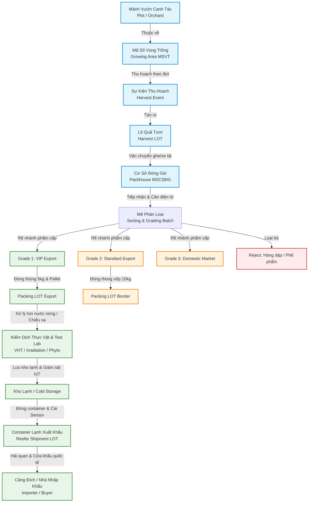

# 04_FRUIT PLAYBOOK — GOTRACE MEKONG
## Branching Supply Chain · Data Complexity · Export Evidence & International Market Compliance

**Phiên bản:** Master 2.5 — 25/09/2026  
**Chuyên trách biên soạn:** Fruit Playbook Specialist (Tích hợp toàn diện Reference Architecture & Playbook)  
**Tài liệu nền tảng tích hợp:** Fruit Reference Architecture & Playbook Master Specification  
**Thuộc bộ tài liệu:** [GOTRACE Mekong Strategy & Execution System 2026–2028](./00_MASTER_INDEX.md)  
**Đối tượng sử dụng:** Founder, Hội đồng Quản trị (BOD), PMO Lead, Kỹ sư Giải pháp (Solution Architect), Đội ngũ Sales & Triển khai thực địa Tây Nam Bộ.  
**Vai trò chiến lược trong Hệ sinh thái GOTRACE:** Chứng minh năng lực xử lý **Độ phức tạp Dữ liệu (Data Complexity)** — đồ thị chuỗi rẽ nhánh (Branching Supply Chain), phân cấp chất lượng (Quality Grading), quản trị vùng trồng GIS hạng nhất, kiểm soát hạn ngạch chống mượn mã, tuân thủ kiểm dịch quốc tế (GACC, BICON, PLS, APHIS) và viễn thám chuỗi lạnh IoT.

---

> [!IMPORTANT]
> **ĐỊNH VỊ CỐT LÕI CỦA GOTRACE TRONG NGÀNH HÀNG TRÁI CÂY:**  
> GOTRACE **tuyệt đối không bán** "tem mã QR truy xuất nguồn gốc giá rẻ" hay "phần mềm ghi chép nhật ký nông hộ đại trà".  
> GOTRACE định vị là **Hạ tầng Dữ liệu Chuỗi cung ứng (Supply Chain Data Infrastructure)** — chuyển hóa toàn bộ luồng vật chất từ **Mảnh vườn (Plot) $\rightarrow$ Vùng trồng (Growing Area) $\rightarrow$ Khung thu hoạch (Harvest Window) $\rightarrow$ Cơ sở đóng gói (Packhouse) $\rightarrow$ Phân cấp chất lượng (Grading) $\rightarrow$ Xử lý kiểm dịch (VHT/Irradiation) $\rightarrow$ Chuỗi lạnh viễn thám (Cold Chain Telemetry) $\rightarrow$ Cửa khẩu / Cảng biển xuất khẩu** thành một **Đồ thị Dữ liệu Chuỗi cung ứng có Bằng chứng Pháp lý (Verifiable Supply Chain Data Graph)**, bảo vệ quyền xuất khẩu cho các Anchor Enterprise trước các đợt thanh tra kiểm dịch quốc tế gắt gao.

---

## MỤC LỤC CHI TIẾT

1. [Vai Trò Chiến Lược & Luận Cứ Định Vị (Strategic Role & Thesis)](#1-vai-tro-chien-luoc--luan-cu-dinh-vi)
2. [Thực Tế Thị Trường ĐBSCL & Bối Cảnh Khủng Hoảng (2025–2026)](#2-thuc-te-thi-truong-dbscl--boi-canh-khung-hoang)
3. [5 Đặc Tính Kiến Trúc Dữ Liệu Khác Biệt Của Trái Cây](#3-5-dac-tinh-kien-truc-du-lieu-khac-biet-cua-trai-cay)
4. [Kiến Trúc Chuỗi Tham Chiếu & Dòng Chảy Vận Hành (Operational Reference Chain)](#4-kien-truc-chuoi-tham-chieu--dong-chay-van-hanh)
5. [Mô Hình Đối Tượng Dữ Liệu Cốt Lõi (Core Data Objects Architecture)](#5-mo-hinh-doi-tuong-du-lieu-cot-loi)
6. [Quản Trị Vùng Trồng Hạng Nhất (Growing Area as First-Class Object)](#6-quan-tri-vung-trong-hang-nhat)
7. [Mô Hình Thu Hoạch & Phân Cấp Chất Lượng Rẽ Nhánh (Grading & Mass Balance)](#7-mo-hinh-thu-hoach--phan-cap-chat-luong-re-nhanh)
8. [Ma Trận Luật Kiểm Dịch Quốc Tế (Market Eligibility Engine)](#8-ma-tran-luat-kiem-dich-quoc-te)
9. [Kiến Trúc Giám Sát Chuỗi Lạnh Viễn Thám IoT (Cold-Chain Telemetry Engine)](#9-kien-truc-giam-sat-chuoi-lanh-vien-tham-iot)
10. [Động Cơ Kiểm Soát Rủi Ro Trái Cây (10 Fruit Risk Engine Rules: R01 – R10)](#10-dong-co-kiem-soat-rui-ro-trai-cay)
11. [Giao Diện Khách Mua Hàng Quốc Tế & Phân Quyền Bảo Mật Dữ Liệu (Buyer View)](#11-giao-dien-khach-mua-hang-quoc-te--phan-quyen-bao-mat-du-lieu)
12. [Hồ Sơ Khách Hàng Mục Tiêu (ICP) & Mạng Lưới Anchor Enterprises ĐBSCL](#12-ho-so-khach-hang-muc-tieu-icp--mang-luoi-anchor-enterprises-dbscl)
13. [Kịch Bản Trình Diễn Thực Tế (Field Demo Scenarios)](#13-kich-ban-trinh-dien-thuc-te)
14. [Gói Thâm Nhập Thị Trường & Chẩn Đoán Dữ Liệu (Entry Offer & Diagnostic)](#14-goi-tham-nhap-thi-truong--chan-doan-du-lieu)
15. [Hợp Đồng Pilot (SOW) & Tiêu Chí Nghiệm Thu Khắt Khe (Deterministic Acceptance)](#15-hop-dong-pilot-sow--tieu-chi-nghiem-thu-khat-khe)
16. [Kết Luận Chiến Lược & Tích Hợp Hệ Sinh Thái (Strategic Conclusion)](#16-ket-luan-chien-luoc--tich-hop-he-sinh-thai)

---

<a name="1-vai-tro-chien-luoc--luan-cu-dinh-vi"></a>
## 1. Vai Trò Chiến Lược & Luận Cứ Định Vị (Strategic Role & Thesis)

### 1.1 Vị trí của Fruit Playbook trong bộ 3 Archetypes
Trong chiến lược triển khai nền tảng dữ liệu chuỗi cung ứng GOTRACE tại Tây Nam Bộ, mỗi ngành hàng đóng một vai trò cấu trúc đồ thị dữ liệu riêng biệt:
- [03_Rice_Playbook.md](./03_Rice_Playbook.md) giải bài toán **Chuỗi Tuyến Tính & Quy Mô Mạng Lưới (Linear Chain & Network Scale)**: Dòng chảy thẳng từ cánh đồng đến nhà máy xay xát, chứng minh năng lực xử lý hàng triệu tấn sản lượng và đo đạc tín chỉ carbon MRV.
- **`04_Fruit_Playbook.md`** giải bài toán **Chuỗi Rẽ Nhánh & Độ Phức Tạp Dữ Liệu (Branching Chain & Data Complexity)**: Xử lý sự phân tách đa cấp chất lượng, chuyển đổi quy cách đóng gói, kiểm soát hạn ngạch diện tích và đáp ứng ma trận kiểm dịch đa quốc gia.
- [05_Kitchen_Playbook.md](./05_Kitchen_Playbook.md) giải bài toán **Chuỗi Hội Tụ & Kéo Cầu Hạ Nguồn (Converging Chain & Downstream Demand)**: Tích hợp đa nguyên liệu vào suất ăn, kích hoạt truy xuất ngược tức thời khi xảy ra sự cố ngộ độc.

```text
                  CẤU TRÚC ĐỒ THỊ CHUỖI CUNG ỨNG TRÁI CÂY (BRANCHING GRAPH)

  [Vườn chuyên canh / Plot] ──► [Vùng trồng được cấp mã / MSVT]
                                              │
                                   (Khung thu hoạch nhiều lứa)
                                              ▼
                                    [Lô Quả Tươi / Harvest LOT]
                                              │
                                   (Tiếp nhận & Cân điện tử)
                                              ▼
                                   [Mẻ Phân Loại / Sorting Batch]
                                              │
         ┌────────────────────────────────────┼────────────────────────────────────┐
         │                                    │                                    │
         ▼                                    ▼                                    ▼
   [Grade 1 / VIP]                     [Grade 2 / Chuẩn]                    [Grade 3 & Cull]
         │                                    │                                    │
(Quy chuẩn xuất khẩu)               (Quy chuẩn biên mậu)                 (Nội địa / Chế biến)
         ▼                                    ▼                                    ▼
 [Packing LOT A01]                    [Packing LOT B01]                    [Packing LOT C01]
         │                                    │                                    │
 (Xử lý VHT / Chiếu xạ)               (Kiểm tra Cadmium)                 (Bao xá chợ sỉ)
         │                                    │                                    │
         ▼                                    ▼                                    ▼
 [Thị trường Úc / Mỹ]                [Thị trường Trung Quốc]              [Siêu thị / Bếp ăn TP.HCM]
```

### 1.2 Luận cứ định vị (Strategic Thesis)
$$\textbf{Fruit} = \textbf{Branching Genealogy} + \textbf{Quality Grade} + \textbf{Packhouse Transformation} + \textbf{Market Compliance}$$

Một lô thu hoạch trái cây (`HarvestLot`) mang bản chất phân mảnh cao:
1. **$1 \rightarrow \text{Many Grades}$:** Một đợt hái luôn tạo ra quả loại 1 (VIP), loại 2 (tiêu chuẩn), loại 3 (chợ) và hàng phế phẩm (cull/reject).
2. **$1 \rightarrow \text{Many Packing Lots}$:** Cùng một phẩm cấp quả có thể được đóng gói vào thùng 5kg, thùng 10kg, giỏ xuất khẩu hoặc sọt xá.
3. **$1 \rightarrow \text{Multiple Target Markets}$:** Cùng một vùng trồng nhưng quả loại 1 xuất sang Úc (cần chứng thư nhiệt hơi nước VHT), loại 2 xuất sang Trung Quốc (cần chứng nhận kiểm tra Cadmium và mã cơ sở đóng gói GACC), loại 3 tiêu thụ nội địa tại TP.HCM.
4. **$1 \rightarrow \text{Differential Commercial Evidence}$:** Người mua quốc tế yêu cầu xem chứng thư kiểm dịch, kết quả kiểm nghiệm MRL và biểu đồ nhiệt độ chuỗi lạnh; nhưng tuyệt đối không được để lộ giá thu mua tại vườn của thương lái hay lợi nhuận của cơ sở đóng gói.

---

<a name="2-thuc-te-thi-truong-dbscl--boi-canh-khung-hoang"></a>
## 2. Thực Tế Thị Trường ĐBSCL & Bối Cảnh Khủng Hoảng (2025–2026)

### 2.1 Bảng số liệu thực chứng vùng kinh tế trọng điểm ĐBSCL & Tỉnh Đồng Tháp
Toàn bộ các số liệu dưới đây được trích xuất từ dữ liệu khảo sát thực tế và báo cáo của các cơ quan quản lý nông nghiệp vùng Đồng bằng sông Cửu Long:

| Chỉ số thị trường | Dữ liệu thực tế xác thực (2026) | Cơ quan nguồn / Báo cáo thẩm định | Ý nghĩa đối với Nền tảng GOTRACE |
|:---|:---|:---|:---|
| **Diện tích cây ăn trái toàn ĐBSCL** | **414.300 ha** | Bộ Nông nghiệp & PTNT (MARD) | Quy mô nguồn cung cây ăn trái lớn nhất cả nước, chiếm 42,8% sản lượng quốc gia. |
| **Sản lượng trái cây toàn ĐBSCL** | **~6,7 triệu tấn / năm** | Cục Trồng trọt — MARD | Tạo dòng lưu chuyển dữ liệu khổng lồ, cần năng lực xử lý phân cấp lô tự động. |
| **Mã số vùng trồng (MSVT) Đồng Tháp** | **1.147 vùng / 2.758 MSVT** | Chi cục Trồng trọt & BVTV Đồng Tháp | Đồng Tháp là "thủ phủ" dữ liệu vùng trồng; thị trường mẫu (Beachhead) lý tưởng. |
| **Mã cơ sở đóng gói (MSCSĐG) Đồng Tháp** | **496 mã (308 mã đang hoạt động)** | Chi cục Trồng trọt & BVTV Đồng Tháp | Điểm nghẽn quản lý tập trung; nơi diễn ra toàn bộ hoạt động phân loại & đóng thùng. |
| **Vùng chuyên canh Xoài Cao Lãnh** | **>15.700 ha** chuyên canh | UBND Tỉnh Đồng Tháp | Sản phẩm chủ lực xuất khẩu đi Trung Quốc, Mỹ, Úc, Hàn Quốc, Nhật Bản. |
| **Kim ngạch XK rau quả Đồng Tháp H1/2026**| **77,53 triệu USD** | Cục Hải quan Tỉnh Đồng Tháp | Động lực tài chính mạnh mẽ: Doanh nghiệp sẵn sàng trả tiền để bảo vệ kim ngạch. |
| **Hợp tác xã nông nghiệp liên kết** | **133 HTX / Tổ hợp tác** | Sở Công Thương Tỉnh Đồng Tháp | Lực lượng trung gian gom hàng, đầu mối nhập dữ liệu thu hoạch tại vườn. |
| **Các Anchor Enterprise đầu tàu vùng** | **Chánh Thu, Hoàng Phát, Tòng Phát...** | Báo cáo nghiên cứu thị trường | Doanh nghiệp định hình chuỗi; có quyền lực kéo hàng trăm HTX và nhà vườn vào hệ thống. |

### 2.2 Điểm nghẽn thị trường — 4 Khủng hoảng đỉnh điểm (2025–2026)

```text
                                BỐI CẢNH 4 CUỘC KHỦNG HOẢNG LỚN (2025-2026)

   [KHỦNG HOẢNG CADMIUM & AURAMINE O]        [GIAN LẬN & MƯỢN MÃ SỐ VÙNG TRỒNG]
   • GACC hold hàng trăm container sầu riêng • Khởi tố hình sự các vụ mua bán mã khống
   • Giới hạn Cadmium nghiêm ngặt: Cd ≤ 0.05mg/kg • Cục BVTV siết chặt kiểm toán định mức
   • Cấm tuyệt đối chất vàng nhuộm Auramine O • Yêu cầu đối soát diện tích thực vs sản lượng
                       │                                         │
                       └────────────────────┬────────────────────┘
                                            ▼
                       ┌─────────────────────────────────────────┐
                       │     ĐÒI HỎI BẮT BUỘC HẠ TẦNG DỮ LIỆU    │
                       │          XÁC THỰC CỦA GOTRACE           │
                       └────────────────────┬────────────────────┘
                                            ▲
                       ┌────────────────────┴────────────────────┐
                       │                                         │
   [LỆNH 280 GACC - HIỆU LỰC 01/06/2026]     [RÀO CẢN KIỂM DỊCH ĐA THỊ TRƯỜNG]
   • Tái đăng ký bắt buộc toàn bộ cơ sở đóng gói • Úc: BICON bắt buộc xử lý nhiệt hơi nước VHT
   • Truy xuất tận mảnh vườn và người giám sát • Hàn Quốc: PLS áp trần mặc định 0.01 mg/kg
   • Bắt buộc lưu trữ dữ liệu chuỗi lạnh IoT  • Mỹ: Chiếu xạ liều tối thiểu 400 Gy
```

1. **Khủng hoảng kim loại nặng Cadmium và chất nhuộm Auramine O:**
   - Trong năm 2025 và đầu 2026, Tổng cục Hải quan Trung Quốc (GACC) liên tục phát đi các thông báo khẩn cảnh báo hàng trăm lô hàng sầu riêng và chuối của Việt Nam vượt ngưỡng dư lượng Cadmium ($>0.05\text{ mg/kg}$) và phát hiện tồn dư chất nhuộm màu công nghiệp Auramine O (Vàng O — chất gây ung thư cấm dùng trong thực phẩm).
   - Hậu quả: Hàng loạt mã cơ sở đóng gói và mã vùng trồng lớn tại Tiền Giang, Bến Tre, Đồng Tháp, Đắk Lắk bị đình chỉ tư cách xuất khẩu; container nằm ứ đọng tại cửa khẩu Tân Thanh, Kim Thành gây thiệt hại hàng triệu USD mỗi tuần.
2. **Nạn "mượn mã", "bán mã" và gian lận hạn ngạch sản lượng:**
   - Bộ Công an và Thanh tra Bộ NN&PTNT liên tục phanh phui các đường dây làm giả hồ sơ mã số vùng trồng (MSVT) và cơ sở đóng gói (MSCSĐG).
   - Thủ đoạn phổ biến: Doanh nghiệp gom trái cây trôi nổi ngoài thị trường tự do, không rõ nguồn gốc kiểm dịch, sau đó "mượn" mã của một HTX hợp pháp tại Đồng Tháp để khai báo khống hải quan. Một diện tích 10 ha xoài nhưng khai báo xuất khẩu tới 500 tấn ($50\text{ tấn/ha}$ — vượt gấp đôi năng suất thực tế!).
3. **Trung Quốc siết chặt Lệnh 280 (Hiệu lực từ 01/06/2026):**
   - Nối tiếp Lệnh 248 và 249, Lệnh 280 của GACC quy định toàn bộ cơ sở đóng gói xuất khẩu sang Trung Quốc phải thực hiện tái kiểm định điều kiện an toàn sinh học.
   - Bắt buộc doanh nghiệp phải xuất trình được hồ sơ truy xuất điện tử có liên kết tọa độ GIS thực tế của từng vườn thành viên, nhật ký phun xịt thuốc BVTV và dữ liệu giám sát nhiệt độ chuỗi lạnh từ khi đóng thùng đến lúc qua cửa khẩu.
4. **Rào cản kỹ thuật kiểm dịch phức tạp giữa các thị trường:**
   - Cùng một trái xoài Cát Chu Cao Lãnh: Muốn đi Úc phải có chứng thư xử lý nhiệt hơi nước VHT $46.5^\circ\text{C}$; muốn đi Mỹ phải chuyển lên TP.HCM chiếu xạ 400 Gy tại nhà máy Sơn Sơn hoặc An Phú; muốn đi Hàn Quốc phải vượt qua danh mục 400 hoạt chất kiểm soát của MFDS với trần mặc định $\le 0.01\text{ mg/kg}$.

---

<a name="3-5-dac-tinh-kien-truc-du-lieu-khac-biet-cua-trai-cay"></a>
## 3. 5 Đặc Tính Kiến Trúc Dữ Liệu Khác Biệt Của Trái Cây

So với chuỗi cung ứng lúa gạo (Rice) có tính đồng nhất cao, chuỗi trái cây (Fruit) đặt ra 5 thách thức kiến trúc dữ liệu đặc thù đòi hỏi GOTRACE phải thiết kế mô hình đồ thị chuyên biệt:

### 3.1 Khung thời gian thu hoạch theo đợt (Harvest Window)
Trái cây không gặt đồng loạt trên toàn bộ diện tích trong một ngày như lúa. Một vườn xoài hay sầu riêng kéo dài thời gian thu hoạch từ 2 đến 4 tuần qua nhiều đợt hái khác nhau:
$$\text{Orchard / Plot} \xrightarrow{\text{Nở hoa}} \text{Đậu quả} \xrightarrow{\text{Bọc trái}} \text{Chín sinh lý} \xrightarrow{\text{Harvest Window}} \begin{cases} \text{Đợt 1: Quả sớm (Cơm lứa)} \\ \text{Đợt 2: Rộ mùa (Chính vụ)} \\ \text{Đợt 3: Thu vét (Cuối vụ)} \end{cases}$$
Mỗi đợt hái có độ chín, kích thước, dư lượng thuốc BVTV và độ đường (Brix) khác nhau. Do đó, hệ thống không thể gắn mã lô theo "năm sản xuất" mà phải gắn theo từng **Sự kiện thu hoạch cụ thể (`HarvestEvent`)** trong một khung thời gian xác định.

### 3.2 Chuỗi rẽ nhánh (Branching Genealogy)
Một lô quả sau khi hái từ vườn (`HarvestLot`) khi chuyển về cơ sở đóng gói lập tức bị chia tách theo phẩm cấp:
$$\text{HarvestLot} \xrightarrow{\text{Sorting \& Grading}} \begin{cases} \textbf{Grade 1 (VIP):} \text{Xuất khẩu đường bay/biển sang Úc, Mỹ, Hàn Quốc, Nhật} \\ \textbf{Grade 2 (Chuẩn):} \text{Đóng thùng xuất khẩu đường bộ sang Trung Quốc} \\ \textbf{Grade 3 (Loại):} \text{Bao xá tiêu thụ chợ đầu mối Thủ Đức, Bình Điền} \\ \textbf{Reject (Phế phẩm):} \text{Hàng dập, sâu cuống } \rightarrow \text{ Bán ép nước / Hủy sinh học} \end{cases}$$
Hệ thống đồ thị GOTRACE phải duy trì mối quan hệ phả hệ cha-con (Parent-Child Directed Acyclic Graph) để khi một quả xoài Grade 1 bị khiếu nại tại Melbourne, hệ thống vẫn lập tức xác định được quả đó cùng hái một ngày với những quả Grade 2 đang bày bán tại Bắc Kinh.

### 3.3 Chuyển hóa đóng gói (Packing Transformation)
$$\text{HarvestLot} \longrightarrow \text{SortingBatch} \longrightarrow \text{GradeLot} \longrightarrow \text{PackingLot} \longrightarrow \text{ShipmentLot}$$
> [!CAUTION]
> **NGUYÊN TẮC VÀNG CỦA HỆ THỐNG:** $\textbf{HarvestLot} \neq \textbf{PackingLot}$.  
> Quả tươi khi thu hoạch tính bằng Kilogram sọt thô; khi vào đóng gói chuyển hóa thành Thùng carton 5kg có lót xốp, Pallet 90 thùng, gắn mã vạch GS1-128 và mã định danh container. Tuyệt đối không được gộp chung hai khái niệm này trong cơ sở dữ liệu.

### 3.4 Quy định kiểm dịch chuyên biệt theo thị trường (Market-Specific Rules)
Trái cây là mặt hàng kiểm dịch thực vật sống (Live Phytosanitary Cargo). Cùng một loại quả nhưng mỗi thị trường nhập khẩu có một bộ quy tắc kiểm tra (Rule Matrix) hoàn toàn khác nhau. Dữ liệu của một lô hàng phải được đối soát động thông qua **Market Eligibility Engine** để xác định tư cách xuất khẩu trước khi dán nhãn pallet.

### 3.5 Bằng chứng chuỗi lạnh viễn thám (Cold-Chain IoT Evidence)
Trái cây nhiệt đới tiếp tục hô hấp và chín sau khi hái. Nếu đứt gãy chuỗi lạnh, trái cây sẽ hỏng hoàn toàn trước khi cập cảng:
$$\text{Hái vườn} \rightarrow \text{Pre-cooling (Hạ nhiệt sơ bộ)} \rightarrow \text{Đóng gói} \rightarrow \text{Kho lạnh lưu trữ} \rightarrow \text{Container lạnh (Reefer)} \rightarrow \text{Cảng biển}$$
Dữ liệu nhiệt độ và độ ẩm theo thời gian thực (Time-series IoT Telemetry) không chỉ là thông số kỹ thuật, mà là **bằng chứng pháp lý bắt buộc** để giải quyết tranh chấp bảo hiểm hàng hải và thủ tục thông quan.

---

<a name="4-kien-truc-chuoi-tham-chieu--dong-chay-van-hanh"></a>
## 4. Kiến Trúc Chuỗi Tham Chiếu & Dòng Chảy Vận Hành (Operational Reference Chain)

Dưới đây là sơ đồ chi tiết dòng chảy vật chất và dòng chảy dữ liệu xuyên suốt chuỗi cung ứng trái cây xuất khẩu từ ĐBSCL:



### Bảng đối chiếu các điểm thu thập dữ liệu (Data Capture Points):

| Chặng chuỗi cung ứng | Thực thể dữ liệu sinh ra | Thiết bị / Phương thức thu thập | Bằng chứng kiểm định gắn kèm (Evidence) |
|:---|:---|:---|:---|
| **1. Vườn & Vùng trồng** | `GrowingArea`, `Plot` | Khảo sát GIS, đo vẽ Polygon, hồ sơ Chi cục BVTV | Chứng nhận MSVT cấp bởi Cục BVTV, Danh sách nông hộ |
| **2. Thu hoạch** | `HarvestEvent`, `HarvestLot` | Ứng dụng di động GOTRACE Mobile (Offline-first) | Phiếu cân vườn, ảnh chụp hiện trường, biên bản giao nhận |
| **3. Tiếp nhận tại vựa** | `ReceivingRecord` | Đầu cân điện tử kết nối IoT qua RS-232/RS-485 | Phiếu cân tổng trạm cân, biên bản kiểm tra cảm quan |
| **4. Phân loại phẩm cấp**| `SortingGradingBatch`, `GradeLot` | Cân phân cỡ tự động hoặc bảng chấm kiểm tra KCS | Bảng tổng hợp phân loại Grade, tỷ lệ hao hụt tự nhiên |
| **5. Đóng gói & Dán nhãn**| `PackingLot` | Máy in mã vạch công nghiệp, nhãn GS1-128/QR | Mã định danh thùng carton, danh sách kiện trên Pallet |
| **6. Xử lý kỹ thuật** | `TreatmentEvent` | Hệ thống SCADA buồng VHT hoặc nhà máy chiếu xạ | Chứng thư xử lý VHT, Chứng chỉ chiếu xạ Sơn Sơn/An Phú |
| **7. Kiểm nghiệm Lab** | `LabTestResult` | Tích hợp API phòng Lab (Eurofins, SGS, Quatest) | Phiếu kết quả kiểm nghiệm Cadmium, Auramine O, MRLs |
| **8. Bảo quản & Vận tải**| `ColdChainTelemetry` | Sensor nhiệt độ/độ ẩm IoT truyền 4G/Cellular | Biểu đồ chuỗi thời gian nhiệt độ (Time-series Chart) |
| **9. Xuất khẩu** | `ShipmentLot` | Hệ thống ERP vựa / Khai báo Hải quan VNACCS | Vận đơn Bill of Lading, Seal hải quan, Giấy Phyto |

---

<a name="5-mo-hinh-doi-tuong-du-lieu-cot-loi"></a>
## 5. Mô Hình Đối Tượng Dữ Liệu Cốt Lõi (Core Data Objects Architecture)

Tuân thủ kiến trúc chuẩn hóa quy định tại [02_Platform_Object_Implementation_Blueprint.md](./02_Platform_Object_Implementation_Blueprint.md), hệ sinh thái dữ liệu trái cây GOTRACE được cấu thành từ 4 nhóm đối tượng đồ thị:

```text
                  4 NHÓM ĐỐI TƯỢNG ĐỒ THỊ TRONG HỆ THỐNG GOTRACE FRUIT

  ┌─────────────────────────┐          ┌─────────────────────────┐
  │   IDENTITY ENTITIES     │          │    PRODUCT ENTITIES     │
  │ • GrowingArea (MSVT)    │          │ • Crop / Variety        │
  │ • Plot / Orchard        │          │ • HarvestLot            │
  │ • Packhouse (MSCSĐG)    │          │ • GradeLot              │
  │ • ColdStorage / Facility│          │ • PackingLot            │
  │ • Vehicle / Reefer      │          │ • ShipmentLot           │
  └────────────┬────────────┘          └────────────┬────────────┘
               │                                    │
               └──────────────────┬─────────────────┘
                                  ▼
  ┌─────────────────────────┐          ┌─────────────────────────┐
  │   OPERATIONAL EVENTS    │          │    EVIDENCE OBJECTS     │
  │ • HarvestEvent          │◄─────────┤ • PhytosanitaryCert     │
  │ • SortingGradingBatch   │          │ • LabTestResult (Cd/Au) │
  │ • TreatmentEvent (VHT)  │          │ • TreatmentCertificate  │
  │ • TelemetryStream (IoT) │          │ • TemperatureTimeSeries │
  └─────────────────────────┘          └─────────────────────────┘
```

### Chuẩn định danh đồ thị toàn cầu (Global Chain Identifier - GCI):
Mọi thực thể và sự kiện trong Playbook Trái cây đều sử dụng định dạng mã định danh duy nhất (GCI):
- **Vùng trồng:** `GT:VN:PLACE:MARD:VN-DTP-OR-2026-0881`
- **Mảnh vườn thành viên:** `GT:VN:PLOT:DTHAP:PLOT-MX-001`
- **Cơ sở đóng gói:** `GT:VN:PLACE:MARD:CSDG-DT-0496`
- **Lô thu hoạch tươi:** `GT:VN:LOT:DTHAP:HLOT-20260925-CC01`
- **Lô thành phẩm đóng gói:** `GT:VN:LOT:PACK:PACK-20260925-MANGO-AUS-01`
- **Container xuất khẩu:** `GT:VN:SHIPMENT:REEFER:CSNU882910-4`

---

<a name="6-quan-tri-vung-trong-hang-nhat"></a>
## 6. Quản Trị Vùng Trồng Hạng Nhất (Growing Area as First-Class Object)

### 6.1 Nguyên tắc thiết kế: Vùng trồng là First-Class Graph Node
> [!IMPORTANT]
> Trong các phần mềm thông thường, "Mã vùng trồng" chỉ là một trường chuỗi văn bản (String) được gõ tự do vào phần mô tả sản phẩm.  
> **Trong GOTRACE, Vùng trồng (`GrowingArea`) là một Đối tượng Quản trị Dữ liệu Hạng Nhất (First-Class Object)** — một đỉnh độc lập trên đồ thị tri thức, sở hữu đầy đủ:
> 1. Tọa độ ranh giới địa lý thực tế (Polygon GIS chuẩn GeoJSON).
> 2. Phả hệ liên kết với từng mảnh vườn (`Plot`) và định danh công dân của từng nông hộ thành viên.
> 3. Hạn ngạch sản lượng định mức (Yield Quota) theo diện tích và mùa vụ.
> 4. Trạng thái phê duyệt thị trường từ các cơ quan kiểm dịch quốc tế (GACC, DAFF, MFDS, APHIS).

### 6.2 Thuật toán Kiểm soát Hạn ngạch (Yield Quota Engine) chống gian lận "Mượn Mã"
Để triệt phá hoàn toàn tình trạng mua gom trái cây trôi nổi rồi mượn mã vùng trồng hợp pháp để khai báo hải quan, GOTRACE kích hoạt **Động cơ Giám sát Hạn ngạch**:

$$\text{Hạn ngạch Tối đa Cho phép (Tấn)} = \text{Tổng diện tích Vùng trồng (ha)} \times \text{Định mức Năng suất Tối đa (Tấn/ha/vụ)}$$

*Đối với Xoài Cát Chu Cao Lãnh chuyên canh: Định mức năng suất tối đa được thiết lập $\le 25\text{ tấn/ha/năm}$.*  
*Đối với Sầu riêng Ri6 / Monthong: Định mức năng suất tối đa được thiết lập $\le 30\text{ tấn/ha/năm}$.*

$$\text{Hạn ngạch Còn lại} = \text{Hạn ngạch Tối đa} - \sum_{i=1}^{k} \text{Khối lượng HarvestLot}_i$$

*Nếu $\text{Khối lượng HarvestLot Mới} > \text{Hạn ngạch Còn lại} \longrightarrow$ Hệ thống lập tức kích hoạt Rule `R03 Quota Overflow`, tự động khóa phát hành mã QR truy xuất và gửi cảnh báo đỏ tới KCS cơ sở đóng gói.*

### 6.3 Schema YAML 1: Mã số Vùng trồng Hạng Nhất (`FruitProductionArea`)

```yaml
# Schema định danh Vùng trồng Hạng Nhất (FruitProductionArea)
growing_area_id: "GT:VN:PLACE:MARD:VN-DTP-OR-2026-0881"
official_code: "VN-DTP-OR-2026-0881"
commercial_name: "Vung trong Xoai Cat Chu Xuat Khau My Xuong"
crop: "MANGO"
variety: "CAT_CHU"
location:
  province: "Dong Thap"
  district: "Cao Lanh"
  commune: "My Xuong"
  gis_center_point: [10.4612, 105.6321]
  polygon_boundaries:
    type: "Polygon"
    coordinates:
      - [10.4601, 105.6310]
      - [10.4635, 105.6312]
      - [10.4640, 105.6350]
      - [10.4598, 105.6345]
      - [10.4601, 105.6310]
total_area_ha: 45.5
representative_organization: "Hop tac xa Xoai My Xuong"
representative_person:
  full_name: "Vo Viet Hung"
  title: "Giam doc HTX"
  phone: "+84-918-234-567"
  national_id: "087085009876"
registered_plots:
  - plot_id: "GT:VN:PLOT:DTHAP:PLOT-MX-001"
    farmer_name: "Nguyen Van Hai"
    citizen_id: "087085001234"
    area_ha: 1.2
    tree_count: 350
    estimated_yield_tons: 22.0
  - plot_id: "GT:VN:PLOT:DTHAP:PLOT-MX-002"
    farmer_name: "Tran Van Lam"
    citizen_id: "087085005678"
    area_ha: 1.8
    tree_count: 520
    estimated_yield_tons: 32.5
approved_markets:
  - market: "CHINA"
    regulatory_body: "GACC"
    gacc_registration_code: "VN-DTP-OR-0881"
    effective_from: "2024-03-15"
    expires_at: "2027-03-15"
    status: "ACTIVE"
  - market: "AUSTRALIA"
    regulatory_body: "DAFF"
    effective_from: "2025-06-01"
    expires_at: "2028-06-01"
    status: "ACTIVE"
  - market: "KOREA"
    regulatory_body: "MFDS"
    effective_from: "2025-01-01"
    expires_at: "2028-01-01"
    status: "ACTIVE"
  - market: "USA"
    regulatory_body: "USDA_APHIS"
    effective_from: "2025-09-01"
    expires_at: "2027-09-01"
    status: "PENDING_AUDIT"
season_metrics_2026:
  season_id: "SEASON-2026-CHINH-VU"
  flowering_date: "2026-06-10"
  harvest_window_start: "2026-09-15"
  harvest_window_end: "2026-10-20"
  max_yield_rate_tons_per_ha: 25.0
  total_quota_tons: 1137.5  # 45.5 ha * 25.0 tons/ha
  harvested_cumulative_tons: 412.5
  quota_remaining_tons: 725.0
evidence_refs:
  - "EVI-CERT-BVTV-DTP-2026-0881.PDF"
  - "EVI-AUDIT-MINUTES-GACC-DTP-2025.PDF"
system_status: "APPROVED_AND_ACTIVE"
```

---

<a name="7-mo-hinh-thu-hoach--phan-cap-chat-luong-re-nhanh"></a>
## 7. Mô Hình Thu Hoạch & Phân Cấp Chất Lượng Rẽ Nhánh (Grading & Mass Balance)

### 7.1 Phân cấp chất lượng quả (Quality Grading Taxonomy)
Ngay khi quả tươi về đến cơ sở đóng gói (`Packhouse`), toàn bộ lô hàng được đưa qua dây chuyền phân loại cơ học hoặc chấm điểm cảm quan KCS theo 4 cấp bậc nghiêm ngặt:

1. **Grade 1 (VIP / Xuất khẩu Cao cấp):**
   - Trọng lượng quả đạt chuẩn: Xoài Cát Chu từ $350\text{g} - 450\text{g/trái}$; Sầu riêng Ri6 từ $2.0\text{kg} - 4.5\text{kg/trái}$.
   - Độ ngọt Brix: Xoài $\ge 14.5^\circ\text{Bx}$; Sầu riêng cơm ráo hạt lép, độ béo ngậy chuẩn.
   - Ngoại quan: Vỏ nhẵn bóng, không tì vết trầy xước, tuyệt đối không có vết chích ruồi đục quả, không nấm thán thư.
   - Thị trường tiêu thụ: Xuất khẩu sang Úc (qua VHT), Nhật Bản, Hàn Quốc, Mỹ (qua chiếu xạ), hoặc phân khúc sầu riêng quà biếu cao cấp sang Trung Quốc.
2. **Grade 2 (Tiêu chuẩn / Xuất khẩu Biên mậu):**
   - Trọng lượng chênh nhẹ: Xoài $300\text{g} - 350\text{g}$ hoặc $450\text{g} - 550\text{g}$.
   - Ngoại quan: Cho phép vết rám vỏ do gió cọ xát $<10\%$ diện tích bề mặt, thịt quả chắc chắn, không ảnh hưởng chất lượng bên trong.
   - Thị trường tiêu thụ: Đóng thùng xốp xuất khẩu container sang Trung Quốc qua các cửa khẩu phía Bắc hoặc siêu thị cao cấp nội địa.
3. **Grade 3 (Hàng xá / Tiêu thụ Nội địa Phổ thông):**
   - Trọng lượng không đồng đều, vỏ rám nhiều, cong vẹo nhẹ.
   - Thị trường tiêu thụ: Đóng sọt xá chuyển về Chợ đầu mối Thủ Đức, Chợ đầu mối Hóc Môn, chuỗi bếp ăn công nghiệp hoặc làm trái cây tráng miệng trường học.
4. **Cull / Reject (Phế phẩm & Loại bỏ):**
   - Quả bị dập nát cơ học, thâm thối cuống, nhiễm nấm bệnh hoặc có vết chích của côn trùng.
   - Xử lý: Tách múi bán cho nhà máy ép puree/nước trái cây đóng lon hoặc chuyển giao đơn vị xử lý rác thải hữu cơ ủ phân sinh học.

### 7.2 Thuật toán Cân bằng Khối lượng Rẽ nhánh (Branching Mass Balance Reconciliation)
Tại cơ sở đóng gói, GOTRACE triển khai động cơ đối soát cân bằng vật chất bảo tồn khối lượng:

$$\text{Net Weight Đầu Vào} = \sum \text{Grade 1} + \sum \text{Grade 2} + \sum \text{Grade 3} + \text{Reject} + \text{Hao hụt Tự nhiên (Natural Moisture Shrinkage)}$$

$$\text{Tỷ lệ Sai số Đối soát} = \frac{\left| \text{Tổng Đầu Ra} + \text{Hao hụt} - \text{Net Đầu Vào} \right|}{\text{Net Đầu Vào}} \times 100\%$$

*Quy tắc nghiệp vụ:*
- **Hao hụt tự nhiên cho phép:** Đối với xoài và sầu riêng tươi, mức độ mất nước và hao hụt cuống trong vòng 24 giờ phân loại dao động từ $0.5\% - 2.0\%$.
- **Cảnh báo bất thường (Rule R05):** Nếu tỷ lệ sai số đối soát vượt quá $2.0\%$ hoặc tỷ lệ hao hụt tự nhiên vượt quá $4.0\%$, hệ thống lập tức phát cờ cảnh báo gian lận (nghi vấn tráo hàng hoặc gian lận đầu cân).

---

### 7.3 Schema YAML 2: Lô Thu Hoạch & Sự Kiện Thu Hoạch (`HarvestBatch`)

```yaml
# Schema Sự kiện & Lô Thu hoạch Tươi (HarvestBatch)
harvest_event_id: "GT:VN:EVENT:HARVEST:HEVT-20260925-001"
harvest_lot_id: "GT:VN:LOT:DTHAP:HLOT-20260925-CC01"
growing_area_ref: "GT:VN:PLACE:MARD:VN-DTP-OR-2026-0881"
plot_ref: "GT:VN:PLOT:DTHAP:PLOT-MX-001"
farmer_name: "Nguyen Van Hai"
crop: "MANGO"
variety: "CAT_CHU"
harvest_window:
  round_number: 2
  total_rounds_planned: 3
  harvest_date: "2026-09-25"
  started_at: "2026-09-25T06:00:00+07:00"
  completed_at: "2026-09-25T10:30:00+07:00"
measurements:
  gross_weight_kg: 8500.0
  tare_weight_kg: 150.0  # Trong luong sot dung
  net_weight_kg: 8350.0
  sample_brix_score: 14.8
  average_fruit_weight_g: 385.0
field_inspector:
  name: "Tran Van Lam"
  role: "KCS Kiem soat Vung trong"
  signature_hash: "0x8f3c7b2a...e901"
transportation:
  transporter_type: "TRUCK"
  license_plate: "66C-128.45"
  driver_name: "Le Van Phuc"
  destination_facility: "GT:VN:PLACE:MARD:CSDG-DT-0496"
  departure_time: "2026-09-25T11:00:00+07:00"
evidence_refs:
  - "EVI-FIELD-SCALE-SLIP-0925-01.JPG"
  - "EVI-TRUCK-DEPARTURE-PHOTO.JPG"
status: "DISPATCHED_TO_PACKHOUSE"
```

---

### 7.4 Schema YAML 3: Phiên Phân Loại & Lô Đóng Gói Hoàn Chỉnh (`PackingRun`)

```yaml
# Schema Phiên Phân Loại & Đóng Gói Rẽ Nhánh (PackingRun & PackingLot)
sorting_batch_id: "GT:VN:BATCH:FRUIT:SORT-20260925-TP01"
facility_id: "GT:VN:PLACE:MARD:CSDG-DT-0496"
facility_name: "Nha may Dong goi Xoai Tong Phat - Cao Lanh"
official_packhouse_code: "VN-DTP-PH-0496"
execution_window:
  started_at: "2026-09-25T13:00:00+07:00"
  completed_at: "2026-09-25T16:30:00+07:00"
input_materials:
  - harvest_lot_id: "GT:VN:LOT:DTHAP:HLOT-20260925-CC01"
    source_growing_area: "GT:VN:PLACE:MARD:VN-DTP-OR-2026-0881"
    net_weight_kg: 8350.0
sorting_outputs:
  - grade_lot_id: "GLOT-20260925-GRADE-A"
    grade_level: "GRADE_1_VIP"
    weight_kg: 4592.5
    percentage_yield: 55.0
    quality_metrics:
      min_weight_g: 350
      max_weight_g: 450
      brix_score: 14.8
      skin_defect_pct: 0.0
    target_destination: "EXPORT_AUSTRALIA_VHT"
    packing_lot_assigned: "GT:VN:LOT:PACK:PACK-20260925-MANGO-AUS-01"

  - grade_lot_id: "GLOT-20260925-GRADE-B"
    grade_level: "GRADE_2_STANDARD"
    weight_kg: 2505.0
    percentage_yield: 30.0
    quality_metrics:
      min_weight_g: 300
      max_weight_g: 500
      brix_score: 13.5
      skin_defect_pct: 7.5
    target_destination: "EXPORT_CHINA_BORDER"
    packing_lot_assigned: "GT:VN:LOT:PACK:PACK-20260925-MANGO-CN-02"

  - grade_lot_id: "GLOT-20260925-GRADE-C"
    grade_level: "GRADE_3_DOMESTIC"
    weight_kg: 918.5
    percentage_yield: 11.0
    target_destination: "DOMESTIC_WHOLESALE_HCMC"
    packing_lot_assigned: "GT:VN:LOT:PACK:PACK-20260925-DOM-03"

  - grade_lot_id: "GLOT-20260925-REJECT"
    grade_level: "CULL_REJECT"
    weight_kg: 250.5
    percentage_yield: 3.0
    reject_reason: "FRUIT_FLY_STING_OR_MECHANICAL_BRUISE"
    disposal_plan: "PULP_PROCESSING_FACTORY"

mass_balance_reconciliation:
  total_input_net_kg: 8350.0
  total_output_kg: 8266.5
  natural_moisture_shrinkage_kg: 83.5
  shrinkage_percentage: 1.00
  unaccounted_difference_kg: 0.0
  mass_balance_status: "PERFECTLY_BALANCED"

# Chi tiết Lô Thành phẩm Đóng gói Xuất khẩu Đi Úc (PackingLot Specification)
packing_lot_details:
  packing_lot_id: "GT:VN:LOT:PACK:PACK-20260925-MANGO-AUS-01"
  crop: "MANGO"
  variety: "CAT_CHU"
  target_market: "AUSTRALIA"
  packaging_spec:
    carton_box_type: "TELESCOPIC_VENTILATED_5KG"
    total_boxes_count: 900
    net_weight_per_box_kg: 5.0
    total_net_weight_kg: 4500.0
    pallets_count: 10
    boxes_per_pallet: 90
  treatment_details:
    treatment_type: "VAPOR_HEAT_TREATMENT_VHT"
    treatment_facility_code: "VN-BTR-VHT-001"
    core_temperature_target_c: 46.5
    core_temperature_achieved_c: 46.8
    duration_minutes: 42
    treatment_cert_ref: "VHT-CERT-2026-AUS-992"
  labeling_and_traceability:
    symbology: "GS1_128"
    gci_code: "GT:VN:LOT:PACK:PACK-20260925-MANGO-AUS-01"
    qr_pallet_url: "https://trace.gotrace.vn/p/GT-VN-LOT-PACK-20260925-MANGO-AUS-01"
  phytosanitary_certificate_no: "PHYTO-VN-2026-DTP-88419"
  prescribed_storage_temperature: "12.0C - 14.0C"
  lot_status: "SEALED_AND_READY_FOR_REEFER_LOADING"
```

---

<a name="8-ma-tran-luat-kiem-dich-quoc-te"></a>
## 8. Ma Trận Luật Kiểm Dịch Quốc Tế (Market Eligibility Engine)

### 8.1 Kiến trúc Động cơ Thẩm định Thị trường (Rules-based Market Eligibility Engine)
Mỗi lô hàng trước khi bốc xếp lên xe lạnh đều được chạy qua **Market Eligibility Engine** để đối soát với hồ sơ điều kiện nhập khẩu của quốc gia đích:

```text
               LUỒNG THẨM ĐỊNH TỰ ĐỘNG CỦA MARKET ELIGIBILITY ENGINE

   [Hồ sơ Lô hàng Packing LOT] ──► [Truy vấn Quy định Thị trường Mục tiêu]
                                                   │
         ┌─────────────────────────────────────────┼─────────────────────────────────────────┐
         ▼                                         ▼                                         ▼
   [TRUNG QUỐC (GACC)]                     [ÚC (DAFF / BICON)]                   [HÀN QUỐC (MFDS)]
   • MSVT & MSCSĐG active GACC             • MSVT & MSCSĐG chuẩn DAFF            • Danh mục MFDS Approved
   • Test Cadmium ≤ 0.05 mg/kg             • Chứng thư VHT 46.5°C                • Test PLS 400 hoạt chất
   • Test Auramine O = Âm tính             • Diệt ruồi Bactrocera                • Ngưỡng trần ≤ 0.01 mg/kg
         │                                         │                                         │
         └─────────────────────────────────────────┼─────────────────────────────────────────┘
                                                   │
                                                   ▼
                                        [KẾT QUẢ ĐÁNH GIÁ TỰ ĐỘNG]
                         ┌─────────────────────────┬─────────────────────────┐
                         ▼                         ▼                         ▼
                    [ELIGIBLE]             [CONDITIONAL]          [NOT_ELIGIBLE]
                 Cấp phép đóng cont        Kiểm tra cảm quan       Khóa lô tức thời
```

### 8.2 Bảng Ma Trận Luật Kiểm Dịch 4 Thị Trường Xuất Khẩu Trọng Điểm:

| Thị trường mục tiêu | Cơ quan quản lý & Căn cứ pháp lý | Yêu cầu Mã số Vùng trồng & Đóng gói | Yêu cầu Kỹ thuật Xử lý & Kiểm dịch | Giới hạn Dư lượng & Hoạt chất cấm |
|:---|:---|:---|:---|:---|
| **TRUNG QUỐC** | **Tổng cục Hải quan Trung Quốc (GACC)**<br>• Lệnh 248 & 249<br>• **Lệnh 280 (01/06/2026)** | • MSVT và MSCSĐG phải nằm trong danh sách GACC phê duyệt còn hiệu lực.<br>• Giấy Phyto do Cục BVTV cấp. | • Thùng carton có lỗ thông khí, có lưới xốp bọc bảo vệ từng quả.<br>• Nhãn thùng song ngữ Trung - Việt có in mã QR và tên vùng trồng.<br>• Khử trùng Methyl Bromide nếu có rệp sáp. | • **Cadmium (Cd):** $\le 0.05\text{ mg/kg}$ (đặc biệt sầu riêng, chuối).<br>• **Auramine O (Vàng O):** Tuyệt đối cấm ($0\text{ ppb}$).<br>• Kiểm tra nghiêm ngặt rệp sáp, ruồi giấm. |
| **ÚC (AUSTRALIA)** | **Bộ Nông nghiệp Úc (DAFF)**<br>• Hệ thống điều kiện nhập khẩu sinh học **BICON** | • MSVT và MSCSĐG được Cục BVTV Việt Nam đề xuất và DAFF chấp thuận chính thức. | • Bắt buộc **Xử lý nhiệt hơi nước VHT (Vapor Heat Treatment):** Tâm quả xoài phải đạt $46.5^\circ\text{C}$ duy trì liên tục tối thiểu 20–40 phút diệt ruồi đục quả (*Bactrocera*).<br>• Nhà đóng gói khép kín chống côn trùng. | • Kiểm dịch nghiêm ngặt dịch hại nhóm 1: Ruồi đục quả (*Bactrocera dorsalis*, *B. correcta*), mọt vỏ quả.<br>• Dư lượng thuốc BVTV theo Bộ tiêu chuẩn MRL Australia. |
| **HÀN QUỐC** | **Bộ An toàn Thực phẩm & Dược phẩm Hàn Quốc (MFDS)** | • MSVT và nhà máy chế biến được MFDS thẩm tra và duy trì mã số đăng ký hàng năm. | • Đạt chuẩn Good Agricultural Practices (GlobalGAP / VietGAP).<br>• Khử trùng bề mặt quả và kiểm dịch ruồi đục quả tại cảng đến. | • Áp dụng triệt để **Positive List System (PLS):** Hoạt chất không có mức MRL quy định riêng mặc định áp trần cực đoan $\le 0.01\text{ mg/kg}$.<br>• Kiểm soát danh mục 400 hoạt chất BVTV. |
| **HOA KỲ (USA)** | **Cục Kiểm dịch Động Thực vật Mỹ (USDA - APHIS)** | • MSVT được cấp chứng chỉ quản lý dịch hại của USDA; liên kết nhà đóng gói tiêu chuẩn APHIS. | • Bắt buộc **Chiếu xạ phòng dịch (Food Irradiation):** Liều lượng hấp thụ tối thiểu $400\text{ Gy}$ tại cơ sở được APHIS công nhận (Sơn Sơn hoặc An Phú tại TP.HCM). | • Tuân thủ Đạo luật Hiện đại hóa ATTP (FDA FSMA).<br>• Dư lượng thuốc BVTV theo danh mục dung sai cho phép của Cơ quan Bảo vệ Môi trường Mỹ (EPA). |

### 8.3 4 Phán quyết Thẩm định Tự động (Market Eligibility Verdicts):
1. **ELIGIBLE (Đủ điều kiện):** $100\%$ bằng chứng hợp lệ, mã MSVT/MSCSĐG còn hạn, kết quả test Cadmium/Auramine O đạt chuẩn, chứng thư VHT/Chiếu xạ đầy đủ $\rightarrow$ Hệ thống tự động tạo bộ chứng từ xuất khẩu `Trace Package`.
2. **CONDITIONAL (Có điều kiện):** Hồ sơ kỹ thuật đạt nhưng cần KCS kiểm tra cảm quan độ cứng của vỏ quả trước khi dán seal container.
3. **MISSING_EVIDENCE (Thiếu bằng chứng):** Thiếu phiếu kết quả test lab hoặc chứng thư kiểm dịch $\rightarrow$ Hệ thống chặn phát hành lệnh xuất kho.
4. **NOT_ELIGIBLE (Không đạt chuẩn):** Phát hiện tồn dư chất cấm hoặc mã số vùng trồng bị đình chỉ $\rightarrow$ Khóa lô vĩnh viễn, kích hoạt cơ chế chuyển hướng (Market Diversion Engine) sang chế biến hoặc tiêu thụ nội địa.

---

<a name="9-kien-truc-giam-sat-chuoi-lanh-vien-tham-iot"></a>
## 9. Kiến Trúc Giám Sát Chuỗi Lạnh Viễn Thám IoT (Cold-Chain Telemetry Engine)

### 9.1 Cơ chế phân hủy sinh học và vai trò của Chuỗi Lạnh đối với Trái Cây
Trái cây nhiệt đới là nông sản có cường độ hô hấp rất mạnh sau thu hoạch. Nhiệt độ bảo quản không chuẩn xác sẽ gây ra thảm họa:
- **Tổn thương lạnh (Chilling Injury):** Nếu bảo quản Xoài Cát Chu ở nhiệt độ $<10.0^\circ\text{C}$, thịt quả sẽ bị thâm đen, mất mùi thơm, ruột ủng nước và không thể chín tự nhiên.
- **Bùng phát nấm thán thư (Anthracnose):** Nếu nhiệt độ bảo quản $>15.0^\circ\text{C}$ kết hợp độ ẩm cao, bào tử nấm *Colletotrichum gloeosporioides* lập tức nảy mầm, tạo các đốm đen làm thối quả chỉ sau 48 giờ.

### 9.2 Bảng thông số Dải Nhiệt độ & Độ ẩm Quy chuẩn theo Loại Quả:

| Mặt hàng trái cây | Dải nhiệt độ tối ưu ($^\circ\text{C}$) | Độ ẩm tương đối (%) | Hậu quả khi quá nhiệt ($> \text{Max}$) | Hậu quả khi quá lạnh ($< \text{Min}$) |
|:---|:---:|:---:|:---|:---|
| **Xoài Cát Chu (Tươi)** | **$12.0^\circ\text{C} - 14.0^\circ\text{C}$** | $85\% - 90\%$ | Chín nhanh, thối cuống, bùng phát nấm thán thư | Tổn thương lạnh (Chilling injury), ruột thâm đen |
| **Sầu riêng tươi nguyên quả**| **$14.0^\circ\text{C} - 16.0^\circ\text{C}$** | $80\% - 85\%$ | Nứt gai, lên men chua múi sầu riêng | Múi sượng, chai cơm, không thể chín |
| **Sầu riêng múi cấp đông** | **$\le -18.0^\circ\text{C}$** | $90\% - 95\%$ | Tách nước, biến chất tế bào thịt quả | Không có rủi ro (càng lạnh sâu càng bảo quản tốt) |
| **Chuối già Nam Mỹ** | **$13.0^\circ\text{C} - 14.5^\circ\text{C}$** | $90\% - 95\%$ | Kích hoạt khí Ethylene tự nhiên gây chín rộ | Vỏ bị xỉn màu xám chì, mất giá trị thương mại |
| **Thanh long ruột đỏ/trắng**| **$4.0^\circ\text{C} - 6.0^\circ\text{C}$** | $90\%$ | Héo tai (tai thanh long biến sang màu vàng/nâu) | Thâm thịt quả khi đưa ra nhiệt độ thường |

### 9.3 Quy tắc Xử lý Ngoại lệ Chuỗi Lạnh (Cold-Chain Excursion Rule Engine)
Dữ liệu chuỗi thời gian (Time-series data) từ thiết bị IoT thu phát tín hiệu mỗi 15 phút được kiểm soát bởi 3 cấp cảnh báo:
- **Cảnh báo Mức 1 (Deviation Warning):** Nhiệt độ lệch khỏi ngưỡng quy chuẩn $\pm 2.0^\circ\text{C}$ kéo dài $>60$ phút $\rightarrow$ Hệ thống tự động gửi tin nhắn SMS/Telegram cho tài xế xe lạnh và điều phối viên kho vận kiểm tra giắc cắm điện.
- **Cảnh báo Mức 2 (Critical Excursion Alert):** Nhiệt độ vượt ngưỡng quy định kéo dài **$>180$ phút liên tục** $\rightarrow$ Hệ thống kích hoạt Rule `R09 Cold Chain Excursion`, tự động gắn cờ đỏ `TEMP_EXCURSION_FLAG` lên toàn bộ các `PackingLot` nằm trong container, chuyển đổi trạng thái lô hàng từ "Đủ điều kiện xuất khẩu" sang "Bắt buộc kiểm tra cảm quan KCS lại".
- **Cảnh báo Mức 3 (Power Loss Emergency):** Mất nguồn điện hệ thống làm mát máy lạnh container liên tục $>120$ phút giữa chặng đường $\rightarrow$ Kích hoạt cảnh báo khẩn cấp điều động xe cứu hộ hoặc đổi đầu kéo reefer container.

---

### 9.4 Schema YAML 4: Chuỗi Viễn Thám Chuỗi Lạnh IoT (`ColdChainTelemetry`)

```yaml
# Schema Viễn Thám Chuỗi Lạnh IoT Thời Gian Thực (ColdChainTelemetry)
telemetry_event_id: "GT:VN:EVENT:TELEM:TELEM-CONT-8841-20260925-014"
container_identification:
  container_number: "CSNU882910-4"
  container_type: "40FT_HIGH_CUBE_REEFER"
  shipping_line: "COSCO_SHIPPING"
iot_telemetry_device:
  device_id: "IOT-TRACKER-QUECTEL-BG95-04"
  hardware_model: "GL501MG_IP67_COLD_CHAIN"
  battery_level_percent: 94
  network_connectivity: "CELLULAR_4G_LTE_M"
cargo_manifest:
  commodity: "MANGO_FRESH_CAT_CHU"
  cargo_weight_net_kg: 18000.0
  assigned_packing_lots:
    - "GT:VN:LOT:PACK:PACK-20260925-MANGO-AUS-01"
    - "GT:VN:LOT:PACK:PACK-20260925-MANGO-AUS-02"
telemetry_sample:
  timestamp: "2026-09-25T16:15:00+07:00"
  gps_location:
    latitude: 10.4589
    longitude: 105.6380
    speed_kmh: 58.4
    heading_degrees: 142
    current_address: "Quoc lo 30, Xa My Xuong, Huyen Cao Lanh, Dong Thap"
  sensor_readings:
    probe_1_air_supply_temp_c: 12.8
    probe_2_cargo_core_temp_c: 13.1
    probe_3_air_return_temp_c: 13.4
    probe_4_ambient_outdoor_temp_c: 32.5
    cargo_humidity_relative_pct: 88.2
    reefer_power_source: "GENSET_ACTIVE"
    container_door_seal_status: "CLOSED_AND_LOCKED"
threshold_evaluation:
  prescribed_temp_min_c: 12.0
  prescribed_temp_max_c: 14.0
  consecutive_excursion_minutes: 0
  excursion_status: "NORMAL"
  risk_engine_verdict: "CLEARED_GREEN"
```

---

<a name="10-dong-co-kiem-soat-rui-ro-trai-cay"></a>
## 10. Động Cơ Kiểm Soát Rủi Ro Trái Cây (10 Fruit Risk Engine Rules: R01 – R10)

GOTRACE xây dựng bộ động cơ 10 quy tắc tự động giám sát rủi ro chuỗi cung ứng trái cây nhằm phòng ngừa sớm các lỗi kiểm dịch trước khi hàng cập cảng:

```text
                  BẢNG ĐIỀU KHIỂN 10 QUY TẮC RỦI RO (FRUIT RISK ENGINE)

   [R01] Unapproved Growing Area   ──► Chặn xuất kho nếu MSVT chưa duyệt / hết hạn
   [R02] Suspended Packhouse       ──► Đình chỉ xuất xưởng nếu cơ sở đóng gói có lệnh phạt
   [R03] Quota Overflow            ──► Khóa cấp mã nếu sản lượng > 25 tấn/ha/vụ (Chống mượn mã)
   [R04] Broken Lot Lineage        ──► Chặn thông quan nếu mất liên kết phả hệ cha-con
   [R05] Mass Balance Anomaly      ──► Cảnh báo rung chuông nếu sai số phân loại > 2%
   [R06] Missing Heavy Metal Test  ──► Cửa tử: Chặn tuyệt đối sầu riêng nếu thiếu test Cadmium
   [R07] Positive Auramine O       ──► Tiêu hủy lô hàng tức thì nếu phát hiện chất vàng ô
   [R08] Invalid Harvest Window    ──► Cảnh báo nếu hái lệch chu kỳ nở hoa / trái non
   [R09] Cold Chain Excursion      ──► Đánh dấu cờ đỏ nếu lệch nhiệt độ liên tục > 180 phút
   [R10] Duplicate Lot Allocation  ──► Khóa xuất khẩu nếu 1 lô hàng khai báo cho 2 thị trường
```

### Bảng đặc tả chi tiết 10 Fruit Risk Engine Rules:

| Mã Rule | Tên quy tắc kiểm soát | Mức độ rủi ro | Logic điều kiện kích hoạt (Rule Logic) | Tác động nghiệp vụ thực tế | Hành động xử lý tự động của GOTRACE |
|:---|:---|:---:|:---|:---|:---|
| **R01** | **Unapproved Growing Area** | **CRITICAL** | `GrowingArea.status != 'APPROVED' OR TargetMarket NOT IN GrowingArea.approved_markets OR GrowingArea.expiry_date < Shipment.estimated_arrival_date` | Nguy cơ bị hải quan nước nhập khẩu tịch thu toàn bộ lô hàng do MSVT không hợp lệ. | Tự động khóa phát hành mã QR truy xuất và ngăn chặn tạo tờ khai xuất khẩu. |
| **R02** | **Suspended Packhouse** | **CRITICAL** | `Packhouse.status IN ('SUSPENDED', 'UNDER_AUDIT', 'REVOKED')` | Cơ sở đóng gói đang bị Cục BVTV hoặc GACC đình chỉ tư cách xuất khẩu. | Đóng băng toàn bộ các `PackingLot` tạo ra từ cơ sở này; gửi báo cáo khẩn cho BOD. |
| **R03** | **Quota Overflow** | **HIGH** | `(GrowingArea.harvested_cumulative_tons + CurrentLot.weight_tons) > (GrowingArea.area_ha * GrowingArea.max_yield_rate_tons_per_ha)` | Dấu hiệu gian lận mượn mã: diện tích 10 ha nhưng thu hoạch $>250\text{ tấn}$ xoài. | Từ chối cấp quyền truy xuất cho phần sản lượng vượt hạn ngạch; kích hoạt thanh tra thực địa. |
| **R04** | **Broken Lot Lineage** | **HIGH** | `PackingLot.input_grade_lots IS EMPTY OR ANY GradeLot NOT CONNECTED TO Valid HarvestLot` | Đứt gãy cây phả hệ: Không thể truy ngược thùng hàng về vườn trồng gốc. | Gắn cờ cảnh báo đứt gãy dữ liệu; không cho phép in nhãn pallet xuất khẩu. |
| **R05** | **Mass Balance Anomaly** | **MEDIUM** | `ABS(Total_Outputs + Loss - Input_Fresh_Weight) / Input_Fresh_Weight > 0.02 OR Process_Loss > 0.04` | Sai lệch số liệu cân hoặc có hiện tượng đánh tráo hàng phế phẩm lấy hàng tốt. | Phát cảnh báo mất cân bằng vật chất; yêu cầu Quản đốc vựa đối soát lại đầu cân. |
| **R06** | **Missing Heavy Metal Test** | **CRITICAL** | `Product == 'DURIAN' AND TargetMarket == 'CHINA' AND NOT EXISTS(LabTest WHERE analyte == 'CADMIUM' AND result <= 0.05 AND status == 'VALID')` | Container sầu riêng chắc chắn bị GACC giữ lại tại cửa khẩu Tân Thanh nếu thiếu phiếu test Cd. | Cửa tử chặn xuất hàng: Không có phiếu test lab âm tính Cadmium không cho đóng container. |
| **R07** | **Positive Auramine O** | **CRITICAL** | `EXISTS(LabTest WHERE analyte == 'AURAMINE_O' AND result == 'DETECTED')` | Vi phạm hình sự nghiêm trọng: Phát hiện chất nhuộm vàng công nghiệp gây ung thư. | Khóa vĩnh viễn lô hàng; thông báo cơ quan chức năng tiêu hủy; rút quyền vựa trên hệ thống. |
| **R08** | **Invalid Harvest Window** | **MEDIUM** | `HarvestDate NOT BETWEEN Orchard.flowering_date + min_maturity_days AND Orchard.flowering_date + max_maturity_days` | Trái cây hái non hoặc hái trái vụ không khai báo; nguy cơ chua ủng hoặc sượng cơm. | Cảnh báo lệch mùa vụ; yêu cầu đo độ ngọt Brix bắt buộc trước khi đưa vào phân loại. |
| **R09** | **Cold Chain Excursion** | **HIGH** | `ConsecutiveMinutes(TemperatureSensor.value > Target_Max OR TemperatureSensor.value < Target_Min) >= 180` | Quá nhiệt gây nấm thán thư hoặc quá lạnh gây tổn thương mô quả thâm ruột. | Gắn nhãn `TEMP_EXCURSION_FLAG`; chuyển container sang làn kiểm tra cảm quan trước khi thông quan. |
| **R10** | **Duplicate Lot Allocation** | **CRITICAL** | `EXISTS(Shipment WHERE lot_id == CurrentLot.id AND shipment_id != CurrentShipment.id AND status != 'CANCELLED')` | Gian lận khai khống: Cùng một lô quả nhưng khai báo xuất khẩu 2 lần cho 2 khách hàng. | Ngăn chặn xuất khẩu trùng lặp; khóa tờ khai hải quan điện tử thứ 2 tức thì. |

---

<a name="11-giao-dien-khach-mua-hang-quoc-te--phan-quyen-bao-mat-du-lieu"></a>
## 11. Giao Diện Khách Mua Hàng Quốc Tế & Phân Quyền Bảo Mật Dữ Liệu (Buyer View)

Một rào cản lớn khiến các vựa và doanh nghiệp xuất khẩu trái cây ĐBSCL ngần ngại số hóa là nỗi sợ **lộ bí mật thương mại** (giá mua tại vườn của nông dân, danh sách bạn hàng, biên lợi nhuận của thương lái).  
GOTRACE giải quyết triệt để bài toán này bằng cơ chế **Phân vùng Truy cập Dữ liệu Đồ thị (Graph Data Access Partitioning)**:

```text
               PHÂN VÙNG DỮ LIỆU HIỂN THỊ CHO ĐỐI TÁC NHẬP KHẨU (BUYER VIEW)

   [NHỮNG GÌ BUYER QUỐC TẾ ĐƯỢC PHÉP THẤY]      [BÍ MẬT THƯƠNG MẠI ĐƯỢC CHE GIẤU TUYỆT ĐỐI]
   ✅ Mã định danh Vận đơn & Container          ❌ Giá thu mua tại vườn (Farmgate Price)
   ✅ Mã số Vùng trồng (MSVT) & Bản đồ GIS     ❌ Biên lợi nhuận thương lái & vựa (Margins)
   ✅ Mã số Cơ sở Đóng gói (MSCSĐG)             ❌ Danh sách đối tác khách hàng khác
   ✅ Phẩm cấp chất lượng (Grade 1/2)           ❌ Hợp đồng mua bán nội bộ giữa HTX & Vựa
   ✅ Chứng thư xử lý kiểm dịch (VHT / Phyto)   ❌ Thông tin các thửa vườn không thuộc lô hàng
   ✅ Phiếu kiểm nghiệm Lab (Cadmium / Auramine)❌ Lịch sử đàm phán công nợ
   ✅ Biểu đồ chuỗi thời gian nhiệt độ lạnh IoT ❌ Dữ liệu chi phí logistics vận tải nội địa
```

Khách mua hàng quốc tế (hoặc thanh tra hải quan nước sở tại) khi quét mã QR trên thùng hàng hoặc tra cứu trên cổng Web GOTRACE Portal chỉ nhận được bản báo cáo kiểm định **Trace Package PDF/JSON** được ký số mật mã, bảo đảm chứng minh nguồn gốc hợp pháp mà không làm tổn hại đến lợi ích thương mại của doanh nghiệp Việt Nam.

---

<a name="12-ho-so-khach-hang-muc-tieu-icp--mang-luoi-anchor-enterprises-dbscl"></a>
## 12. Hồ Sơ Khách Hàng Mục Tiêu (ICP) & Mạng Lưới Anchor Enterprises ĐBSCL

### 12.1 Ba Chân Dung Khách Hàng Lý Tưởng (ICP):

1. **ICP 1 — Cơ sở Đóng gói & Xuất khẩu Trái cây Lớn (Export Packhouse Anchor):**
   - *Quy mô:* Công suất đóng gói $\ge 20\text{ tấn/ngày}$; doanh thu xuất khẩu $\ge 5\text{ triệu USD/năm}$.
   - *Đặc điểm:* Sở hữu hoặc liên kết tối thiểu $5 - 10$ mã số vùng trồng; xuất khẩu chính ngạch sang Trung Quốc, Úc, Mỹ, Hàn Quốc.
   - *Nỗi đau (Economic Pain):* Từng bị GACC hoặc kiểm dịch Úc cảnh báo; sợ nhất là bị rút mã đóng gói khiến toàn bộ nhà máy phải đóng cửa.
   - *Người ra quyết định:* Tổng Giám đốc (CEO), Phó Giám đốc Xuất nhập khẩu, Trưởng phòng QA/QC.
2. **ICP 2 — Vựa Thu mua & Sơ chế Trái cây Cấp vùng (Regional Consolidation Hub):**
   - *Quy mô:* Xử lý $50 - 100\text{ tấn/ngày}$ trong mùa cao điểm; nằm tại các điểm nút giao thông (Cao Lãnh, Cái Bè, Cai Lậy, Châu Thành).
   - *Đặc điểm:* Thu mua từ hàng trăm nông hộ nhỏ lẻ; vừa đóng hàng tươi vừa tách múi sầu riêng cấp đông.
   - *Nỗi đau:* Rối loạn sổ sách khi phân loại Grade; hay bị đối tác ép giá vì không chứng minh được xuất xứ vùng trồng hợp pháp.
3. **ICP 3 — Hợp tác xã Cây ăn trái Chuyên canh Kiểu mới (Specialized Fruit Cooperative):**
   - *Quy mô:* Diện tích canh tác $\ge 30\text{ ha}$; có từ $30 - 100$ xã viên.
   - *Đặc điểm:* Được cấp MSVT chính thức nhưng không có công cụ giám sát sản lượng thực tế; nguy cơ bị thương lái bên ngoài "mượn mã".
   - *Nỗi đau:* Bị cơ quan chức năng phạt hoặc thu hồi mã vì sản lượng khai báo vượt diện tích.

### 12.2 Danh mục Anchor Enterprise Mục tiêu tại ĐBSCL:

| Doanh nghiệp Anchor | Địa bàn trọng điểm | Mặt hàng chủ lực | Thị trường trọng điểm | Đánh giá thế mạnh & Cơ hội triển khai GOTRACE |
|:---|:---|:---|:---|:---|
| **Công ty TNHH XNK Trái cây Chánh Thu** | Bến Tre / Tiền Giang / Đồng Tháp | Sầu riêng, Xoài, Nhãn | Trung Quốc, Hoa Kỳ, Nhật Bản | **Anchor sầu riêng số 1 Việt Nam.** Xuất khẩu lô sầu riêng chính ngạch đầu tiên sang Trung Quốc. Nhu cầu tối cấp thiết kiểm soát Cadmium và mã đóng gói. |
| **Công ty TNHH Tòng Phát** | TP Cao Lãnh, Tỉnh Đồng Tháp | Xoài Cát Chu, Xoài Cát Hòa Lộc | Úc, Hàn Quốc, Nhật Bản | Doanh nghiệp xuất khẩu xoài bài bản nhất Đồng Tháp; quy trình xử lý VHT chuẩn mực; năng lực số hóa cao. |
| **Hoàng Phát Fruit** | Long An / Tiền Giang / Đồng Tháp | Thanh long, Xoài, Nhãn | Nhật Bản, Hàn Quốc, Úc, Mỹ | Sở hữu nhà máy xử lý nhiệt hơi nước VHT hiện đại; mạng lưới liên kết vùng trồng rộng lớn khắp ĐBSCL. |
| **Vựa Trái cây 7 Nhung** | Tỉnh Đồng Tháp | Xoài chuyên canh, Sầu riêng cấp đông | Trung Quốc, Siêu thị nội địa | Mô hình kết hợp xuất khẩu hàng tươi và chế biến đông lạnh; độ phức tạp rẽ nhánh cao; đại diện tiêu biểu cho khối vựa. |
| **HTX Xoài Mỹ Xương** | Huyện Cao Lãnh, Đồng Tháp | Xoài Cát Chu Cao Lãnh | Xuất khẩu & Chuỗi bán lẻ cao cấp | HTX tiên phong với mô hình "Cây xoài nhà tôi"; tư duy số hóa tiến bộ; sẵn sàng áp dụng nhật ký điện tử và quản trị hạn ngạch. |
| **Westernfarm** | Tỉnh Đồng Tháp | Trái cây tươi & Nông sản sấy dẻo | EU, Hoa Kỳ, Nhật Bản | Đội ngũ quản lý trẻ, data readiness cao, định hướng minh bạch chuỗi cung ứng theo tiêu chuẩn quốc tế. |

---

<a name="13-kich-ban-trinh-dien-thuc-te"></a>
## 13. Kịch Bản Trình Diễn Thực Tế (Field Demo Scenarios)

### Kịch bản Demo 1: "Thanh Tra Kiểm Dịch & Xử Lý Khủng Hoảng Nhiễm Độc Trong 15 Phút" (Contamination Trace)
* **Bối cảnh giả định:** Lúc 14h00, Tổng cục Hải quan Trung Quốc (GACC) thông báo container sầu riêng số `#CSNU882910-4` bị giữ tại cửa khẩu Tân Thanh do phát hiện hàm lượng Cadmium đạt $0.07\text{ mg/kg}$ (vượt trần quy định $0.05\text{ mg/kg}$). Doanh nghiệp có 2 giờ để giải trình, nếu không toàn bộ mã số đóng gói sẽ bị tước quyền xuất khẩu vĩnh viễn!
* **Quy trình xử lý thực chiến của GOTRACE trong 15 phút:**
  1. **Phút 01 — Nhập mã Container:** PMO Lead nhập mã `#CSNU882910-4` vào thanh tìm kiếm toàn cục của GOTRACE $\rightarrow$ Màn hình hiển thị đồ thị 02 Lô đóng gói bên trong (`PACK-01` và `PACK-02`).
  2. **Phút 03 — Reverse Trace:** Hệ thống thực hiện truy ngược đồ thị trong 1,2 giây $\rightarrow$ Bóc tách nguồn gốc của `PACK-01` đến từ một `SortingBatch` tại Cai Lậy, được thu gom từ 3 mảnh vườn (`Vườn A` 40%, `Vườn B` 35%, `Vườn C` 25%).
  3. **Phút 06 — Khoanh vùng mẫu đất & phân bón:** Truy xuất hồ sơ kiểm nghiệm đất định kỳ của 3 vườn $\rightarrow$ Phát hiện mẫu đất của `Vườn B` hồi tháng 5/2026 có chỉ số phosphat cao bất thường (nguồn phát sinh Cadmium).
  4. **Phút 09 — Forward Trace (Quét bán kính ảnh hưởng):** Nhấn nút Forward Trace từ `Vườn B` $\rightarrow$ Hệ thống lập tức hiển thị: Trái cây từ `Vườn B` còn được phân bổ vào 01 container khác (`#TGHU441920-8`) hiện đang trên đường vận chuyển qua địa phận Nghệ An!
  5. **Phút 12 — Ra quyết định giải cứu:** Tổng Giám đốc Chánh Thu ra lệnh khẩn cấp: Cho xe thứ hai quay đầu về tổng kho để tách múi cấp đông tiêu thụ nội địa (không bị phạt Cadmium); đồng thời trích xuất toàn bộ Trace Package điện tử chứng minh sai sót chỉ cục bộ tại 1 mảnh vườn độc lập gửi hỏa tốc cho Chi cục BVTV giải trình với GACC.
  6. **Phút 15 — Kết quả:** Doanh nghiệp bảo vệ thành công mã số đóng gói, không bị đình chỉ xuất khẩu toàn bộ hệ thống!

```text
               SƠ ĐỒ 15 PHÚT GIẢI CỨU MÃ CƠ SỞ ĐÓNG GÓI TRÊN GOTRACE

   [Phút 01: Nhập Cont CSNU882910] ──► [Phút 03: Reverse Trace 3 Vườn A, B, C]
                                                         │
   [Phút 12: Quay đầu Cont 2] ◄── [Phút 09: Forward Trace Cont thứ 2 đang chạy]
         │                                               ▲
         ▼                                               │
   [Phút 15: Bảo vệ mã đóng gói] ◄───── [Phút 06: Bắt đúng Vườn B nhiễm Cadmium]
```

### Kịch bản Demo 2: "Bảng Điều Khiển Sức Khỏe Mã Số Vùng Trồng & Hạn Ngạch Thời Gian Thực"
Màn hình Dashboard trực quan hóa dành cho Chi cục BVTV và Giám đốc HTX:
- 🟢 **Mã Xanh (Healthy):** 48 Mã vùng trồng còn hạn sử dụng $>90$ ngày, sản lượng đã thu hoạch đạt $<80\%$ hạn ngạch quy định.
- 🟡 **Mã Vàng (Warning):** 05 Mã vùng trồng sắp hết hạn kiểm định $(<30$ ngày) hoặc sản lượng đã thu hoạch đạt $>90\%$ hạn ngạch.
- 🔴 **Mã Đỏ (Locked):** 02 Mã vùng trồng bị hệ thống tự động khóa: 1 mã có sản lượng khai báo vượt $105\%$ diện tích định mức ($>25\text{ tấn/ha}$); 1 mã đang có văn bản đình chỉ của cơ quan kiểm dịch.

---

<a name="14-goi-tham-nhap-thi-truong--chan-doan-du-lieu"></a>
## 14. Gói Thâm Nhập Thị Trường & Chẩn Đoán Dữ Liệu (Entry Offer & Diagnostic)

Tuân thủ chiến lược bán hàng giải pháp B2B, GOTRACE không bắt đầu bằng hợp đồng phần mềm trăm triệu mà thâm nhập bằng gói tư vấn chẩn đoán:

### Gói Chẩn Đoán Dữ Liệu Chuỗi Trái Cây (Fruit Supply Chain Diagnostic — 2 đến 4 tuần)
* **Mục tiêu:** Giúp chủ vựa và doanh nghiệp xuất khẩu nhìn thấy toàn bộ "lỗ hổng tử huyệt" trong dữ liệu và rủi ro kiểm dịch trước khi cơ quan hải quan quốc tế phát hiện.
* **5 Đầu ra cốt lõi của Gói Chẩn đoán:**
  1. **Báo cáo Thẩm định Sức khỏe MSVT & MSCSĐG:** Rà soát tính pháp lý, tình trạng active trên hệ thống GACC/BICON và đối soát diện tích thực vs sản lượng của toàn bộ mạng lưới thu mua.
  2. **Bản đồ Luồng Vật chất & Rẽ nhánh (Physical & Data Flow Mapping):** Vẽ sơ đồ thực tế dòng chảy từ vườn $\rightarrow$ phân cỡ $\rightarrow$ đóng gói $\rightarrow$ xử lý nhiệt $\rightarrow$ kho lạnh.
  3. **Thử nghiệm Truy xuất trên 01 Lô hàng Xuất khẩu Thực tế:** Thực hiện truy ngược và truy xuôi toàn bộ dữ liệu của 1 container xuất khẩu thực tế của doanh nghiệp.
  4. **Ma trận Kiểm tra Dư lượng & Rủi ro Kiểm dịch:** Xác định danh mục hoạt chất BVTV và kim loại nặng đang thiếu phiếu test định kỳ.
  5. **Lộ trình Chuyển đổi Dữ liệu & Bản kiến trúc triển khai phần mềm GOTRACE.**
* **Chi phí triển khai:** $30.000.000 - 50.000.000\text{ VND}$ (Được hoàn lại $100\%$ nếu doanh nghiệp ký hợp đồng triển khai Pilot chính thức).

---

<a name="15-hop-dong-pilot-sow--tieu-chi-nghiem-thu-khat-khe"></a>
## 15. Hợp Đồng Pilot (SOW) & Tiêu Chí Nghiệm Thu Khắt Khe (Deterministic Acceptance)

### 15.1 Thiết kế Phạm vi Thí điểm (Pilot Scope — 90 Ngày) & Cửa Sổ Mùa Vụ ĐBSCL

> [!NOTE] **Cửa Sổ Mùa Vụ & Thời Điểm Kích Hoạt Thí Điểm:**
> - **Cửa sổ 1 — Sầu riêng Nghịch vụ Cuối năm (Tháng 10–12/2026 đến Tháng 1/2027):** Tại Tiền Giang (Cai Lậy, Cái Bè), Bến Tre và Đồng Tháp, nông dân có kỹ thuật xiết nước, tạo mầm để thu hoạch sầu riêng trái vụ với sản lượng lớn và giá trị xuất khẩu rất cao. **Fruit Pilot không bắt buộc phải đợi đến 2027**. Nếu đội ngũ hoàn tất setup và ký hợp đồng chẩn đoán sớm trong Q4/2026, GOTRACE có thể kích hoạt ngay pilot trên lô sầu riêng nghịch vụ cuối năm, kiểm chứng hệ thống trước khi bước vào năm 2027.
> - **Cửa sổ 2 — Chính vụ Trái cây 2027 (Tháng 3–7/2027):** Xoài Cát Chu Cao Lãnh (Tháng 3–5/2027) và Sầu riêng chính vụ Tây Nam Bộ (Tháng 5–7/2027) là giai đoạn mở rộng quy mô diện rộng (Scale-up) sau khi đã tích lũy đầy đủ kinh nghiệm từ các mẻ nghịch vụ.
$$\textbf{Phạm vi Pilot} = \text{1 Cơ sở Đóng gói (Anchor Packhouse)} + \text{1 Mặt hàng Quả (Xoài/Sầu riêng)} + \text{3–5 Vùng trồng (MSVT)} + \text{1 Lô Xuất khẩu Thực tế}$$

### 15.2 5 Tiêu chí Nghiệm thu Khắt khe (Deterministic Acceptance Criteria):

- [ ] **Tiêu chí 1 — Reverse Traceability $\le 5$ Giây:**  
  Từ bất kỳ mã tem thùng carton hoặc mã pallet của lô hàng xuất khẩu, hệ thống phải truy ngược lại chính xác: Sự kiện phân loại, mã lô thu hoạch, mảnh vườn canh tác cụ thể, danh tính nông hộ và tọa độ polygon GIS vùng trồng trong thời gian không quá 5 giây.
- [ ] **Tiêu chí 2 — Forward Traceability $\le 5$ Giây:**  
  Từ một mảnh vườn giả lập có cảnh báo dư lượng Cadmium hoặc dịch hại ruồi đục quả, hệ thống phải quét đồ thị và hiển thị toàn bộ danh sách các mẻ phân loại, mã lô đóng gói, số hiệu container và khách hàng nhập khẩu liên quan trong không quá 5 giây.
- [ ] **Tiêu chí 3 — Cân bằng Khối lượng Rẽ nhánh (Branching Mass Balance) Sai số $<2\%$:**  
  Bảng đối soát cân bằng vật chất giữa tổng khối lượng quả tươi đầu vào tiếp nhận với tổng khối lượng các phân cấp đầu ra (Grade 1 + Grade 2 + Grade 3 + Reject) và hao hụt tự nhiên phải cân bằng với sai số tuyệt đối dưới $2.0\%$.
- [ ] **Tiêu chí 4 — Xuất Trọn Bộ Trace Package Hợp Chuẩn Quốc Tế:**  
  Hệ thống trích xuất thành công hồ sơ xuất khẩu số hóa (gồm: Chứng nhận MSVT, MSCSĐG, kết quả test lab Cadmium/Auramine O, chứng thư xử lý nhiệt hơi nước VHT/chiếu xạ, và biểu đồ chuỗi lạnh IoT) định dạng PDF/JSON song ngữ đạt chuẩn chấp thuận của đối tác nhập khẩu.
- [ ] **Tiêu chí 5 — Kích hoạt Chính xác 100% Cảnh báo Fruit Risk Engine:**  
  Thử nghiệm giả lập thành công việc phát hiện và chặn tự động ít nhất 3 kịch bản rủi ro: Khai báo vượt hạn ngạch sản lượng vùng trồng (R03), Thiếu phiếu test Cadmium cho sầu riêng đi Trung Quốc (R06), và Đột biến nhiệt độ kho lạnh quá 180 phút (R09).

---

<a name="16-ket-luan-chien-luoc--tich-hop-he-sinh-thai"></a>
## 16. Kết Luận Chiến Lược & Tích Hợp Hệ Sinh Thái (Strategic Conclusion)

> **LÚA GẠO CHỨNG MINH QUY MÔ MẠNG LƯỚI. TRÁI CÂY CHỨNG MINH ĐỘ PHỨC TẠP VÀ TÍNH CHÍNH XÁC CỦA ĐỒ THỊ DỮ LIỆU.**

`04_Fruit_Playbook.md` không chỉ là cẩm nang hướng dẫn bán hàng mà là bản thiết kế hoàn chỉnh về kiến trúc dữ liệu chuỗi rẽ nhánh của nền tảng GOTRACE. Việc làm chủ bài toán trái cây cho phép GOTRACE:
1. Đập tan rào cản nghi ngờ của các nhà xuất khẩu lớn về năng lực xử lý phân cấp chất lượng và biến động khối lượng.
2. Trở thành "tấm lá chắn pháp lý" bảo vệ các cơ sở đóng gói và vùng trồng ĐBSCL trước các cuộc thanh tra kiểm dịch quốc tế ngày càng gắt gao của Trung Quốc, Úc, Mỹ và Hàn Quốc.
3. Tạo tiền đề vững chắc để liên kết ngược dòng với chuỗi Bếp ăn & Dịch vụ Thực phẩm trong [05_Kitchen_Playbook.md](./05_Kitchen_Playbook.md), hoàn thiện bức tranh hệ sinh thái dữ liệu nông sản toàn diện tại Đồng bằng sông Cửu Long.

---

### Tài liệu Liên kết trong Hệ thống GOTRACE Mekong:
- [00_MASTER_INDEX.md](./00_MASTER_INDEX.md) — Mục lục Tổng thể & Sơ đồ Điều hướng Tài liệu Toàn dự án.
- [01_Mekong_Market_Intelligence_GTM_2026_2030.md](./01_Mekong_Market_Intelligence_GTM_2026_2030.md) — Báo cáo Nghiên cứu Thị trường & Chiến lược GTM ĐBSCL.
- [02_Platform_Object_Implementation_Blueprint.md](./02_Platform_Object_Implementation_Blueprint.md) — Kiến trúc 9 Đối tượng Nền tảng & Khế ước GCI.
- [03_Rice_Playbook.md](./03_Rice_Playbook.md) — Playbook Ngành hàng Lúa gạo (Chuỗi Tuyến tính & MRV 1Mha).
- [05_Kitchen_Playbook.md](./05_Kitchen_Playbook.md) — Playbook Ngành hàng Bếp ăn & Suất ăn Công nghiệp (Chuỗi Hội tụ & An toàn ATTP).
- [06_PMO_Master_Execution_Plan.md](./06_PMO_Master_Execution_Plan.md) — Kế hoạch Thực thi PMO Master 44 Chương & 90 Ngày Thực địa.
- [07_Target_Account_Map.md](./07_Target_Account_Map.md) — Danh bạ 100 Khách hàng Trọng điểm ĐBSCL.
- [08_Sales_Discovery_Playbook.md](./08_Sales_Discovery_Playbook.md) — Cẩm nang Phỏng vấn & Khai thác Nhu cầu Khách hàng.
- [09_Strategic_Gap_Analysis.md](./09_Strategic_Gap_Analysis.md) — Phân tích Khoảng trống Chiến lược & Ma trận Năng lực Nền tảng.
