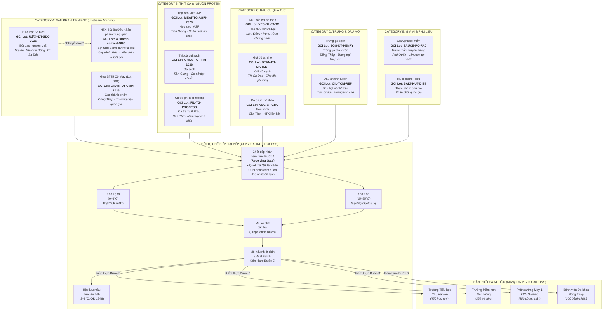
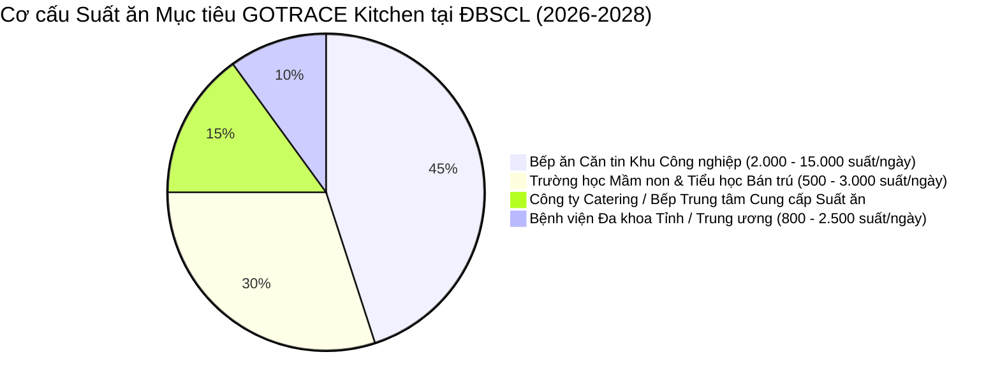
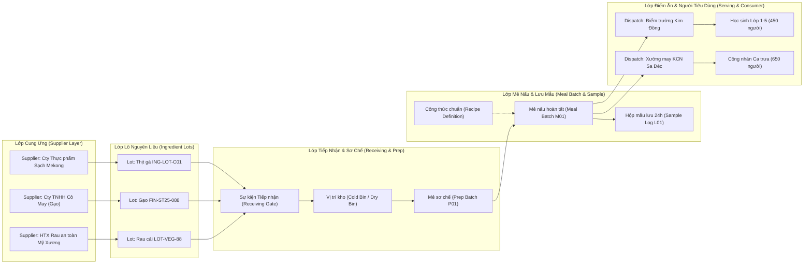
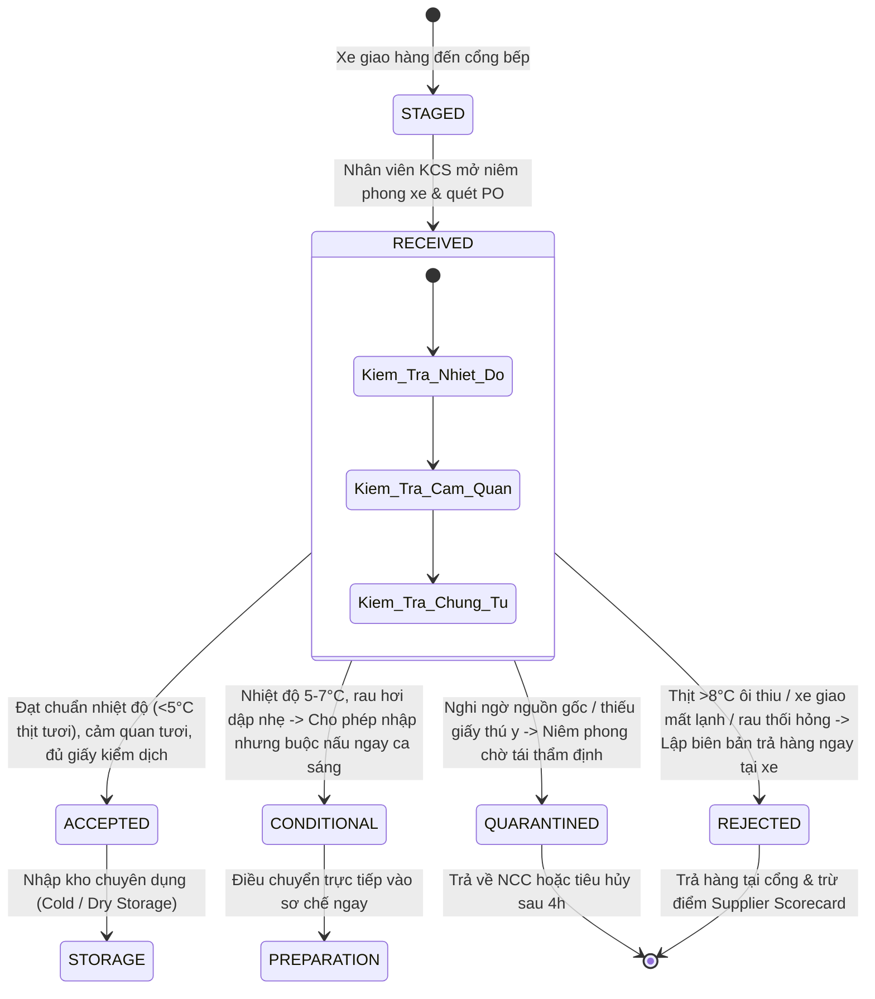
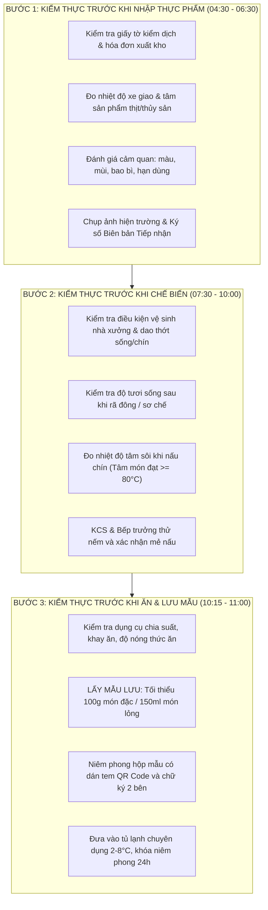
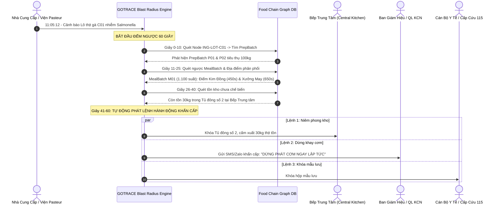
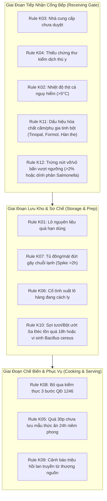
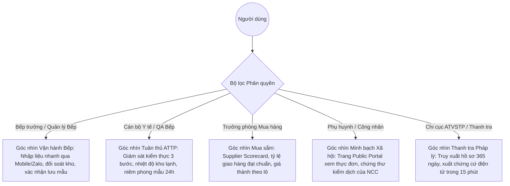
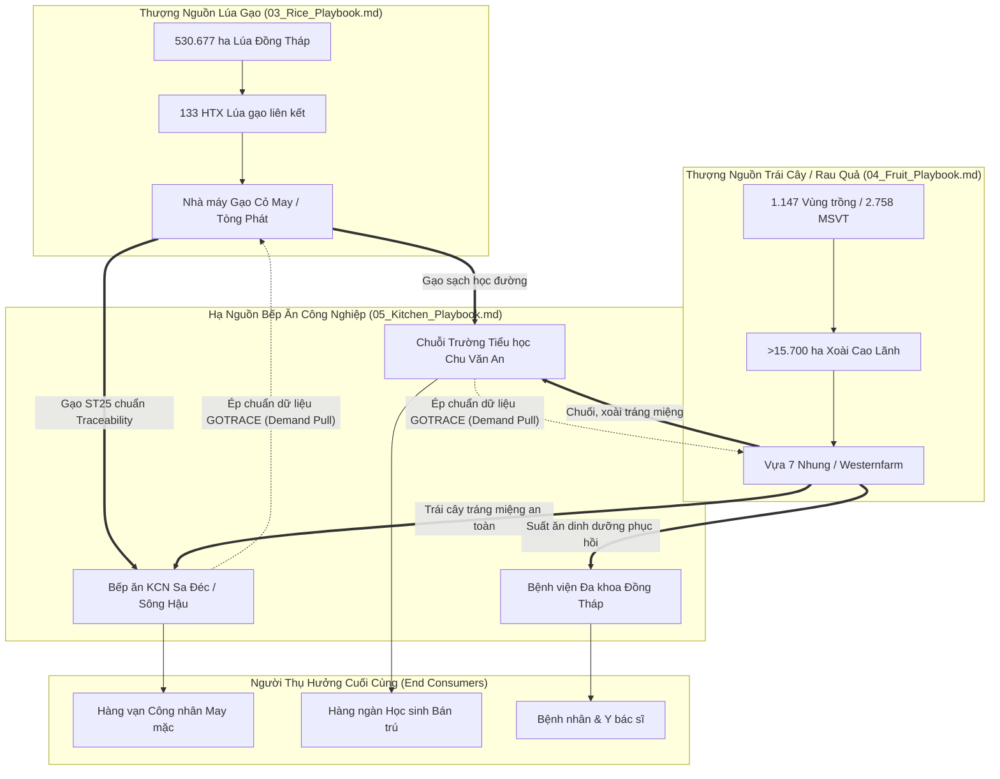

# 05_KITCHEN PLAYBOOK — GOTRACE MEKONG
## Converging Supply Chain · Downstream Demand Anchor · Food Safety Accountability & 60-Second Incident Engine

**Phiên bản:** Master Edition 2.5 — Tháng 09/2026  
**Mã tài liệu:** `GT-DOC-05-KT`  
**Thuộc bộ tài liệu:** [GOTRACE Mekong Strategy & Execution System 2026–2028](./00_MASTER_INDEX.md)  
**Đối tượng thụ hưởng:** Founder, Hội đồng Quản trị (BOD), PMO Lead, Kỹ sư Trưởng Hệ thống, Đội ngũ BD/Sales Bếp ăn Công nghiệp & Đội Triển khai Giải pháp tại ĐBSCL  
**Strategic Role:** Chứng minh khả năng liên kết dữ liệu chuỗi cung ứng đa nguồn thượng nguồn (Lúa gạo & Trái cây/Rau màu) hội tụ về điểm tiêu dùng hạ nguồn, thiết lập lớp bảo vệ pháp lý vững chắc và kích hoạt động cơ phản ứng sự cố ngộ độc thực phẩm trong $\le 60\text{ giây}$.

---

> [!IMPORTANT]
> **ĐỊNH VỊ CHIẾN LƯỢC CỦA VERTICAL KITCHEN:**
> - **KHÔNG BÁN:** *"Phần mềm quản trị bếp ăn"*, *"ERP nhà hàng"*, hay *"Mã QR in trên nắp hộp cơm cho học sinh/công nhân quét xem ảnh minh họa"*.
> - **ĐỊNH VỊ BÁN:** **Hạ tầng Dữ liệu Trách nhiệm Giải trình An toàn Thực phẩm (Food Safety Accountability Data Infrastructure)** kết nối lô nguyên liệu, phiếu kiểm thực 3 bước theo Quyết định 1246/QĐ-BYT, nhiệt độ chuỗi lạnh, đối soát tiêu hao thực tế theo công thức và nhật ký lưu mẫu 24h thành một đồ thị khép kín.
> - **GIÁ TRỊ SỐNG CÒN:** Giúp Hiệu trưởng trường học, Giám đốc Nhân sự KCN, Ban Giám đốc Bệnh viện và Chủ doanh nghiệp Catering trả lời chính xác trong **60 giây**:
>   *"Món ăn trưa nay được nấu từ những lô nguyên liệu nào, do ai giao lúc mấy giờ, lưu mẫu ở ngăn tủ nào, và nếu một lô thịt bị phát hiện nhiễm khuẩn Salmonella thì chính xác bao nhiêu suất ăn, tại phân xưởng/điểm trường nào bị ảnh hưởng để dừng khay cơm trước giờ phát?"*

---

## MỤC LỤC CHI TIẾT
1. [Vai Trò Chiến Lược & Luận Cứ Đầu Tư (Strategic Role & Thesis)](#1-vai-tro-chien-luoc)
2. [Bối Cảnh Khủng Hoảng ATTP & Sức Ép Pháp Lý ĐBSCL (2025–2026)](#2-boi-canh-khung-hoang)
3. [Hồ Sơ Khách Hàng Mục Tiêu & Phân Khúc Trọng Tâm (ICP & Accounts)](#3-ho-so-khach-hang)
4. [Kiến Trúc Chuỗi Cung Ứng Hội Tụ (Converging Supply Chain Architecture)](#4-kien-truc-chuoi-hoi-tu)
5. [Mô Hình Tiếp Nhận Nguyên Liệu 4 Trạng Thái & Quản Trị Nhà Cung Cấp](#5-mo-hinh-tiep-nhan)
6. [Quản Trị Phả Hệ Kho & Thuật Toán Đối Soát Recipe vs. Actual Consumption](#6-pha-he-kho-doi-soat-recipe)
7. [Quy Trình Kiểm Thực 3 Bước & Lưu Mẫu 24H Theo Quyết Định 1246/QĐ-BYT](#7-kiem-thuc-3-buoc-luu-mau)
8. [Động Cơ Truy Vết Bán Kính Tác Động Sự Cố Trong 60 Giây (Blast Radius Engine)](#8-dong-co-truy-vet-60s)
9. [Kitchen Risk Engine — 9 Quy Tắc Phát Hiện Sớm Nguy Cơ (Rules K01–K09)](#9-kitchen-risk-engine)
10. [Bộ 4 Data Schemas YAML Chuẩn Kỹ Thuật Hệ Thống](#10-bo-4-schemas-yaml)
11. [Phân Quyền Trải Nghiệm Đa Tác Nhân (Role-Based Access Control)](#11-phan-quyen-rbac)
12. [Kịch Bản Trình Diễn Bán Hàng: "Ứng Phó Thanh Tra Đột Xuất Trong 10 Phút"](#12-kich-ban-demo-thanh-tra)
13. [Ranh Giới Phạm Vi Sản Phẩm MVP (Scope Boundaries)](#13-ranh-gioi-mvp)
14. [Thiết Kế Thử Nghiệm Pilot SOW & Tiêu Chí Nghiệm Thu (Deterministic Acceptance)](#14-thiet-ke-pilot-sow)
15. [Liên Kết Farm-to-Table: Bếp Ăn Là Điểm Neo Lực Kéo Hạ Nguồn (Demand Anchor)](#15-lien-ket-farm-to-table)

---

<a name="1-vai-tro-chien-luoc"></a>
## 1. VAI TRÒ CHIẾN LƯỢC & LUẬN CỨ ĐẦU TƯ (STRATEGIC ROLE & THESIS)

### 1.1 Khác biệt cấu trúc cốt lõi so với Lúa gạo và Trái cây
Trong cấu trúc dữ liệu đồ thị của nền tảng GOTRACE, ba ngành hàng đại diện cho ba hình thái đồ thị cơ bản:
- **Ngành Lúa gạo ([03_Rice_Playbook.md](./03_Rice_Playbook.md)):** Chuỗi chuyển hóa tuyến tính ($1 \rightarrow 1\text{ Transformation}$): Lô lúa tươi $\rightarrow$ Mẻ sấy $\rightarrow$ Bóc vỏ tách màu $\rightarrow$ Lô gạo thành phẩm.
- **Ngành Trái cây ([04_Fruit_Playbook.md](./04_Fruit_Playbook.md)):** Chuỗi phân nhánh thứ cấp ($1 \rightarrow \text{Many Branching}$): 1 Lô thu hoạch tại mã số vùng trồng $\rightarrow$ Sơ chế phân cấp Grade 1 (Xuất khẩu khẩu), Grade 2 (Nội địa), Grade 3/Cull (Chế biến ép nước).
- **Ngành Bếp ăn Tập thể (Kitchen):** **Chuỗi hội tụ đa nguồn ($\text{Many} \rightarrow 1 \rightarrow \text{Many Convergence}$)**.



### 1.2 Luận cứ kinh doanh (The Business Thesis)
Bếp ăn tập thể là mắt xích chịu **rủi ro pháp lý cao nhất nhưng lại kiểm soát quyền chi tiêu trực tiếp nhất** trong toàn bộ chuỗi giá trị nông sản:
1. **Lá chắn pháp lý hình sự:** Khi ngộ độc tập thể xảy ra, người đứng đầu tổ chức (Hiệu trưởng, Tổng giám đốc nhà máy) phải đối mặt với nguy cơ khởi tố hình sự. Họ không cần một phần mềm ghi chép văn phòng; họ cần một **Hệ thống Chứng cứ Bất khả Biến (Tamper-evident Evidence Ledger)** để chứng minh mình đã thực hiện đúng quy trình kiểm soát và cách ly kịp thời.
2. **Điểm neo lực kéo nhu cầu (Downstream Demand Anchor):** Bếp ăn công nghiệp tiêu thụ hàng chục tấn gạo và rau củ mỗi tuần. Khi Bếp ăn triển khai GOTRACE và yêu cầu nhà cung ứng phải cung cấp dữ liệu số hóa tương thích, họ tạo ra **sức ép thương mại tự nhiên** buộc các nhà máy gạo và vựa trái cây thượng nguồn phải áp dụng Playbook Rice và Fruit của GOTRACE.

---

<a name="2-boi-canh-khung-hoang"></a>
## 2. BỐI CẢNH KHỦNG HOẢNG ATTP & SỨC ÉP PHÁP LÝ ĐBSCL (2025–2026)

### 2.1 Số liệu thực tế chấn động tại ĐBSCL & Toàn quốc
Thị trường bếp ăn tập thể tại Đồng bằng sông Cửu Long và khu vực kinh tế phía Nam đang trải qua làn sóng thắt chặt an toàn vệ sinh thực phẩm (ATTP) chưa từng có do sự gia tăng đột biến của các ca ngộ độc quy mô lớn:

| Chỉ số An toàn Thực phẩm | Số liệu Thực tế H1/2026 | Biến động so với cùng kỳ | Nguồn dữ liệu & Căn cứ thẩm định |
|:---|:---:|:---:|:---|
| **Tổng số vụ ngộ độc thực phẩm tập thể** | **58 vụ** | Tăng **+66%** so với H1/2025 | Cục An toàn Thực phẩm (Bộ Y tế) |
| **Số ca nhập viện cấp cứu** | **1.573 ca** | Tăng đột biến tại các KCN & trường học | Báo cáo Y tế Dự phòng Quốc gia |
| **Số ca tử vong ghi nhận** | **10 ca tử vong** | Đều do sốc nhiễm khuẩn độc tố vi sinh cấp | Cục ATTP (Bộ Y tế) |
| **Tỷ lệ xảy ra tại bếp ăn tập thể** | **>75%** | Tập trung vào trường bán trú và KCN | Thanh tra Bộ Y tế 2026 |
| **Thời gian trung bình truy tìm nguyên nhân (Cũ)** | **72 – 120 giờ** | Bằng phương pháp lấy mẫu nuôi cấy truyền thống | Bệnh viện Nhi đồng & BV Đa khoa ĐBSCL |
| **Thời gian khoanh vùng mục tiêu với GOTRACE** | **$\le 60\text{ giây}$** | Tự động quét cây phả hệ lô nguyên liệu | [Kiến trúc Tham chiếu Kỹ thuật](#8-dong-co-truy-vet-60s) |

### 2.2 Sức ép từ cơ quan quản lý và các vụ án điểm
- **Vụ án tuồn thịt heo dịch bệnh vào trường học bán trú (2025–2026):** Cơ quan Cảnh sát Điều tra đã khởi tố đường dây làm giả giấy kiểm dịch thú y để cung ứng thịt nhiễm Dịch tả lợn châu Phi (ASF) cho chuỗi trường tiểu học tại miền Nam. Vụ việc khiến toàn bộ Ban Giám hiệu bị đình chỉ công tác, kéo theo chỉ thị tổng thanh tra toàn bộ bếp ăn trường học trên 13 tỉnh ĐBSCL.
- **Quy định công khai nguồn thực phẩm trước 7h30 sáng:** Sở GD&ĐT TP.HCM, Cần Thơ và Đồng Tháp áp dụng quy định bắt buộc các trường mầm non và tiểu học phải công khai trực tuyến nguồn gốc thực phẩm nhập trong ngày (nhà cung cấp, biển số xe giao, khối lượng, cảm quan) cho phụ huynh theo dõi trước giờ ăn trưa.
- **Sửa đổi Luật An toàn Thực phẩm (Hiệu lực 2026):** Chuyển dịch toàn diện từ mô hình "Tiền kiểm cấp phép" sang **"Hậu kiểm truy vết chuỗi dữ liệu"**. Bắt buộc cơ sở bếp ăn phải lưu trữ nhật ký số hóa về nguồn gốc nguyên liệu và mẫu thức ăn lưu trong tối thiểu 1 năm. Nếu xảy ra ngộ độc mà không chứng minh được nguồn gốc, đơn vị vận hành bếp bị xử lý hình sự kịch khung.

---

<a name="3-ho-so-khach-hang"></a>
## 3. HỒ SƠ KHÁCH HÀNG MỤC TIÊU & PHÂN KHÚC TRỌNG TÂM (ICP & ACCOUNTS)

GOTRACE tập trung vào 4 phân khúc khách hàng tổ chức (Institutional ICP) có quy mô suất ăn lớn và rủi ro thương hiệu/pháp lý trực tiếp:



### 3.1 Bảng phân tích chi tiết 4 phân khúc mục tiêu

| Phân khúc Khách hàng | Quy mô & Địa bàn Điểm tựa | Nỗi đau cốt lõi (Core Pain) | Người quyết định mua (Buyer Persona) | Giá trị GOTRACE mang lại |
|:---|:---|:---|:---|:---|
| **1. Bếp ăn Căn tin Khu Công nghiệp** | **KCN Sa Đéc** (Đồng Tháp), **KCN Sông Hậu** (Hậu Giang), **KCN Trà Nóc** (Cần Thơ), KCN Tân Đức (Long An). Quy mô: $2.000 - 15.000\text{ suất/ngày}$. | Ngộ độc hàng loạt khiến đình trệ sản xuất dây chuyền; trách nhiệm pháp lý với Liên đoàn Lao động và Ban Quản lý KCN. | Tổng Giám đốc Nhà máy, Giám đốc Nhân sự (HRD), Trưởng Ban An toàn Lao động. | Cô lập suất ăn nhiễm độc trước giờ ăn ca; báo cáo chứng cứ giao nộp thanh tra trong 15 phút. |
| **2. Trường Bán trú & Quốc tế** | Mầm non, Tiểu học tại Cần Thơ, Cao Lãnh, Sa Đéc, Long Xuyên, TP.HCM. Quy mô: $500 - 3.000\text{ suất/ngày}$. | Áp lực khủng khiếp từ Ban đại diện Cha mẹ học sinh; nguy cơ bị tước giấy phép trường; công khai thực đơn trước 7h30. | Hiệu trưởng, Chủ tịch Hội đồng Quản trị trường, Ban đại diện Phụ huynh. | Trang Portal phụ huynh minh bạch 100% hóa đơn kiểm dịch; chứng minh trách nhiệm minh bạch của nhà trường. |
| **3. Bệnh viện Đa khoa Tỉnh / TW** | Bệnh viện Đa khoa Đồng Tháp, Bệnh viện Đa khoa TW Cần Thơ. Quy mô: $800 - 2.500\text{ suất/ngày}$. | Chế độ ăn bệnh lý nghiêm ngặt; ngộ độc trên bệnh nhân nặng gây tử vong ngay lập tức; áp lực kiểm định ATTP y tế. | Giám đốc Bệnh viện, Trưởng khoa Dinh dưỡng Tiết chế, Trưởng phòng Kế hoạch Tổng hợp. | Truy vết phả hệ dinh dưỡng từng bệnh nhân; đối soát chính xác chế độ ăn theo bệnh án điện tử. |
| **4. Công ty Suất ăn Công nghiệp** | Các tập đoàn vận hành chuỗi bếp trung tâm (Central Kitchen) như Aden Services, The Caterers, Trường Phú. | Rủi ro bị nhà máy cắt hợp đồng khi 1 cơ sở vi phạm; gian lận nguyên liệu giữa các ca nấu; khó kiểm soát chất lượng từ xa. | Giám đốc Điều hành (COO), Giám đốc Chuỗi cung ứng (CSO), Quản lý Chất lượng (QA Manager). | Quản trị tập trung đa bếp; kiểm soát định mức Recipe vs Thực tế; bảo vệ uy tín thương hiệu đấu thầu. |

---

<a name="4-kien-truc-chuoi-hoi-tu"></a>
## 4. KIẾN TRÚC THAM CHIẾU CHUỖI HỘI TỤ (CONVERGING SUPPLY CHAIN ARCHITECTURE)

Kế thừa kiến trúc đối tượng chuẩn từ [02_Platform_Object_Implementation_Blueprint.md](./02_Platform_Object_Implementation_Blueprint.md), hệ thống Kitchen triển khai mô hình đồ thị hội tụ $\text{Many} \rightarrow 1 \rightarrow \text{Many}$:



### 4.1 Danh mục đối tượng dữ liệu cốt lõi (Core Data Primitives)
1. **Thực thể Cố định (Master Entities):**
   - `Organization`: Đơn vị pháp nhân sở hữu chuỗi (Trường học, Nhà máy, Đơn vị Catering).
   - `Kitchen`: Điểm bếp vật lý (Bếp nấu tại chỗ On-site Kitchen hoặc Bếp Trung tâm Central Kitchen).
   - `Supplier`: Nhà cung cấp nguyên liệu được cấp mã định danh First-Class Supplier ID kèm hồ sơ thẩm định ATTP.
   - `Ingredient`: Danh mục mặt hàng nguyên liệu chuẩn hóa (SKU nguyên liệu).
   - `StorageLocation`: Vị trí lưu kho vật lý (Tủ mát $0-5^\circ\text{C}$, Tủ đông $\le -18^\circ\text{C}$, Kho khô).
   - `ConsumerGroup`: Khối thụ hưởng bữa ăn (Khối lớp bán trú, Ca kíp xưởng sản xuất, Khoa điều trị).
2. **Thực thể Vận hành Chuỗi (Operational Entities):**
   - `IngredientLot`: Lô nguyên liệu gắn liền với hóa đơn, phiếu xuất kho và chứng thư thú y của NCC.
   - `Receiving`: Sự kiện tiếp nhận tại cổng bếp, đo lường nhiệt độ và cảm quan (Kiểm thực Bước 1).
   - `PreparationBatch`: Mẻ sơ chế (cắt thái, ngâm rửa ozon, tẩm ướp sơ bộ).
   - `Recipe`: Định mức công thức chuẩn BOM (Bill of Materials) cho khẩu phần $N$ người.
   - `MealBatch`: Mẻ nấu hoàn chỉnh, đo nhiệt độ tâm món ăn chín $\ge 80^\circ\text{C}$ (Kiểm thực Bước 2).
   - `SampleRetentionRecord`: Bản ghi niêm phong mẫu thức ăn lưu 24h theo chuẩn Bộ Y tế.
   - `Serving`: Sự kiện chia suất ăn, vận chuyển và chia khay trước giờ ăn (Kiểm thực Bước 3).
3. **Thực thể Bằng chứng & Kiểm soát Rủi ro (Compliance & Risk Entities):**
   - `TemperatureRecord`: Chuỗi đo nhiệt độ thời gian thực của thùng xe giao hàng, kho lưu và tủ mẫu lưu.
   - `Inspection`: Biên bản kiểm thực 3 bước điện tử có chữ ký số xác thực.
   - `Incident`: Sự cố an toàn thực phẩm được kích hoạt nội bộ hoặc từ nhà cung cấp.
   - `BlastRadiusReport`: Báo cáo động cơ quét phả hệ tính toán phạm vi ảnh hưởng trong 60 giây.

### 4.2 Bốn Trụ Cột Thực Phẩm Hội Tụ Toàn Diện (The 4 Converging Ingredient Pillars)
Một bữa ăn bán trú trường học hay suất ăn ca công nghiệp **không bao giờ chỉ gồm một loại nguyên liệu đơn lẻ**. Để thiết lập lá chắn trách nhiệm pháp lý vững chắc, hệ thống GOTRACE Kitchen chuẩn hóa toàn diện 4 trụ cột thực phẩm thượng nguồn hội tụ tại cổng bếp:

| Trụ Cột Thực Phẩm | Danh Mục Hàng Hóa Đại Diện | Nguồn Gốc Thượng Nguồn ĐBSCL | Nỗi Đau & Nguy Cơ Vi Sinh / Hóa Chất | Cơ Chế Kiểm Soát Bằng Chứng GOTRACE (Evidence Ledger) |
|:---|:---|:---|:---|:---|
| **1. Tinh Bột & Sợi Truyền Thống (Starch Pillar)** | Gạo ST25, Jasmine 85, Bột gạo lọc Sa Đéc, Sợi bún tươi, Bánh canh, Hủ tiếu Sa Đéc, Phở tươi. | Cụm Làng nghề Bột Sa Đéc (Tân Phú Đông), Nhà máy Gạo Cỏ May, Lộc Trời. | **Hạn dùng siêu ngắn (12–18h)**; lạm dụng chất tẩy trắng (Tinopal, Formol, Natri Benzoat); sinh độc tố vi khuẩn *Bacillus cereus* từ cơm/bún để lưu kho. | • Mã GCI kép: Lô Bột ướt $\rightarrow$ Khay sợi tươi.<br>• Hash SHA-256 kết quả xét nghiệm vi sinh định kỳ.<br>• Rule K10 tự động cảnh báo mẻ sợi tồn quá 18h. |
| **2. Thịt & Thủy Hải Sản (Protein Pillar)** | Thịt heo VietGAP, Thịt gà đùi sạch, Thịt bò, Cá tra/ba sa phi lê, Tôm tươi, Chả cá basa. | Chuỗi chăn nuôi an toàn Tiền Giang, Bến Tre; Vùng nuôi cá tra Đồng Tháp, Cần Thơ. | Đứt gãy chuỗi lạnh vận chuyển ($>5^\circ\text{C}$); thịt nhiễm dịch bệnh (Dịch tả heo ASF, Cúm H5N1); vi khuẩn sinh độc cấp tính (*Salmonella*, *E.coli* O157:H7). | • IoT cảm biến nhiệt độ xe lạnh liên tục.<br>• Bắt buộc đính kèm Chứng thư Thú y hợp lệ (Rule K04).<br>• Đo nhiệt độ tâm sản phẩm $\le 5^\circ\text{C}$ lúc giao (Rule K02). |
| **3. Trứng Gia Cầm & Đạm Phụ Trợ (Egg Pillar)** | Trứng gà tiệt trùng UV, Trứng vịt sạch kiểm dịch, Đậu hũ miếng, Chả lụa tiệt trùng. | Trang trại gia cầm quy chuẩn (Ba Huân, Vĩnh Thành Đạt, Trại vịt kiểm soát ĐBSCL). | Trứng dính phân mang khuẩn *Salmonella enteritidis* thẩm thấu qua vỏ; đậu hũ thạch cao công nghiệp; chả lụa nhiễm *Clostridium botulinum* do yếm khí. | • Mã số cơ sở chăn nuôi & Ngày đẻ/đóng gói.<br>• Giới hạn lưu kho tối đa 7 ngày ở điều kiện mát.<br>• Kiểm tra ngoại quan vỏ trứng không dập nứt. |
| **4. Rau Củ Quả & Gia Vị (Veg & Spice Pillar)** | Rau ăn lá (cải, rau muống), Củ quả VietGAP, Nấm rơm, Trái cây tráng miệng, Nước mắm, Dầu ăn. | HTX Rau an toàn Cần Thơ, Tiền Giang, Đà Lạt; Trái cây Cao Lãnh; Gia vị chuẩn VSATTP. | Dư lượng thuốc BVTV vượt ngưỡng MRL; ký sinh trùng giun sán từ nguồn nước tưới bẩn; dầu ăn tái chế không rõ xuất xứ. | • Quét mã QR Mã số vùng trồng (MSVT VietGAP).<br>• Ghi nhận nồng độ rửa sục ozone/chlorine tại Bước 2.<br>• Lưu vết nhãn hiệu gia vị & hóa đơn tài chính hợp lệ. |

---

<a name="5-mo-hinh-tiep-nhan"></a>
## 5. MÔ HÌNH TIẾP NHẬN NGUYÊN LIỆU 4 TRẠNG THÁI & QUẢN TRỊ NHÀ CUNG CẤP

Mọi nguyên liệu trước khi được phép đưa vào khu vực bảo quản hoặc sơ chế đều phải đi qua **Chốt Kiểm Soát Tiếp Nhận Cổng Bếp (Receiving Gate)** vào khung giờ $4\text{h}30 - 6\text{h}30$ sáng hàng ngày:



### 5.1 Bốn trạng thái tiếp nhận nguyên liệu chuẩn mực
1. **ACCEPTED (Tiếp nhận Đạt chuẩn):**
   - Nhiệt độ thịt tươi sống tâm sản phẩm $\le 5.0^\circ\text{C}$; xe giao hàng $\le 4.0^\circ\text{C}$.
   - Có đầy đủ giấy kiểm dịch thú y có mộc đỏ hợp lệ của cơ quan thú y địa phương.
   - Cảm quan: Thịt đàn hồi tốt, màu sắc hồng hào tự nhiên, không có mùi lạ.
2. **CONDITIONAL (Tiếp nhận Có điều kiện):**
   - Nhiệt độ thịt tươi trong khoảng $5.1^\circ\text{C} - 7.0^\circ\text{C}$; rau củ có tỷ lệ dập cuống $<5\%$.
   - **Ràng buộc hệ thống:** Bắt buộc gắn thẻ sử dụng ngay (Use-First Priority) trong mẻ nấu trưa cùng ngày; cấm tuyệt đối chuyển vào cấp đông bảo quản dài ngày.
3. **QUARANTINED (Cách ly Thẩm định):**
   - Lô hàng nghi ngờ tem nhãn bị rách, số serial trên giấy kiểm dịch lệch so với niêm phong xe giao hàng.
   - **Ràng buộc hệ thống:** Chuyển vào ô lưu trữ cách ly riêng biệt (`QUARANTINE-BIN`); hệ thống tự động khóa cứng mã lô con, không cho phép chọn trên màn hình xuất kho nấu ăn.
4. **REJECTED (Từ chối Nhập hàng):**
   - Thịt có mùi ôi thiu, chảy nhớt, nhiệt độ xe giao $>8.0^\circ\text{C}$ (đứt gãy chuỗi lạnh nghiêm trọng).
   - Hệ thống tự động kích hoạt **Biên bản Vi phạm Tiếp nhận Điện tử**, chụp ảnh hiện trường, trừ điểm tín nhiệm của NCC và gửi cảnh báo khẩn cấp đến Trưởng phòng Thu Mua.

### 5.2 Quản trị Nhà Cung Cấp Định Lượng (Supplier Performance Scorecard)
Hệ thống không đánh giá nhà cung cấp bằng cảm tính mà tự động tính toán điểm tín nhiệm hàng tuần dựa trên 7 tín hiệu số học:

$$\text{Supplier Trust Score} = 100 - \left( 5 \cdot N_{\text{Late}} + 15 \cdot N_{\text{TempEx}} + 20 \cdot N_{\text{DocMissing}} + 30 \cdot N_{\text{Rejected}} + 50 \cdot N_{\text{Incident}} \right)$$

- Nếu điểm tín nhiệm $<70$: Hệ thống tự động chuyển NCC sang trạng thái `PROBATION` (Thử thách) và yêu cầu KCS kiểm tra $100\%$ từng kiện hàng.
- Nếu điểm tín nhiệm $<50$: Tự động khóa mã NCC (`SUSPENDED`), cấm nhân viên lập đơn hàng PO mới.

---

<a name="6-pha-he-kho-doi-soat-recipe"></a>
## 6. QUẢN TRỊ PHẢ HỆ KHO & THUẬT TOÁN ĐỐI SOÁT RECIPE VS. ACTUAL CONSUMPTION

### 6.1 Nguyên tắc bất biến bảo toàn phả hệ (Genealogy Invariant Rule)
> [!CRITICAL]
> **NGUYÊN TẮC BẤT BIẾN:**
> *Một lô nguyên liệu đã nhập kho không bao giờ được phép biến mất ngầm khỏi hệ thống.*
> Mọi lượng xuất kho đều phải ánh xạ chính xác vào một `PreparationBatch` hoặc `MealBatch` cụ thể, hoặc phải có biên bản tiêu hủy thất thoát (`SpoilageRecord`) có xác thực 2 bên.

### 6.2 Phân tách cấu trúc: Recipe Definition vs. Actual Consumption
Các hệ thống quản lý bếp truyền thống chỉ quản lý "công thức lý thuyết", dẫn đến việc khi xảy ra ngộ độc không thể biết chính xác nguyên liệu từ nguồn nào đã gây họa. GOTRACE tách bạch tuyệt đối:

```text
┌────────────────────────────────────────────────────────────────────────┐
│ RECIPE DEFINITION (Định Mức Chuẩn Lý Thuyết - Menu Cơm Trưa 1.000 Suất) │
│ - Thịt gà phi lê: 100.0 kg                                             │
│ - Gạo ST25:        80.0 kg                                             │
│ - Cải ngọt:        60.0 kg                                             │
└───────────────────────────────────┬────────────────────────────────────┘
                                    │
                  THỰC TẾ XUẤT KHO NẤU ĂN (ACTUAL CONSUMPTION)
                                    │
                                    ▼
┌────────────────────────────────────────────────────────────────────────┐
│ CÂY PHẢ HỆ TIÊU HAO LÔ CON THỰC TẾ (ACTUAL LOT LINEAGE)                │
│                                                                        │
│ 1. Thịt gà (Tổng: 100.0 kg, Chênh lệch 0.0 kg):                        │
│    ├── 85.0 kg từ Lot ING-LOT-20260925-C01 (Cty Thực phẩm Sạch Mekong)│
│    └── 15.0 kg từ Lot ING-LOT-20260924-C02 (Trại gà Ba Tri - Bến Tre) │
│                                                                        │
│ 2. Gạo ST25 (Tổng: 80.0 kg, Chênh lệch 0.0 kg):                        │
│    └── 80.0 kg từ Lot FIN-ST25-COMAY-DTP-088 (Cty TNHH Cỏ May)        │
│                                                                        │
│ 3. Cải ngọt (Tổng: 62.5 kg, Hao hụt gọt rễ +2.5 kg = +4.1% dung sai):  │
│    └── 62.5 kg từ Lot LOT-VEG-DL-88 (HTX Rau an toàn Mỹ Xương)         │
└────────────────────────────────────────────────────────────────────────┘
```

### 6.3 Ý nghĩa pháp lý của việc phân bổ phả hệ lô con
Khi Trung tâm Y tế Dự phòng công bố mẫu thịt gà của *Trại gà Ba Tri* bị nhiễm khuẩn Salmonella:
- **Nếu quản lý truyền thống:** Trường học hoặc KCN phải thu hồi toàn bộ 1.000 suất ăn, tiêu hủy toàn bộ 100kg thịt gà, bồi thường thiệt hại cho cả 2 nhà cung cấp và uy tín sụp đổ.
- **Với GOTRACE:** Hệ thống bóc tách chính xác: 15kg thịt của Ba Tri chỉ được dùng để nấu `PrepBatch P02` cấp cho **Phân xưởng May 2 (150 suất)**. 850 suất còn lại tại các phân xưởng khác hoàn toàn an toàn và sử dụng thịt của NCC Mekong Đạt chuẩn. **Bảo vệ toàn diện cho 85kg thịt sạch của nhà cung ứng chuẩn mực!**

---

<a name="7-kiem-thuc-3-buoc-luu-mau"></a>
## 7. QUY TRÌNH KIỂM THỰC 3 BƯỚC & LƯU MẪU 24H THEO QUYẾT ĐỊNH 1246/QĐ-BYT

Hệ thống GOTRACE số hóa toàn diện quy trình kiểm tra an toàn thực phẩm bắt buộc của Bộ Y tế theo **Quyết định số 1246/QĐ-BYT ngày 31/03/2017**:



### 7.1 Quy chuẩn kỹ thuật lấy mẫu và niêm phong mẫu lưu 24h
1. **Khối lượng mẫu lưu bắt buộc:**
   - Thức ăn đặc (thịt, cá, xào, rau củ luộc, cơm): Tối thiểu **$100\text{g}$** cho mỗi món.
   - Thức ăn lỏng (canh, súp, nước sốt, chè): Tối thiểu **$150\text{ml}$** cho mỗi món.
2. **Quy cách bảo quản và dán tem:**
   - Dụng cụ lưu mẫu: Hộp inox hoặc hũ thủy tinh có nắp đậy kín, đã được tiệt trùng sấy khô ở nhiệt độ $>100^\circ\text{C}$.
   - Tem niêm phong điện tử: In trực tiếp từ máy in nhãn GOTRACE tại bếp, bao gồm: Mã QR định danh, Tên món ăn, Bữa ăn (Trưa/Chiều), Giờ lấy mẫu chính xác, Họ tên & Chữ ký của Cán bộ Y tế và Bếp trưởng.
   - Nhiệt độ tủ lưu mẫu: Duy trì nghiêm ngặt trong dải **$2.0^\circ\text{C} - 8.0^\circ\text{C}$** liên tục trong **24 giờ**.
   - Sau 24 giờ, nếu không có bất kỳ phản ánh bất thường nào, nhân viên bấm xác nhận *"Hủy mẫu hết hạn"* trên ứng dụng để kết thúc chu trình giám sát.

### 7.2 Danh mục 5 chỉ tiêu vi sinh đối chứng khẩn cấp
Khi xảy ra sự cố ngộ độc nghi vấn, mẫu lưu được bàn giao cho cơ quan y tế dự phòng để xét nghiệm đối chứng khẩn cấp theo 5 chỉ tiêu vi sinh vật trọng yếu:

| STT | Tên Vi Sinh Vật Mục Tiêu | Ngưỡng Cho Phép (TCVN / QĐ 1246) | Nguồn Lây Nhiễm Điển Hình Trong Bếp Ăn | Triệu Chứng Ngộ Độc Cấp |
|:---:|:---|:---|:---|:---|
| **1** | ***Salmonella* spp.** | **Không được có trong 25g (0/25g)** | Thịt gà sống, trứng gia cầm chưa nấu chín, nhiễm chéo thớt thái. | Sốt cao, tiêu chảy cấp, đau quặn bụng sau 6–48 giờ. |
| **2** | ***Escherichia coli* (E. coli)** | **$< 10\text{ CFU/g}$** | Rau sống rửa không sạch, nguồn nước nhiễm khuẩn, bàn tay người sơ chế. | Tiêu chảy ra máu, suy thận cấp do độc tố Shiga sau 2–8 ngày. |
| **3** | ***Staphylococcus aureus*** | **$< 100\text{ CFU/g}$** | Độc tố tụ cầu vàng từ vết trầy xước tay đầu bếp, để nguội ở nhiệt độ phòng. | Buồn nôn, nôn mửa dữ dội sau 30 phút đến 6 giờ ăn. |
| **4** | ***Clostridium perfringens*** | **$< 100\text{ CFU/g}$** | Thịt kho, canh súp hầm khối lượng lớn để nguội chậm, thiếu oxy. | Đau bụng quặn thắt, tiêu chảy sau 8–16 giờ. |
| **5** | ***Bacillus cereus*** | **$< 100\text{ CFU/g}$** | Cơm nấu để qua đêm, tinh bột chiên nguội, xào không đủ nhiệt. | Nôn mửa cấp (độc tố chịu nhiệt) sau 1–5 giờ. |

---

<a name="8-dong-co-truy-vet-60s"></a>
## 8. ĐỘNG CƠ TRUY VẾT BÁN KÍNH TÁC ĐỘNG SỰ CỐ TRONG 60 GIÂY (BLAST RADIUS ENGINE)

Đây là **tính năng có giá trị tài chính và sinh mạng cao nhất của GOTRACE Kitchen Playbook**: Chuyển đổi trạng thái từ *"ứng phó bị động hoảng loạn"* sang *"cô lập đồ thị tự động theo thời gian thực"*.



### 8.1 Thuật toán quét đồ thị xuôi 4 bước (Timeline $\le 60\text{ Giây}$)
- **Giây 0 – 10 (Node Isolation):** Hệ thống nhận mã định danh lô nhiễm khuẩn (`ING-LOT-20260925-C01`). Thuật toán truy vết xuôi tìm kiếm toàn bộ các cạnh nối đến các node `PreparationBatch`.
- **Giây 11 – 25 (Lineage Expansion):** Tìm toàn bộ các node `MealBatch` đã hoàn tất từ mẻ sơ chế đó. Bóc tách danh mục món ăn (vd: *"Cà ri gà"*), số lượng suất nấu, giờ đóng hộp và xe vận chuyển.
- **Giây 26 – 40 (Blast Radius Mapping):** Ánh xạ các mẻ cơm vào danh sách các điểm trường học, nhà máy, phân xưởng kèm khung giờ ăn dự kiến (Serving Window). Xác định số lượng người ăn đang đối mặt nguy cơ.
- **Giây 41 – 60 (Automated Action Directives):** Phát hành đồng thời 3 Lệnh hành động cách ly tự động (Automated Action Directives):
  1. **Lệnh Cách Ly Tồn Kho (Lock Raw Stock):** Niêm phong ngay lập tức lượng nguyên liệu sống còn tồn trong tủ lạnh.
  2. **Lệnh Dừng Phục Vụ (Halt Serving):** Đẩy thông báo báo động đỏ qua SMS/Zalo/App đến Hiệu trưởng và Quản lý KCN: **"DỪNG PHÁT KHAY CƠM NGAY LẬP TỨC"** (nếu trước giờ ăn) hoặc kích hoạt phác đồ y tế khẩn cấp (nếu đã ăn).
  3. **Lệnh Khóa Mẫu Lưu (Lock Sample):** Xác định vị trí tọa độ hộp mẫu lưu trong tủ bảo quản, cấm hủy mẫu để bàn giao cho Trung tâm Y tế Dự phòng.

### 8.2 Xử lý trường hợp biên (Edge Cases):
- **Trường hợp 1: Cảnh báo đến lúc 11h45 khi học sinh đã ăn xong 20 phút:**
  Hệ thống lập tức chuyển trạng thái sang **Phác đồ Y tế Khẩn cấp**:
  - Tự động trích xuất danh sách 450 học sinh theo lớp học đã ăn món Cà ri gà.
  - Định vị hộp mẫu lưu `#SAMPLE-L01` để chuyển gấp cho Đội Cấp cứu 115 và Bệnh viện Đa khoa tỉnh Đồng Tháp.
  - Xuất gói hồ sơ điện tử chứng minh lỗi thuộc về vi khuẩn của NCC, bảo vệ ban giám hiệu nhà trường khỏi cáo buộc tắc trách.
- **Trường hợp 2: Xe giao thịt lúc 5h00 sáng nhiệt độ thùng xe đo được là $+11.0^\circ\text{C}$:**
  Nhân viên KCS quét mã từ chối, hệ thống lập biên bản vi phạm có hình ảnh và số đo nhiệt độ, tự động gửi thông báo phạt vi phạm hợp đồng đến NCC và gợi ý chuyển đơn hàng sang NCC dự phòng đã ký cam kết.

---

<a name="9-kitchen-risk-engine"></a>
## 9. KITCHEN RISK ENGINE — 9 QUY TẮC PHÁT HIỆN SỚM NGUY CƠ (RULES K01–K09)

Động cơ quy tắc Kitchen Risk Engine liên tục lắng nghe các luồng sự kiện để ngăn chặn thảm họa an toàn thực phẩm ngay từ trước khi thức ăn được đưa lên bếp:



### Chi tiết 12 Quy tắc Cảnh báo Sớm (Rules K01 đến K12):

```text
┌──────────────────────────────────────────────────────────────────────────────────────────────────┐
│ K01 — EXPIRED INGREDIENT LOT (Nguyên liệu hết hạn sử dụng)                                       │
│ Severity: CRITICAL | Tự động khóa xuất kho                                                       │
│ Logic: IF CurrentDate >= IngredientLot.expiry_date AND TargetAction == 'ISSUE_TO_KITCHEN'        │
│ Action: Khóa cứng thao tác quét mã; phát còi hú cảnh báo trên thiết bị cầm tay; gửi thông báo    │
│         cho Bếp trưởng và QA Manager yêu cầu lập biên bản tiêu hủy.                             │
└──────────────────────────────────────────────────────────────────────────────────────────────────┘

┌──────────────────────────────────────────────────────────────────────────────────────────────────┐
│ K02 — DANGEROUS RECEIVING TEMPERATURE (Nhiệt độ tiếp nhận nguy hiểm)                             │
│ Severity: HIGH | Cảnh báo vi phạm chuỗi lạnh cổng bếp                                           │
│ Logic: IF Product.category == 'FRESH_MEAT' AND Receiving.temperature_celsius > 5.0              │
│ Action: Đánh dấu trạng thái REJECTED hoặc CONDITIONAL (nếu 5-7°C); bắt buộc chụp ảnh nhiệt kế;   │
│         không cho phép nhập vào kho bảo quản thông thường.                                      │
└──────────────────────────────────────────────────────────────────────────────────────────────────┘

┌──────────────────────────────────────────────────────────────────────────────────────────────────┐
│ K03 — UNAPPROVED SUPPLIER (Nhà cung cấp chưa qua thẩm định)                                      │
│ Severity: HIGH | Ngăn chặn thực phẩm trôi nổi                                                    │
│ Logic: IF Supplier.qualification_status != 'APPROVED' OR Supplier.trust_score < 50               │
│ Action: Từ chối tạo phiếu tiếp nhận; khóa quy trình thanh toán kho vận; cảnh báo Giám đốc Mua sắm│
│         về nguy cơ nhập hàng không rõ nguồn gốc ngoài luồng hợp đồng.                           │
└──────────────────────────────────────────────────────────────────────────────────────────────────┘

┌──────────────────────────────────────────────────────────────────────────────────────────────────┐
│ K04 — MISSING VETERINARY CERTIFICATE (Thiếu chứng thư kiểm dịch thú y)                          │
│ Severity: CRITICAL | Tuân thủ pháp luật thú y                                                   │
│ Logic: IF Product.requires_vet_cert == true AND Receiving.evidence_vet_cert IS NULL              │
│ Action: Không cho phép hoàn tất bước tiếp nhận; chuyển lô hàng vào trạng thái QUARANTINED;       │
│         yêu cầu tài xế xuất trình chứng thư số hoặc ảnh chụp mộc đỏ trong vòng 60 phút.         │
└──────────────────────────────────────────────────────────────────────────────────────────────────┘

┌──────────────────────────────────────────────────────────────────────────────────────────────────┐
│ K05 — MISSING FOOD SAMPLE LOG (Quên lưu mẫu thức ăn sau mẻ nấu)                                  │
│ Severity: HIGH | Rủi ro pháp lý theo QĐ 1246/QĐ-BYT                                              │
│ Logic: IF (CurrentTime - MealBatch.cooking_finished_at) > 30_MINUTES                             │
│        AND NOT EXISTS(SampleRetentionRecord WHERE meal_batch_id == MealBatch.id)                 │
│ Action: Báo động đỏ trên màn hình Dashboard Bếp trưởng; gửi SMS khẩn cấp cho Cán bộ Y tế trường  │
│         yêu cầu niêm phong hộp mẫu trước khi xe phân phối rời khỏi bếp.                          │
└──────────────────────────────────────────────────────────────────────────────────────────────────┘

┌──────────────────────────────────────────────────────────────────────────────────────────────────┐
│ K06 — ISSUE QUARANTINED INGREDIENT (Cố tình xuất nguyên liệu đang bị cách ly)                    │
│ Severity: CRITICAL | Ngăn chặn sai sót vận hành nghiêm trọng                                     │
│ Logic: IF IngredientLot.status == 'QUARANTINED' AND TargetMovement == 'PREPARATION'             │
│ Action: Khóa tài khoản nhân viên thao tác; kích hoạt cảnh báo an ninh bếp ăn; lập biên bản vi   │
│         phạm kỷ luật quy trình an toàn thực phẩm gửi Ban Giám đốc.                               │
└──────────────────────────────────────────────────────────────────────────────────────────────────┘

┌──────────────────────────────────────────────────────────────────────────────────────────────────┐
│ K07 — COLD STORAGE TEMPERATURE SPIKE (Đột biến nhiệt độ tủ bảo quản thực phẩm)                  │
│ Severity: HIGH | Bảo toàn chất lượng nguyên liệu dự trữ                                         │
│ Logic: IF StorageLocation.type == 'FREEZER' AND StorageLocation.temp > -12.0 AND Duration > 120m │
│ Action: Đánh dấu cờ rã đông nguy cơ đối với toàn bộ lô hàng trong tủ; yêu cầu nhân viên KCS đo  │
│         lại cảm quan và vi sinh trước khi cấp phép chế biến.                                     │
└──────────────────────────────────────────────────────────────────────────────────────────────────┘

┌──────────────────────────────────────────────────────────────────────────────────────────────────┐
│ K08 — SKIPPED 3-STEP INSPECTION (Bỏ qua biên bản kiểm thực 3 bước)                               │
│ Severity: HIGH | Vi phạm quy chuẩn bắt buộc của Chi cục ATTP                                     │
│ Logic: IF MealBatch.is_served == true AND (Step1_Passed == false OR Step2_Passed == false        │
│                                           OR Step3_Passed == false)                              │
│ Action: Đánh dấu vi phạm quy chế tuân thủ; tự động trừ điểm KPI an toàn của bếp trưởng; gửi báo  │
│         cáo tổng hợp cho đoàn thanh tra ATTP địa phương.                                         │
└──────────────────────────────────────────────────────────────────────────────────────────────────┘

┌──────────────────────────────────────────────────────────────────────────────────────────────────┐
│ K09 — UPSTREAM RECALL PROPAGATION (Lan truyền cảnh báo triệu hồi từ thượng nguồn)                │
│ Severity: CRITICAL | Phản ứng theo mạng lưới đồ thị liên kết                                     │
│ Logic: IF UpstreamLot.status == 'RECALLED' AND ExistsInGraph(UpstreamLot -> IngredientLot)       │
│ Action: Tự động kích hoạt Động cơ Blast Radius Engine; phong tỏa toàn bộ tồn kho tại bếp; phát  │
│         lệnh dừng phân phối đến các điểm ăn trước khi sự cố xảy ra tại bàn ăn.                  │
└──────────────────────────────────────────────────────────────────────────────────────────────────┘

┌──────────────────────────────────────────────────────────────────────────────────────────────────┐
│ K10 — FRESH NOODLE / MOIST STARCH RESIDENCE TIME (Vượt ngưỡng bảo quản sợi tươi & bột Sa Đéc)    │
│ Severity: CRITICAL | Rủi ro nấm mốc và vi khuẩn sinh độc tố Bacillus cereus                     │
│ Logic: IF Product.category == 'FRESH_NOODLES' AND (CurrentTime - ProductionTime) > 18_HOURS      │
│        AND StorageLocation.temp > 15.0°C                                                         │
│ Action: Tự động khóa lô sợi tươi; cấm xuất mẻ nấu; gửi cảnh báo thay thế thực đơn tinh bột sang  │
│         gạo sấy hoặc bún khô bảo quản an toàn; lập biên bản kiểm tra vi sinh.                   │
└──────────────────────────────────────────────────────────────────────────────────────────────────┘

┌──────────────────────────────────────────────────────────────────────────────────────────────────┐
│ K11 — CHEMICAL ADULTERATION ALERT (Phát hiện dấu hiệu phụ gia cấm Tinopal/Formol/Hàn the)        │
│ Severity: CRITICAL | Ngăn chặn thực phẩm tẩy trắng hóa chất vào trường học/bệnh viện             │
│ Logic: IF TestKitResult.substance IN ['TINOPAL', 'FORMALDEHYDE', 'BORAX'] AND Result == POSITIVE │
│ Action: Kích hoạt LỆNH PHONG TỎA KHẨN CẤP tại cổng tiếp nhận; tự động chụp ảnh Kit thử nhanh;    │
│         chuyển trạng thái NCC sang SUSPENDED; phát tín hiệu báo động đến Chi cục ATVSTP địa phương│
└──────────────────────────────────────────────────────────────────────────────────────────────────┘

┌──────────────────────────────────────────────────────────────────────────────────────────────────┐
│ K12 — EGG CRACKED RATIO & SHELL SALMONELLA RISK (Trứng dập vỡ/vỏ bẩn vượt ngưỡng kiểm soát)     │
│ Severity: HIGH | Ngăn ngừa khuẩn Salmonella enteritidis thẩm thấu qua vỏ trứng                   │
│ Logic: IF Product.category == 'EGGS' AND (CrackedCount / TotalCount > 0.02 OR FecesStain == TRUE)│
│ Action: Yêu cầu loại bỏ 100% quả dập nứt; bắt buộc chiếu đèn kiểm tra buồng khí; thực hiện quy   │
│         trình sát khuẩn vỏ trước khi đưa vào khu chế biến bánh/món nấu chín.                     │
└──────────────────────────────────────────────────────────────────────────────────────────────────┘
```

---

<a name="10-bo-4-schemas-yaml"></a>
## 10. BỘ 4 DATA SCHEMAS YAML CHUẨN KỸ THUẬT HỆ THỐNG

### Schema 1: Sự kiện tiếp nhận nguyên liệu tại cổng bếp (`IngredientReceipt`)
```yaml
receiving_event:
  schema_version: "2.5"
  receiving_id: "GT:VN:EVENT:RCV:RCV-2026-0925-0042"
  kitchen:
    kitchen_id: "GT:VN:PLACE:KT:KITCHEN-SADEC-CENTRAL-01"
    kitchen_name: "Bếp ăn Trung tâm Suất ăn Công nghiệp KCN Sa Đéc"
    address: "Lô C2, KCN Sa Đéc, Phường 2, TP. Sa Đéc, Đồng Tháp"
  supplier:
    supplier_id: "GT:VN:PARTY:SUPP:SUPP-MEAT-TIENGIANG-08"
    supplier_name: "Công ty TNHH Thực phẩm Sạch Mekong"
    tax_code: "1201589942"
    qualification_status: "APPROVED"
    current_trust_score: 95.5
  ingredient:
    sku: "ING-CHICKEN-FILLET"
    common_name: "Thịt gà phi lê ức tươi làm sạch"
    ingredient_lot_id: "GT:VN:LOT:ING:ING-LOT-20260925-C01"
    purchase_order_ref: "PO-KT-8841"
    delivery_truck_plate: "66C-142.89"
    gross_weight_kg: 120.0
    tare_weight_kg: 5.0
    net_weight_kg: 115.0
    uom: "KG"
  inspection_step_1_receiving:
    timestamp: "2026-09-25T05:30:00+07:00"
    truck_ambient_temp_celsius: 3.2
    meat_core_temp_celsius: 3.8
    sensory_evaluation: "THIT_TUOI_MAU_HONG_DAN_HOI_TOT_KHONG_MUI_LA"
    packaging_integrity: "INTACT_SEALED"
    production_date: "2026-09-24"
    expiry_date: "2026-09-28"
    acceptance_status: "ACCEPTED"
    assigned_storage_location: "COLD-ROOM-MEAT-BIN-02"
    receiving_inspector:
      staff_id: "STAFF-KCS-MAI-01"
      full_name: "Nguyễn Thị Mai"
      role: "Cán bộ KCS Tiếp nhận"
  evidence_attachments:
    - evidence_id: "EVI-VET-CERT-TG-2026-99142"
      type: "VETERINARY_HYGIENE_CERTIFICATE"
      issuer: "Chi cục Chăn nuôi và Thú y tỉnh Tiền Giang"
      serial_number: "CNTY-TG-99142"
      digital_signature_valid: true
      file_uri: "ipfs://bafybeicmeatcert99142.pdf"
    - evidence_id: "EVI-RECEIVING-SLIP-0042"
      type: "TRUCK_SCALE_RECEIPT_PHOTO"
      captured_at: "2026-09-25T05:32:15+07:00"
      file_uri: "ipfs://bafybeireceivingslip0042.jpg"
  status: "STORED_AVAILABLE"
```

### Schema 2: Điều chuyển nội bộ & Đối soát công thức nấu (`RecipeExecution`)
```yaml
recipe_execution_reconciliation:
  schema_version: "2.5"
  movement_id: "GT:VN:EVENT:MOV:MOV-RECON-20260925-08"
  kitchen_id: "GT:VN:PLACE:KT:KITCHEN-SADEC-CENTRAL-01"
  preparation_batch_id: "GT:VN:BATCH:PREP:PREP-20260925-CHICKEN-CURRY"
  target_meal_batch_id: "GT:VN:BATCH:MEAL:MB-20260925-LUNCH-01"
  timestamp: "2026-09-25T08:15:00+07:00"
  recipe_blueprint:
    recipe_id: "RECIPE-CHICKEN-CURRY-1000P"
    menu_name: "Cơm trưa bán trú: Cà ri gà khoai tây, Canh cải ngọt thịt bằm"
    standard_portions: 1000
    planned_portions: 1100
  reconciled_ingredients:
    - ingredient_sku: "ING-CHICKEN-FILLET"
      ingredient_name: "Thịt gà phi lê tươi"
      expected_qty_kg: 110.0
      actual_consumption_lots:
        - ingredient_lot_id: "GT:VN:LOT:ING:ING-LOT-20260925-C01"
          source_supplier: "Công ty TNHH Thực phẩm Sạch Mekong (Tiền Giang)"
          issued_qty_kg: 95.0
          storage_bin_from: "COLD-ROOM-MEAT-BIN-02"
        - ingredient_lot_id: "GT:VN:LOT:ING:ING-LOT-20260924-C02"
          source_supplier: "Trại gà Ba Tri (Bến Tre)"
          issued_qty_kg: 15.0
          storage_bin_from: "COLD-ROOM-MEAT-BIN-01"
      total_actual_issued_kg: 110.0
      variance_kg: 0.0
      variance_percentage: 0.0
    - ingredient_sku: "ING-RICE-ST25"
      ingredient_name: "Gạo ST25 Cỏ May"
      expected_qty_kg: 88.0
      actual_consumption_lots:
        - ingredient_lot_id: "GT:VN:LOT:FIN:FIN-ST25-COMAY-DTP-088"
          source_supplier: "Công ty TNHH Cỏ May (Đồng Tháp)"
          issued_qty_kg: 88.0
          storage_bin_from: "DRY-SILO-RICE-01"
      total_actual_issued_kg: 88.0
      variance_kg: 0.0
      variance_percentage: 0.0
    - ingredient_sku: "ING-VEG-MUSTARD-GREENS"
      ingredient_name: "Rau cải ngọt an toàn"
      expected_qty_kg: 66.0
      actual_consumption_lots:
        - ingredient_lot_id: "GT:VN:LOT:VEG:LOT-VEG-DL-88"
          source_supplier: "HTX Rau an toàn Mỹ Xương (Đồng Tháp)"
          issued_qty_kg: 68.5
          storage_bin_from: "COOL-ROOM-VEG-01"
      total_actual_issued_kg: 68.5
      variance_kg: 2.5
      variance_percentage: 3.78  # Hao hụt gọt rễ và lá sâu theo định mức cho phép (<5%)
  operational_signatures:
    executive_chef: "CHEF-LE-VAN-TAM (Lê Văn Tám)"
    qa_officer: "QA-TRAN-HOANG-ANH (Trần Hoàng Anh)"
  reconciliation_verdict: "FULL_GENEALOGY_PRESERVED"
```

### Schema 3: Mẻ nấu thành phẩm & Bản ghi lưu mẫu 24h (`SampleRetentionRecord`)
```yaml
meal_batch_sample_retention:
  schema_version: "2.5"
  meal_batch_id: "GT:VN:BATCH:MEAL:MB-20260925-LUNCH-01"
  kitchen_id: "GT:VN:PLACE:KT:KITCHEN-SADEC-CENTRAL-01"
  menu_display_name: "Cơm trưa bán trú: Cà ri gà khoai tây, Canh cải ngọt thịt bằm, Dưa hấu"
  cooking_finished_at: "2026-09-25T10:15:00+07:00"
  scheduled_serving_window: "11:15 - 12:30"
  total_portions_produced: 1100
  inspection_step_2_cooking:
    core_boiling_temp_celsius: 98.5
    cooking_duration_minutes: 45
    food_doneness_check: "COOKED_THOROUGHLY"
    sensory_tasting_result: "NORMAL_DELICIOUS_NO_OFF_FLAVOR"
    inspected_by_chef: "CHEF-LE-VAN-TAM"
  inspection_step_3_pre_serving:
    inspection_time: "2026-09-25T10:25:00+07:00"
    serving_temp_celsius: 74.5
    eating_tray_cleanliness: "STERILIZED_PASS"
    approved_for_dispatch: true
    approved_by_qa: "QA-TRAN-HOANG-ANH"
  food_sample_retention_24h:
    sample_code: "SAMPLE-20260925-L01"
    compliance_standard: "QUYET_DINH_1246_QD_BYT"
    refrigerator_id: "SAMPLE-FRIDGE-01"
    compartment_id: "TRAY-A-LUNCH"
    sealed_at: "2026-09-25T10:30:00+07:00"
    retain_until: "2026-09-26T10:30:00+07:00"
    prescribed_storage_temp_range: "2.0C - 8.0C"
    actual_refrigerator_temp_at_seal: 3.5
    dishes_sampled:
      - dish_name: "Cà ri gà khoai tây"
        sample_weight_grams: 125.0  # Chuẩn Bộ Y tế >= 100g
        sample_container_type: "STAINLESS_STEEL_SEALED_JAR"
      - dish_name: "Canh cải ngọt thịt bằm"
        sample_volume_ml: 165.0     # Chuẩn Bộ Y tế >= 150ml
        sample_container_type: "STAINLESS_STEEL_SEALED_JAR"
      - dish_name: "Cơm trắng ST25"
        sample_weight_grams: 150.0  # Chuẩn Bộ Y tế >= 100g
        sample_container_type: "STAINLESS_STEEL_SEALED_JAR"
    sealing_signatories:
      medic_name: "Nguyễn Thị Cúc (Y tế trường học)"
      medic_license_no: "MED-DTP-08819"
      chef_name: "Lê Văn Tám (Bếp trưởng)"
    seal_status: "INTACT_LOCKED_24H"
    qr_seal_code: "QR-SEAL-20260925-MB01"
  distribution_destinations:
    - site_id: "SITE-SCHOOL-CHU-VAN-AN"
      site_name: "Trường Tiểu học Chu Văn An (TP. Cao Lãnh)"
      portions_dispatched: 450
      dispatch_time: "2026-09-25T10:40:00+07:00"
      transport_truck_plate: "66B-091.22"
    - site_id: "SITE-FACTORY-SEWING-02"
      site_name: "Phân xưởng May 2 - KCN Sa Đéc"
      portions_dispatched: 650
      dispatch_time: "2026-09-25T10:45:00+07:00"
      transport_truck_plate: "66C-223.11"
  status: "DELIVERED_AND_SERVING"
```

### Schema 4: Báo cáo Bán kính Tác động Sự cố trong 60s (`IncidentBlastRadius`)
```yaml
incident_blast_radius_report:
  schema_version: "2.5"
  incident_report_id: "INCIDENT-2026-0925-SALMONELLA-01"
  triggered_at: "2026-09-25T11:05:12+07:00"
  computation_completed_at: "2026-09-25T11:05:48+07:00"
  total_processing_duration_seconds: 36.0  # Đạt chuẩn <= 60 giây
  trigger_metadata:
    trigger_source: "UPSTREAM_SUPPLIER_ALERT"
    alert_issuer: "Công ty TNHH Thực phẩm Sạch Mekong"
    contaminated_lot_id: "GT:VN:LOT:ING:ING-LOT-20260925-C01"
    detected_pathogen: "Salmonella enterica"
    lab_test_evidence_ref: "LAB-TEST-PASTEUR-2026-9901"
  blast_radius_summary:
    total_affected_meal_batches: 1
    total_affected_serving_sites: 2
    total_consumers_at_risk: 1100
    inventory_raw_stock_quarantined_kg: 20.0
  graph_traversal_trace:
    source_node: "GT:VN:LOT:ING:ING-LOT-20260925-C01"
    preparation_batches:
      - prep_batch_id: "GT:VN:BATCH:PREP:PREP-20260925-CHICKEN-CURRY"
        qty_consumed_kg: 95.0
    impacted_meal_batches:
      - meal_batch_id: "GT:VN:BATCH:MEAL:MB-20260925-LUNCH-01"
        dish_name: "Cà ri gà khoai tây"
        portions_produced: 1100
        destinations_impacted:
          - site_name: "Trường Tiểu học Chu Văn An"
            portions: 450
            scheduled_serving_window: "11:15 - 11:45"
            action_status: "HALT_SERVING_DIRECTIVE_DISPATCHED"
            signal_acknowledged_by: "Hiệu trưởng: Trần Văn Minh (11:07:15)"
            patients_affected_count: 0  # Chặn đứng trước giờ ăn 8 phút
          - site_name: "Phân xưởng May 2 - KCN Sa Đéc"
            portions: 650
            scheduled_serving_window: "12:00 - 12:30"
            action_status: "MEAL_TRAYS_IMPOUNDED_IN_CANTEEN"
            signal_acknowledged_by: "Quản lý Căn tin: Lê Thị Hằng (11:06:40)"
            patients_affected_count: 0  # Thu hồi toàn bộ khay ăn trước giờ ăn 54 phút
  quarantine_action_dispatch:
    - directive_id: "DIRECTIVE-01-LOCK-SAMPLE"
      action_code: "LOCK_RETAINED_SAMPLE"
      target_sample_code: "SAMPLE-20260925-L01"
      physical_location: "SAMPLE-FRIDGE-01, TỦ LẠNH MẪU LƯU NGĂN 2"
      status: "SEALED_AND_READY_FOR_HEALTH_DEPARTMENT"
    - directive_id: "DIRECTIVE-02-LOCK-RAW-STOCK"
      action_code: "SEQUESTER_RAW_STOCK"
      quantity_kg: 20.0
      storage_location: "COLD-ROOM-MEAT-BIN-02"
      status: "RED_TAPE_QUARANTINED"
    - directive_id: "DIRECTIVE-03-SUPPLIER-AUDIT"
      action_code: "FREEZE_SUPPLIER_PAYMENTS"
      target_supplier_id: "GT:VN:PARTY:SUPP:SUPP-MEAT-TIENGIANG-08"
      status: "SUSPENDED_PENDING_INVESTIGATION"
  legal_evidence_bundle_exported: "LEGAL-EVIDENCE-BUNDLE-20260925-DTP.ZIP"
  incident_verdict: "CONTAINED_WITHIN_60S_ZERO_HOSPITALIZATION"
```

---

<a name="11-phan-quyen-rbac"></a>
## 11. PHÂN QUYỀN TRẢI NGHIỆM ĐA TÁC NHÂN (ROLE-BASED ACCESS CONTROL)

Hệ thống GOTRACE Kitchen thiết lập ma trận phân quyền RBAC đa góc nhìn, đảm bảo minh bạch nhưng bảo mật thông tin nội bộ:



### Chi tiết quyền hạn từng vai trò:
1. **Bếp trưởng / Quản lý Vận hành (Chef / Kitchen Manager):**
   - Thao tác tiếp nhận nguyên liệu tại cổng bằng Mobile App (quét mã PO, nhập nhiệt độ, chụp ảnh phiếu cân).
   - Xác nhận xuất kho nấu ăn theo thực tế và ký số mẻ nấu hoàn thành.
2. **Cán bộ Y tế / QA An toàn (Health Officer / QA Inspector):**
   - Giám sát toàn bộ quy trình kiểm thực 3 bước điện tử theo QĐ 1246/QĐ-BYT.
   - Ký số niêm phong hộp mẫu lưu 24h và ghi nhận nhiệt độ tủ mẫu lưu hàng ngày.
   - Kích hoạt lệnh ứng phó sự cố khẩn cấp trên hệ thống khi có phản ánh bất thường.
3. **Trưởng phòng Thu Mua (Procurement Director):**
   - Theo dõi bảng xếp hạng Supplier Trust Score để đàm phán hợp đồng hoặc phạt vi phạm.
   - Kiểm soát biến động chi phí nguyên liệu thực tế so với định mức Recipe lý thuyết.
4. **Phụ huynh Học sinh / Người ăn (Public View):**
   - Quét mã QR thực đơn công khai trên bảng tin trường hoặc ứng dụng Zalo Mini App.
   - Xem thực đơn hôm nay, hình ảnh giấy kiểm dịch thú y, nguồn gốc nông trại của gạo ST25 và rau an toàn (đã ẩn các thông tin thương mại nhạy cảm như đơn giá).
5. **Đoàn Thanh tra Chi cục ATVSTP (Auditor / Inspector):**
   - Cấp tài khoản tra cứu tạm thời trong thời gian thanh tra.
   - Truy xuất tức thì toàn bộ chuỗi mắt xích dữ liệu của bất kỳ ngày ăn nào trong vòng 365 ngày qua.

---

<a name="12-kich-ban-demo-thanh-tra"></a>
## 12. KỊCH BẢN TRÌNH DIỄN BÁN HÀNG: "ỨNG PHÓ THANH TRA ĐỘT XUẤT TRONG 10 PHÚT"

Kịch bản Demo tiêu chuẩn để đội ngũ BD/Sales thuyết phục Hiệu trưởng và Giám đốc KCN:

### 12.1 Bối cảnh kịch bản
- **Thời gian:** 09h30 sáng ngày thứ Tư.
- **Địa điểm:** Trường Tiểu học Chu Văn An, TP. Cao Lãnh, Đồng Tháp.
- **Tình huống:** Đoàn Thanh tra liên ngành Chi cục An toàn Vệ sinh Thực phẩm tỉnh Đồng Tháp đến kiểm tra đột xuất bếp ăn bán trú 1.200 học sinh sau khi có tin đồn trên mạng xã hội về nguồn thịt ôi thiu.

### 12.2 Đối chiếu: Phương thức Cũ vs. Nền tảng GOTRACE

```text
┌──────────────────────────────────────────────┬──────────────────────────────────────────────┐
│ QUY TRÌNH TRUYỀN THỐNG (HOẢNG LOẠN)          │ VẬN HÀNH VỚI GOTRACE (MINH BẠCH - 10 PHÚT)   │
├──────────────────────────────────────────────┼──────────────────────────────────────────────┤
│ • Bếp trưởng và kế toán cuống cuồng lục tìm  │ • Phút 01: Mở Dashboard Bếp ăn GOTRACE trên │
│   sổ sách 3 ngày trước trong kho bám dầu mỡ. │   iPad của Hiệu trưởng.                      │
│ • Giấy kiểm dịch thú y bị thất lạc, hóa đơn  │ • Phút 03: Xuất Báo cáo Kiểm thực 3 bước     │
│   nhập thịt bị dính nước ướt nhòe mực.       │   điện tử có chữ ký số của Bác sĩ Y tế.      │
│ • Không nhớ hộp mẫu lưu thịt gà nằm ở ngăn   │ • Phút 05: Click món "Cà ri gà" -> Hiển thị  │
│   nào trong tủ lạnh đầy ắp đồ ăn dư.         │   phiếu cân tiếp nhận lúc 5h30 sáng, nhiệt   │
│ • Mất 3 tiếng không xuất trình đủ bằng chứng │   độ nhận 3.8°C, kèm chứng thư thú y số      │
│   -> Bị lập biên bản vi phạm hành chính, phạt│   CNTY-TG-99142 của Chi cục Thú y Tiền Giang.│
│   tiền và đình chỉ hoạt động bếp ăn.         │ • Phút 07: Dẫn đoàn thanh tra đến tủ mẫu, chỉ│
│                                              │   chính xác hộp mẫu tem số #SAMPLE-L01.      │
│                                              │ • Phút 10: In bản PDF hồ sơ nộp Đoàn thanh   │
│                                              │   tra -> Đoàn đánh giá xuất sắc 100%!        │
└──────────────────────────────────────────────┴──────────────────────────────────────────────┘
```

---

<a name="13-ranh-gioi-mvp"></a>
## 13. RANH GIỚI PHẠM VI SẢN PHẨM MVP (SCOPE BOUNDARIES)

Để đảm bảo triển khai nhanh chóng tại ĐBSCL trong 90 ngày theo kế hoạch PMO ([06_PMO_Master_Execution_Plan.md](./06_PMO_Master_Execution_Plan.md)), hệ thống xác định ranh giới tính năng rõ ràng:

### 13.1 Tính năng Bắt buộc Phải có (Must-Have MVP)
1. **Quản trị Nhà Cung Cấp & Lô Nguyên Liệu:** Tạo mã GCI cho NCC và Lô hàng, số hóa phiếu kiểm dịch thú y.
2. **Chốt Kiểm Thực Bước 1 (Receiving Gate):** Ghi nhận 4 trạng thái, kiểm tra nhiệt độ xe giao và cảm quan.
3. **Genealogy Điều Chuyển Kho:** Bảo toàn nguyên tắc không biến mất ngầm, xuất kho gắn liền với mã mẻ sơ chế.
4. **Đối Soát Recipe vs. Actual:** Phân tách BOM lý thuyết và ghi nhận tiêu hao thực tế theo từng số lô con.
5. **Kiểm Thực Bước 2 & Bước 3:** Đo nhiệt độ nấu chín $\ge 80^\circ\text{C}$ và nhiệt độ chia suất trước giờ ăn.
6. **Nhật Ký Lưu Mẫu Thức Ăn 24H:** In tem QR Code niêm phong, giám sát nhiệt độ tủ $2-8^\circ\text{C}$ theo QĐ 1246.
7. **Động Cơ Blast Radius 60 Giây:** Quét đồ thị xuôi cô lập suất ăn và điểm phân phối khi xảy ra sự cố.
8. **Trang Public View Minh Bạch:** Giao diện xem thực đơn sạch trên Mobile cho phụ huynh/công nhân.

### 13.2 Tính năng Tuyệt đối Không làm trong Giai đoạn 1 (Anti-Scope / What NOT to Build)
- ❌ **Không làm Phần mềm POS Bán lẻ:** Không phát triển máy tính tiền, quẹt thẻ khay cơm, quản lý nạp tiền căn tin.
- ❌ **Không làm Hệ thống Chấm công & Tính lương:** Tránh xa các nghiệp vụ nhân sự của đơn vị vận hành bếp.
- ❌ **Không làm Phần mềm Kế toán Tài chính chuyên sâu:** Không hạch toán thuế, khấu hao tài sản cố định.
- ❌ **Không làm Tính năng AI Tự sinh Thực đơn:** Bếp ăn công nghiệp đã có chuyên gia dinh dưỡng và thực đơn cố định theo tuần.
- ❌ **Không làm Mạng xã hội Đánh giá Món ăn:** Tránh tạo kênh khiếu nại tràn lan không kiểm soát.
- ❌ **Không làm Blockchain phức tạp:** Dùng cơ chế băm dữ liệu Merkle Tree và chữ ký số HMAC-SHA256 để bảo vệ tính toàn vẹn với chi phí vận hành bằng không.

---

<a name="14-thiet-ke-pilot-sow"></a>
## 14. THIẾT KẾ THỬ NGHIỆM PILOT SOW & TIÊU CHÍ NGHIỆM THU (DETERMINISTIC ACCEPTANCE)

### 14.1 Thiết kế gói thử nghiệm Pilot 60–90 Ngày
Mô hình triển khai thử nghiệm chuẩn mực tại một cụm bếp ăn tại ĐBSCL:

$$\text{Quy mô Pilot} \equiv \begin{cases} \mathbf{01}\text{ Đơn vị Bếp ăn (Trường Chu Văn An hoặc Căn tin KCN Sa Đéc)} \\ \mathbf{3 - 5}\text{ Nhà cung cấp chủ lực (Thịt gà, Gạo ST25, Rau Đà Lạt)} \\ \mathbf{10 - 30}\text{ Lô nguyên liệu nhập kho thực tế} \\ \mathbf{01}\text{ Chu kỳ thực đơn 2 tuần liên tục} \\ \mathbf{01}\text{ Bài diễn tập giả lập sự cố ngộ độc thực phẩm (Incident Drill)} \end{cases}$$

### 14.2 Bộ tiêu chí nghiệm thu quyết định (Deterministic Acceptance Criteria)
Các tiêu chí kiểm thử có thể đo lường độc lập, không chấp nhận báo cáo cảm tính:

- [ ] **Tiếp Nhận Số Hóa 100%:** $100\%$ các chuyến xe giao thịt tươi và rau củ đều có bản ghi điện tử ghi nhận nhiệt độ và đính kèm ảnh chụp phiếu kiểm dịch thú y.
- [ ] **Bảo Toàn Phả Hệ Tuyệt Đối:** $100\%$ các mẻ nấu hoàn thành đều truy xuất được danh sách các ID lô nguyên liệu thành phần; không tồn tại mẻ nấu "vô danh" trong cơ sở dữ liệu.
- [ ] **Truy Vết Ngược (Reverse Trace) $\le 10\text{ Giây}$:** Chọn ngẫu nhiên một khay cơm tại bàn ăn $\rightarrow$ Truy xuất ngược ra danh sách các nhà cung ứng và số xe giao hàng trong vòng dưới 10 giây.
- [ ] **Động Cơ Sự Cố (Forward Trace) $\le 60\text{ Giây}$:** Giả lập 01 cảnh báo lô thịt nhiễm khuẩn từ NCC $\rightarrow$ Hệ thống tự động xuất Báo cáo Bán kính Tác động, danh sách điểm ăn bị ảnh hưởng và phát lệnh dừng bữa ăn trong $\le 60\text{ giây}$.
- [ ] **Tuân Thủ Lưu Mẫu QĐ 1246 Đạt 100%:** Toàn bộ các mẻ nấu trưa và chiều đều có mã hộp mẫu lưu tương ứng, khối lượng mẫu đạt $\ge 100\text{g} / 150\text{ml}$ và nhiệt độ tủ lưu được giám sát $2-8^\circ\text{C}$.

---

<a name="15-lien-ket-farm-to-table"></a>
## 15. LIÊN KẾT FARM-TO-TABLE: BẾP ĂN LÀ ĐIỂM NEO LỰC KÉO HẠ NGUỒN (DEMAND ANCHOR)



### 15.1 Hiệu ứng mạng lưới tự củng cố (Self-Reinforcing Network Effect)
1. **Lực kéo thương mại hạ nguồn:** Thay vì phải đi gõ cửa từng hộ nông dân hoặc từng vựa gạo để thuyết phục họ dán mã truy xuất, GOTRACE ký hợp đồng với **01 Khách hàng Bếp ăn Anchor** (như chuỗi trường bán trú TP. Cao Lãnh hoặc chuỗi căn tin KCN Sa Đéc).
2. **Quyền năng ép chuẩn dữ liệu:** Bếp ăn Anchor đưa điều kiện vào hợp đồng mua sắm: *"Chỉ nhập gạo từ các nhà máy có kết nối luồng dữ liệu GOTRACE ([03_Rice_Playbook.md](./03_Rice_Playbook.md)) và chỉ nhập rau củ từ các HTX có mã số vùng trồng minh bạch ([04_Fruit_Playbook.md](./04_Fruit_Playbook.md))"*.
3. **Khép kín đồ thị Mekong:** Khi nhà máy gạo Cỏ May và các HTX rau quả tham gia vào mạng lưới, toàn bộ dữ liệu nông nghiệp từ đồng ruộng ĐBSCL đến khay cơm học sinh được kết nối thành một **Đồ thị Dữ liệu Chuỗi Cung ứng Toàn vẹn (Unified Mekong Supply Chain Data Graph)**.

---

### BẢN ĐỒ THAM CHIẾU LIÊN KẾT HỆ THỐNG (CROSS-REFERENCE MATRIX)

| Mã Tài Liệu Liên Kết | Tên Tài Liệu & Đường Dẫn | Mối Quan Hệ Nghiệp Vụ Với Kitchen Playbook |
|:---|:---|:---|
| `GT-DOC-00-IDX` | [00_MASTER_INDEX.md](./00_MASTER_INDEX.md) | Mục lục tổng thể và điều hướng toàn bộ hệ thống tài liệu GOTRACE. |
| `GT-DOC-00-EXB` | [00_Executive_Brief.md](./00_Executive_Brief.md) | Tóm tắt chiến lược dành cho Hội đồng Quản trị và Nhà đầu tư. |
| `GT-DOC-01-MKT` | [01_Mekong_Market_Intelligence_GTM_2026_2030.md](./01_Mekong_Market_Intelligence_GTM_2026_2030.md) | Căn cứ số liệu thị trường ĐBSCL, cơ cấu DN missing middle và bối cảnh ATTP. |
| `GT-DOC-02-PLT` | [02_Platform_Object_Implementation_Blueprint.md](./02_Platform_Object_Implementation_Blueprint.md) | Đặc tả 9 Primitives cốt lõi và kiến trúc định danh thực thể toàn cầu (GCI). |
| `GT-DOC-03-RCE` | [03_Rice_Playbook.md](./03_Rice_Playbook.md) | Nguồn cung ứng lúa gạo thượng nguồn (Gạo ST25 Cỏ May kết nối vào Bếp ăn). |
| `GT-DOC-04-FRT` | [04_Fruit_Playbook.md](./04_Fruit_Playbook.md) | Nguồn cung ứng trái cây và rau màu an toàn từ các mã số vùng trồng ĐBSCL. |
| `GT-DOC-06-PMO` | [06_PMO_Master_Execution_Plan.md](./06_PMO_Master_Execution_Plan.md) | Kế hoạch vận hành PMO 90 ngày, ngân sách 568M VND và các mốc nghiệm thu. |
| `GT-DOC-07-ACC` | [07_Target_Account_Map.md](./07_Target_Account_Map.md) | Danh sách 100 Anchor Accounts tại ĐBSCL (15 tài khoản Bếp ăn & KCN trọng điểm). |
| `GT-DOC-08-SLS` | [08_Sales_Discovery_Playbook.md](./08_Sales_Discovery_Playbook.md) | Bộ câu hỏi Sales Discovery và kịch bản chốt hợp đồng chẩn đoán chuỗi bếp ăn. |
| `GT-DOC-09-GAP` | [09_Strategic_Gap_Analysis.md](./09_Strategic_Gap_Analysis.md) | Phân tích khoảng trống chiến lược giữa hệ thống truy xuất nhà nước và GOTRACE. |
